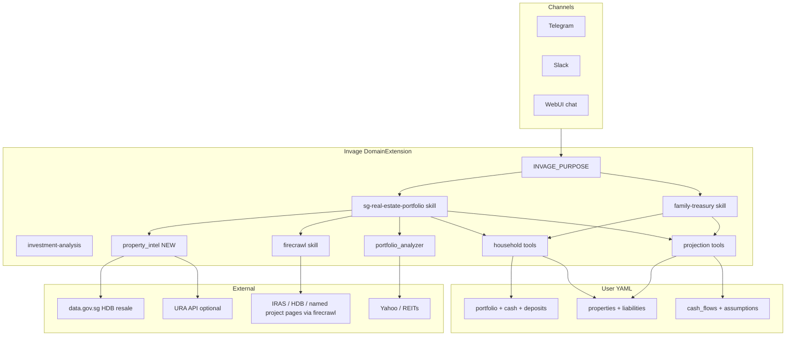
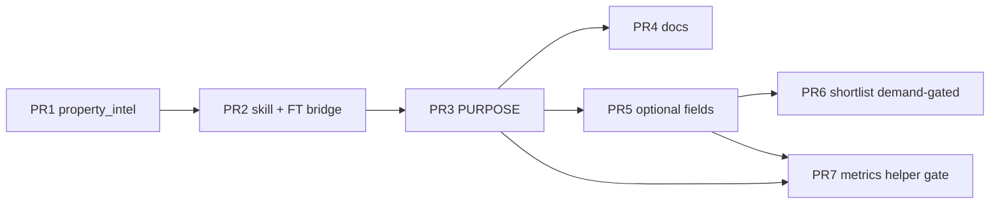

# Real-Estate Portfolio Intelligence for Invage (from rsagent)

**Date:** 2026-08-01  
**Author:** (design draft)  
**Status:** Approved (design) — ready for implementation  
**Scope:** Merge Singapore real-estate **knowledge and market data tools** from `rsagent` into **Invage (Invester)** so household real estate becomes an **investable intelligence sleeve** — not a rebrand to a property agent. Aligns with existing household treasury (`PropertyAsset`, projections, affordability).  
**Related designs:** [Family Treasury Accountant](./2026-07-29-family-treasury-accountant-design.md) · [Data model](../data-model.md)

---

## Overview

Invage already records **manual property marks** and mortgages, and can run **deterministic house-affordability projections**. It cannot honestly answer investor questions that need **market comps**, **Singapore policy costs** (BSD/ABSD/SSD), **yield and carry**, or **mark fairness** — those are strengths of `rsagent` (`property_intel`, `sg-property-advisory`) but live in a separate product identity.

This design ports **only** the investor-relevant core: the `property_intel` tool (HDB resale via data.gov.sg; private path fail-fast without URA) and a new knowledge skill (`sg-real-estate-portfolio`), then **extends** both with portfolio-first metrics (gross/net yield, cash-on-cash, equity/LTV, all-in buy cost, allocation vs REITs, hold/sell framing). Explicitly **out of v1**: layout studio, interior design, multi-unit listing HTML shopping UX / PropertyGuru-style shortlist agent, and any rebrand away from **Invester**.

**Ship order (locked):** tool → skill → PURPOSE → docs (see Explicit phase boundary and PR Plan). Never ship a skill that documents a missing tool.

---

## Background & Motivation

### Current Invage state

| Capability | Status | Location |
|------------|--------|----------|
| Portfolio equities / funds / options | Strong | `src/state/portfolio-state.ts`, analyzer |
| Household books (property, mortgage, cash flows) | Shipped | `src/state/household-state.ts` |
| Projection + affordability | Shipped | `src/treasury/project.ts`, `affordability.ts` |
| Family treasury skill | Shipped | `src/skills/knowledge/family-treasury.md` |
| SG policy / stamp duties | **Missing** | — |
| Live HDB comps / psf | **Missing** | — |
| Yield / LTV / mark-vs-comps recipes | **Missing** | Property is a mark only |

`PropertyAsset` today:

```typescript
// src/state/household-state.ts
export interface PropertyAsset {
  id: string;
  value: number;
  currency: string;
  updated_at: string;
  label?: string;
  mortgage_id?: string;
}
```

Family treasury answers “can we afford this house?” with **user-supplied** price/rate. It does **not** say whether the price is fair vs comps, what ABSD does to required return, or how physical RE equity sits next to REITs in total wealth.

### Current rsagent state (source of truth to adapt)

| Asset | Path | Port in v1? |
|-------|------|-------------|
| Skill `sg-property-advisory` | `rsagent/src/skills/knowledge/sg-property-advisory.md` | **Yes** (adapted → investor framing) |
| Tool `property_intel` | `rsagent/src/tools/property_intel.ts` | **Yes** (near-verbatim) |
| Skill listing HTML report | property-listing-report | **No** |
| `shortlist` tool + state | shortlist-state / tools | **Optional later only if demand**; not in core ship |
| Layout studio / interior design | layout_studio, indoor-*, interior-* | **No** |
| PURPOSE as “SG Property Advisor” | rsagent extension | **No** — keep Invester |

### Pain points

1. **Dual agents**: RE intelligence and portfolio intelligence split across products; household users bounce.  
2. **Thin property sleeve**: mark + mortgage only → no policy-aware second-property cost, no comps, no yield.  
3. **Scenario buy_property** uses a one-off for “stamp duty” but the agent has no structured recipe for BSD+ABSD under buyer profile.  
4. **REIT vs physical RE** is only stock analysis today; no total-wealth allocation view.

---

## Goals & Non-Goals

### Goals

1. **`property_intel` tool** in Invage: HDB resale transactions + price_summary; private market fails fast if `URA_ACCESS_KEY` missing / not implemented (same as rsagent).  
2. **Knowledge skill** for Singapore-deep real-estate **portfolio** decisions: policy framework, stamp duties (with verify-live discipline), comps interpretation, investor metrics (yield, carry, LTV, all-in cost, allocation, mark quality, hold/sell).  
3. **Compose with family-treasury via dual-load rules**: comps and duties feed scenarios and mark updates; second-property / SG buy always loads **both** skills (see Routing matrix).  
4. **Keep Invester brand**: RE is a household / total-wealth sleeve, not a listing shopper product.  
5. **Fail-fast culture**: no fallback comps, rates, or yields; missing inputs → surface gaps.  
6. **Singapore-deep first**; thin optional framing that non-SG books still use generic yield/LTV when user supplies inputs (no fake foreign datasets).  
7. **Research value-add** beyond a dumb port (metrics + total wealth + mark fairness).

### Non-Goals (v1)

| Non-goal | Rationale |
|----------|-----------|
| Layout studio / 3D floor plans | rsagent-specific UX; not portfolio intelligence |
| Interior design studio | Same |
| Multi-unit listing HTML report / shopping UX / PropertyGuru shortlist agent | Shopping product, not Invester — see Key Decision 16 |
| Full URA private sold-price integration | Not implemented in rsagent either; firecrawl path only for **named** units / official pages, not multi-unit packs |
| Auto-update property marks from comps | User/agent must write marks explicitly |
| Tax/legal/loan underwriting | Educational framing only |
| Global multi-country property APIs | SG-deep first |
| Shortlist/watchlist product surface | Deferred until demand; not in core ship (PR1–4) |
| Rebrand to property agent | Product constraint |
| Silent defaults for ABSD rates, rents, appreciation | Project culture |
| Optimization / caching of data.gov.sg | Not requested |
| Changing projection engine amortization rules | Orthogonal |
| Numeric duty amounts from training memory | Must verify this-turn or refuse numeric ABSD/BSD/SSD |

### Explicit phase boundary (aligned with PR Plan)

Ship order is **tool → skill → PURPOSE → docs**. “Phase 1+2” in conversation means the **core shippable pair** (tool + skill), not skill-before-tool.

| Phase | Ships | Does not ship | Maps to PR |
|-------|-------|---------------|------------|
| **1** | Tool `property_intel` + registration + unit tests | Skill that references the tool | **PR1** |
| **2** | Skill `sg-real-estate-portfolio` + catalog; reverse bridge in `family-treasury.md` Related | PURPOSE surgery | **PR2** |
| **3** | PURPOSE / session-protocol / hard-rules wiring; optional `/guidance property` | Schema changes | **PR3** |
| **4** | Docs (`data-model.md` + plan archive) | — | **PR4** |
| **5** (later, optional) | Richer optional `PropertyAsset` fields | Layout / listing report | **PR5** |
| **6** (later, optional) | Shortlist only if product demand proven | WebUI shortlist dashboard | **PR6** |
| **7** (later, optional) | Pure `property_metrics` helper/tool | Auto mark refresh | **PR7** |

**Core ship (must land first):** Phase 1–4 / PR1–PR4. Optional phases are independently gated after production routing is proven.

---

## Key Decisions

| # | Topic | Choice | Rationale |
|---|--------|--------|-----------|
| 1 | Product identity | **Keep Invester**; RE = portfolio/household sleeve | Confirmed product constraint; family-treasury precedent |
| 2 | v1 delivery | **`property_intel` + skill + PURPOSE** (no schema, no shortlist) | Highest leverage; no shopping UX bloat |
| 3 | Skill name / framing | `sg-real-estate-portfolio` (not copy of `sg-property-advisory`) | Investor metrics + allocation; policy is means, not the product |
| 4 | Geography | **Singapore-deep**; thin global framing for pure math metrics | rsagent strength; no invented foreign comps |
| 5 | Market data | Port rsagent `property_intel` (HDB live; private fail-fast) | Proven code; same env vars |
| 6 | Private residential data | **Firecrawl** when URA path fails — for **named** unit/project/policy pages only; label asking vs sold | Multi-channel discipline without becoming a listing shopper |
| 7 | Stamp duty rates in skill | **No numeric BSD/ABSD/SSD amount without this-turn Firecrawl (or user-pasted official table) with as-of date**; if verify fails → qualitative framework only or refuse numeric amount | Rates change; fail-honest; training memory is not authoritative |
| 8 | Metrics computation | **Skill recipes + agent arithmetic** in v1; optional pure TS helpers later | Ship intelligence without premature engine surface; still fail-fast on missing inputs |
| 8b | Phase 4 promote gate | Promote `property_metrics` if **≥2 observed production incidents** of wrong LTV/yield/equity with correct tool/state inputs | Objective ship gate, not vibes |
| 9 | Data model v1 | **No required schema change**; optional fields only in Phase 5 | Verify-datamodel-first; household already has property + mortgage |
| 10 | Interaction with family-treasury | **Complement, not replace**; dual-load rules mandatory for overlapping queries | Treasury = books/projection; RE skill = policy/comps/yield |
| 11 | Second property / ABSD | Policy-aware **cost of capital** on buy scenarios; identity assumptions explicit | Core value for multi-property households |
| 12 | REIT treatment | **Listed REITs stay portfolio sleeve**; skill teaches allocation across physical equity, REITs, liquid book | No double-count property marks |
| 13 | Comps → mark | Agent may **recommend** mark update; user confirms via `update_property` | Never auto-write marks from API |
| 14 | Fail-fast | No invented comps/rates/rents/yields; tool errors surface; empty comps ≠ invent “typical” town prices | Project Claude.md / family-treasury culture |
| 15 | Port technique | **Copy-adapt into invage tree** (not npm monorepo dep on rsagent) | Deploy independence; invage package already standalone |
| **16** | **Shopping / listing-hunt stance** | **Multi-unit listing packs / shortlist UX = out of scope.** Named property price for all-in + affordability + yield (if user supplies rent) = in scope. Firecrawl OK for policy/official pages and **named** listing/project context. If user insists “what’s on the market / find me condos under 2M”: qualitative framing + redirect to **name a price/unit** for portfolio analysis, or point to **rsagent** for shopping — **do not invent shortlist UX or multi-unit HTML packs.** | Product constraint; prevent identity drift via Firecrawl portals |
| **17** | **Dual-load precedence** | **`family-treasury`** = books, cash flows, projection, affordability verdict. **`sg-real-estate-portfolio`** = policy, comps, yield, allocation, mark quality. **Second-property / SG buy with policy cost: always load BOTH.** Order: identity + Firecrawl duties → all-in → household gaps → scenario/`compare_scenarios`. Pure NW path / multi-year CF without policy: treasury only. Pure comps/duties/yield without projection: RE skill only (+ household read tools as needed). | Avoid inventing duties in treasury-only path or skipping affordability in RE-only path |
| 18 | Rent storage | **cash_flows only** in v1 and Phase 5 — **no** `monthly_rent` on `PropertyAsset` | Single source of truth; omit-unknown pattern; avoid null-as-zero hazard |
| 19 | Size canonical (Phase 5) | **`size_sqm` only** on owned properties; convert to sqft in presentation with factor 10.7639 (same caveat as property_intel) | Match HDB tool output; avoid dual-field inconsistency |
| 20 | Mortgage link for equity/LTV | Resolve by `property.mortgage_id` **or** liability with `property_id == property.id`. If neither → equity = full value only if user confirms free-and-clear; else LTV **unknown** and surface gap — **never invent principal 0**. | Live model has bidirectional optional links; partial data is common |

---

## Proposed Design

### Architecture



### Layering (what owns what)

```text
┌────────────────────────────────────────────────────────────────┐
│  PURPOSE (Invester) — RE sleeve + dual-load + anti-shopping    │
└────────────────────────────────────────────────────────────────┘
         │
         ▼
┌──────────────────────┐  ┌──────────────────────────────────────┐
│ family-treasury      │  │ sg-real-estate-portfolio (NEW)       │
│ books + projections  │◄─┤ dual-load when SG buy / 2nd property │
│ affordability        │  │ policy · comps · yield · allocation  │
└──────────────────────┘  └──────────────────────────────────────┘
         │                              │
         ▼                              ▼
┌──────────────────────┐  ┌──────────────────────────────────────┐
│ get_household        │  │ property_intel (HDB / private gate)  │
│ property CRUD        │  │ firecrawl (IRAS, named pages only)   │
│ run_projection       │  │ portfolio_analyzer (REITs in sleeve) │
└──────────────────────┘  └──────────────────────────────────────┘
```

### Routing matrix (skills + tools)

Skill selection is **description-only** (utarus ≥ 1.17). Catalog strings must stay disambiguated (below). PURPOSE Session protocol + both skills’ Related sections enforce dual-load.

| User ask (examples) | Skills to load | Tools order | Notes |
|---------------------|----------------|-------------|-------|
| Net worth / 5y cash flow / set salary | `family-treasury` only | `get_household` → assumptions → `run_projection` | No policy/comps |
| HDB comps / “is this psf fair?” (no books mutate) | `sg-real-estate-portfolio` | `property_intel` (need town/type — ask once if missing) | Do not invent typical prices if empty sample |
| Yield / LTV / mark quality on owned home | `sg-real-estate-portfolio` (+ `family-treasury` if books incomplete) | `get_household` → resolve mortgage link → rent from user or cash_flows → `property_intel` if mark quality | Yield **blocked** without rent; mark quality **blocked** without town/type (or Phase 5 fields) |
| Stamp duty / ABSD rates | `sg-real-estate-portfolio` + `firecrawl` | Firecrawl IRAS **this turn** before any numeric amount | If scrape fails → no numeric duty |
| **Second property / SG buy + affordability** | **BOTH** `sg-real-estate-portfolio` **and** `family-treasury` | (1) identity SC/SPR/foreigner + count (2) Firecrawl duties (3) all-in (4) `get_household` gaps (5) scenario + `one_off` duties (6) `compare_scenarios` | Never skip either skill |
| REIT analysis as security | `investment-analysis` | `portfolio_analyzer` | Physical RE skill only for allocation share |
| “Find me condos under 2M” / multi-unit hunt | Neither shopping skill | **No** multi-unit pack | Qualitative redirect: name a price/unit for all-in/affordability, or use rsagent (Key Decision 16) |
| Named unit “Project X stack 08 at P — all-in + can we afford?” | **BOTH** + firecrawl | Price from user or named scrape → duties → scenario | In scope |

### Component map (Invage files)

| Module | Responsibility |
|--------|----------------|
| `src/tools/property_intel.ts` | **New** — port from rsagent; HDB datastore + private fail-fast |
| `src/tools/index.ts` | Register via `createInvageTools()` — **not** `extension.ts` tools array (Invage pattern differs from rsagent) |
| `src/skills/knowledge/sg-real-estate-portfolio.md` | **New** knowledge |
| `src/skills/knowledge/family-treasury.md` | **Update** Related table + dual-load reverse bridge (PR2) |
| `src/skills.ts` | Catalog entry; tighten family-treasury description disambiguation (PR2) |
| `src/extension.ts` | PURPOSE: Success, What you do, In/Out of scope, Session protocol, Hard rules (PR3) |
| `src/guidance.ts` | **Optional:** new subcommand `property` (aliases: `treasury`, `re`, `real-estate`) — only if PR3 includes guidance; else skip |
| `docs/data-model.md` | Document tool + Phase 5 fields when implemented |
| `tests/property_intel.test.ts` | Vitest + mocked fetch (match invage vitest setup) |
| **Unchanged core ship** | `household-state.ts` schema, projection engine, portfolio analyzer |

### Sequence: “Is my Tampines 4-room mark fair? What’s my yield?”

```mermaid
sequenceDiagram
  participant U as User
  participant A as Invester agent
  participant PI as property_intel
  participant HH as get_household
  participant FC as firecrawl

  U->>A: Review home mark + rental yield
  A->>A: Load sg-real-estate-portfolio
  A->>HH: get_household (property value, mortgage link, currency)
  HH-->>A: mark, principal if linked, gaps
  Note over A: Town/type from user message or ask ONE question if missing
  A->>PI: market=hdb price_summary town=TAMPINES flat_type=4 ROOM
  PI-->>A: median/avg/min/max + sample + n
  Note over A: Mark quality only if n sufficient; never invent typical psf
  alt User supplied monthly rent OR matching cash_flow income line
    A->>A: Gross yield = 12*rent/value; net needs opex if stated
  else Rent unknown
    A-->>U: Fail-fast — need rent; do not invent market rent
  end
  opt Policy rates matter (second home / sell)
    A->>FC: scrape IRAS ABSD/SSD tables this turn
    FC-->>A: as-of rates or fail → no numeric duty
  end
  A-->>U: Comps, mark vs median, LTV/equity if mortgage linked, yields if inputs, gaps
```

### Sequence: “Buy second condo — all-in cost & affordability”

```mermaid
sequenceDiagram
  participant U as User
  participant A as Invester
  participant FC as firecrawl
  participant PI as property_intel
  participant SC as save_scenario / compare_scenarios

  U->>A: Second property at price P; I am SC with 1 home
  A->>A: Load BOTH sg-real-estate-portfolio AND family-treasury
  A->>FC: Verify IRAS BSD/ABSD bands this turn
  alt Scrape OK
    FC-->>A: bands + ABSD rate for SC 2nd property as-of
    A->>A: All-in = P + BSD(P) + ABSD(P) + user_fees
  else Scrape fail
    FC-->>A: error
    A-->>U: Qualitative duty framework only; refuse numeric ABSD; still may run scenario if user pastes rates
  end
  opt Named unit comps needed
    A->>PI: HDB comps if relevant
  end
  A->>SC: scenario buy_property + one_off(-(BSD+ABSD+fees)) + optional mortgage/expense
  SC-->>A: AFFORDABLE | TIGHT | NOT_AFFORDABLE | UNKNOWN
  A-->>U: All-in cash need, duty breakdown (assumptions labeled), affordability verdict
```

---

## Skill design: `sg-real-estate-portfolio`

### Catalog entry (`src/skills.ts`)

Disambiguate from `family-treasury` (books/projection/“can we buy” cash path). RE skill owns comps/policy/yield/allocation — not projection alone.

```typescript
// NEW skill
{
  id: 'sg-real-estate-portfolio',
  name: 'SG Real-Estate Portfolio',
  description:
    'Singapore real-estate as a household portfolio sleeve: HDB/private comps via property_intel, ' +
    'BSD/ABSD/SSD and cooling-measure framing (verify IRAS this turn), gross/net yield, cash-on-cash, ' +
    'equity/LTV, all-in buy cost, mark fairness vs comps, lease decay, total wealth allocation ' +
    '(physical RE equity vs portfolio vs REITs), hold/sell and second-property policy cost. ' +
    'Load for stamp duty, ABSD, HDB resale comps, property yield, is my home mark fair, property vs REIT allocation. ' +
    'For second-property / SG buy with duties+affordability: load TOGETHER with family-treasury. ' +
    'Not multi-unit listing shopping, shortlist UX, layout, or interior design. Not pure multi-year cash-flow alone.',
}

// ADJUST family-treasury description (PR2) — keep books/projection focus; drop exclusive ownership of
// SG policy; point dual-load for second property:
// existing triggers: net worth, cash flows, house affordability projection, scenarios
// ADD: "For SG stamp duty, comps, yield, ABSD on a buy: also load sg-real-estate-portfolio."
```

### Knowledge file structure (adapt from rsagent, rewrite voice)

Source: `rsagent/src/skills/knowledge/sg-property-advisory.md`  
Target: `invage/src/skills/knowledge/sg-real-estate-portfolio.md`

| Section | Content | Source |
|---------|---------|--------|
| When to load | Portfolio RE questions, duties, comps, yield, allocation; dual-load table | New + adapted |
| Hard rules | No invent; tool-before-claim; no numeric duties without this-turn verify; no shopping packs; not licensed advice | Both cultures + KD 7/16 |
| Plain language | Gloss ABSD/BSD/SSD/psf/lease once | rsagent |
| Tools | `property_intel`, firecrawl, household CRUD, projection, portfolio_analyzer | New composition |
| Buyer identity | SC / SPR / Foreigner + property count **for duties only** (not shopping intake funnel) | rsagent (reframed) |
| Stamp duties framework | BSD/ABSD/SSD templates; **verify live this turn** | rsagent |
| HDB pathways orientation | BTO/resale/EC high-level (not shopping funnel) | rsagent (trimmed) |
| Interpreting comps | Sample size, lease, storey; thin n; empty ≠ invent typical | rsagent |
| **Investor metrics** | Yield, CoC, equity, LTV, carry, all-in cost + input paths | **Research value-add** |
| **Allocation** | Physical equity vs liquid portfolio vs REITs + FX/MTM rules | **Value-add** |
| **Mark quality** | Requires town/type + comps; never mark-alone | **Value-add** |
| **Hold / sell / refinance framing** | Checklist; SSD; opportunity cost | **Value-add** |
| **Second property** | Dual-load + ABSD + scenario recipe | **Value-add** |
| Family-treasury bridge | Dual-load matrix; when to run projection | New |
| Explicit non-goals / anti-shopping | Layout, interior, multi-listing HTML, shortlist language | New |

### family-treasury.md reverse bridge (PR2 required file)

Update `src/skills/knowledge/family-treasury.md` **Related** table:

| Skill | When |
|-------|------|
| `sg-real-estate-portfolio` | SG stamp duties, HDB comps, yield/LTV/mark quality, second-property ABSD, physical vs REIT allocation — **load together** with this skill for SG buy / second property with policy cost |
| `investment-analysis` | Stocks, portfolio 3-axis, REIT securities |
| … | existing rows |

Also one hard-rule line: when stamp duty or comps affect affordability cash need, load `sg-real-estate-portfolio` and verify duties before inventing `one_off` amounts.

### Research value-add: metric definitions (v1 skill math)

All metrics require **explicit inputs** from tools/state/user. Missing → fail-fast naming the gap. Currency must match **or** reporting currency set with `projection_assumptions.fx` for every foreign ccy involved — **including LTV/equity** (not only yield).

| Metric | Formula (v1) | Required inputs | Notes |
|--------|--------------|-----------------|-------|
| **Property equity** | `value − linked_mortgage.principal` | property + linked liability (see KD 20) | Same ccy or FX; if no link and user did not confirm free-and-clear → equity **unknown** (do not assume principal 0) |
| **LTV** | `principal / value` | same | Fail if value = 0; fail if cross-ccy without FX |
| **Gross yield** | `(12 × monthly_gross_rent) / value` | rent, value | Rent path below; **never invent rent** |
| **Net yield** | `(12 × (rent − monthly_opex)) / value` | opex components | opex only if stated |
| **Cash-on-cash** | `annual_cash_flow_after_debt / cash_equity_in` | CF after mortgage, capital at risk | Capital at risk = user-stated equity in, not invented |
| **Carry cost (monthly)** | `mortgage_payment + opex − rent` | as available | Positive = net cash drain |
| **All-in buy cost** | `P + BSD(P) + ABSD(P) + user_fees` | price, buyer profile, property count, **this-turn verified rates** | If rates not verified → no numeric all-in duties component |
| **Mark vs comps** | `(mark − median_comp) / median_comp` | property_intel sample + town/type match | Flag n &lt; 5; empty sample → refuse mark-quality claim |
| **Lease remaining** | From comps or user | remaining_lease / commence | Qualitative; no invented depreciation schedule |
| **RE allocation** | `physical_equity / total_NW` and `REIT_MTM / total_NW` | See Total wealth recipe | Refuse % if NW incomplete (FX/gaps) |

**Rent / opex data path (v1 — no PropertyAsset.monthly_rent):**

1. **User statement this turn** (e.g. “rent is 3200 SGD/mo”) — use for calculation; offer to `add_cash_flow` kind=income if they want it on books.  
2. **Matching cash_flow lines** after `get_household` / `list_cash_flows`:  
   - Prefer lines whose `label` or `category` clearly indicates rent/rental income for that property (substring match case-insensitive: `rent`, `rental`, property `label`/`id`).  
   - Opex: expense lines with maint/tax/agent/property in label/category **or** user-named line ids.  
   - **No `property_id` on `CashFlowLine` today** — do not invent linkage; if multiple rent lines or ambiguous match → ask **one** clarifying question which line(s) apply.  
3. If neither → **block yield/CoC/carry**; still may answer LTV/equity/mark quality if those inputs exist.

**Mortgage link resolution (KD 20):**

```text
linked = liability where id == property.mortgage_id
      OR (kind==mortgage && property_id == property.id)
if both point to different liabilities → fail-fast, ask user which is correct
if none → do not treat as free-and-clear without user confirmation; LTV unknown
```

**Required return / all-in framing (skill language, not a new tool):**

```text
Sticker price P
+ BSD (progressive bands — as-of IRAS, this-turn verify)
+ ABSD (profile × count — as-of IRAS, this-turn verify)
+ fees (only if user-stated)
= All-in capital C
If expected annual net income N (from user inputs only):
  simple income yield on all-in ≈ N / C
Never invent N or future capital gains.
If duty verify fails: report C as unknown for duty component; do not use memory rates.
```

### Skill recipes (agent) — crisp data paths

1. **Mark quality (owned home)**  
   - Inputs: mark from `get_household`; **town + flat_type** (or private project filters) from user message, property label if unambiguous, or **one** clarifying question. Phase 5 fields when present.  
   - Tools: `property_intel` with filters → compare mark to median.  
   - **Do not** claim mark quality from mark alone or invent “typical Tampines 4-room ~X” if tool empty.  
   - Optional: recommend `update_property` if user accepts.

2. **Yield pack (investment property)**  
   - Inputs: value; rent via rent path above; opex if any; mortgage via link resolution.  
   - Outputs: equity, LTV, gross/net, CoC, carry **or** explicit gaps list (missing rent → no yield numbers).  
   - Not a guaranteed primary outcome for every user — only when rent path succeeds.

3. **Second property cost (dual-load)**  
   - Load **both** skills.  
   - Clarify SC/SPR/foreigner + count → Firecrawl IRAS **this turn** → all-in → household gaps → `compare_scenarios` with `one_off` duties.  
   - No numeric ABSD without verify.

4. **Total wealth RE sleeve**  
   - Steps:  
     1. `get_household` — properties, liabilities, cash, deposits, treasury, gaps.  
     2. Note: `householdGaps()` only flags missing treasury / assumptions / cash_flows — **not** missing property/mortgage; still require property rows for physical equity.  
     3. Physical equity: per-property equity via mortgage link rules; sum in reporting ccy (FX required if mixed).  
     4. Portfolio / REIT MTM: prefer live path (`portfolio_analyzer` or pass `portfolio_value`); if only cost basis available, **label cost basis** and do not call it live MTM. REIT MTM = sum of holdings user identifies as REITs (or tickers known REIT from tool data) — never invent REIT list.  
     5. `total_NW = portfolio + free_cash + deposits + property_values − liability_principals` (all reporting ccy).  
     6. If FX missing or NW incomplete → **refuse allocation %**; list gaps.  
   - Concentration notes only; no auto rebalance.

5. **Hold vs sell checklist**  
   SSD holding window (verify IRAS this turn), mark vs comps (if filters available), carry (if rent path), opportunity cost vs `portfolio_return_annual_pct` if assumptions set — no “must sell” pressure.

### PR2 definition of done (acceptance checklist)

Skill PR must not merge unless:

- [ ] No instructions for `shortlist`, `show_map` as default workflow, `layout_studio`, interior decoration, `save_property_report` multi-unit packs  
- [ ] No product name “SG Property Advisor”  
- [ ] Buyer identity section is **duties/eligibility framing only**, not condo shopping intake funnel  
- [ ] Full metric table + five recipes + rent/opex path + mortgage link rules  
- [ ] Dual-load matrix + family-treasury bridge section  
- [ ] Anti-shopping / Key Decision 16 language  
- [ ] Hard rule: no numeric BSD/ABSD/SSD without this-turn Firecrawl or user-pasted official table  
- [ ] Hard rule: empty comps → no invented typical prices  
- [ ] `family-treasury.md` Related reverse link updated in same PR  
- [ ] Catalog descriptions disambiguated (treasury = books/projection; RE = comps/policy/yield)

### What not to copy from rsagent skill

- Buyer intake optimized for **condo shopping shortlist** as primary funnel  
- `shortlist` tool instructions  
- `show_map` as default  
- Layout / decoration / listing report workflows  
- Voice as “SG Property Advisor” brand  
- “Private condo under 2M → shortlist areas” shopping flow  

---

## Tool design: `property_intel`

### Port contract

Near-verbatim from `rsagent/src/tools/property_intel.ts` into `invage/src/tools/property_intel.ts`.

| Item | Spec |
|------|------|
| Name | `property_intel` |
| Actions | `search_transactions` \| `price_summary` |
| Markets | `hdb` \| `private` |
| HDB source | `https://data.gov.sg/api/action/datastore_search` |
| Default resource | `f1765b54-a209-4718-8d38-a39237f502b3` (override `HDB_RESALE_RESOURCE_ID`) |
| Optional auth | `DATA_GOV_SG_API_KEY` → `x-api-key` |
| Filters | `town`, `flat_type`, `street_name`, `month_from`, `month_to`, `limit` (1–100) |
| HDB guard | At least one of town / flat_type / street_name / month_from |
| PSF | `price / (sqm × 10.7639)` approximate; skill must say so |
| Private | If no `URA_ACCESS_KEY` → fail message directing firecrawl for **named** research (not multi-unit packs); if key set but not implemented → fail (same as rsagent today) |
| Errors | Return fail text; log `[property_intel]`; **do not invent rows** |
| Channel ids | **None** — do not add `channelIdParams` (public market data) |

### Interface (TypeBox — match rsagent)

```typescript
// Import style (match other Invage tools):
// import { Type } from 'typebox';
// import type { AgentTool, AgentToolResult } from '@earendil-works/pi-agent-core';

parameters: Type.Object({
  market: Type.Union([Type.Literal('hdb'), Type.Literal('private')]),
  action: Type.Union([
    Type.Literal('search_transactions'),
    Type.Literal('price_summary'),
  ]),
  town: Type.Optional(Type.String()),
  flat_type: Type.Optional(Type.String()),
  street_name: Type.Optional(Type.String()),
  month_from: Type.Optional(Type.String()), // YYYY-MM
  month_to: Type.Optional(Type.String()),
  limit: Type.Optional(Type.Number()),
})
```

### Registration (Invage pattern — not rsagent)

rsagent binds tools in `extension.ts` as `tools: (userSlug, isAdmin) => [...]`.  
**Invage** uses:

```typescript
// src/extension.ts
tools: () => createInvageTools(),

// src/tools/index.ts
import { createPropertyIntelTool } from './property_intel.js';

export function createInvageTools(): AgentTool[] {
  return [
    ...createPortfolioTools(),
    ...createPlaybookTools(),
    ...createHouseholdTools(),
    ...createProjectionTools(),
    createPropertyIntelTool(), // NEW — after projection is fine; no userSlug factory arg
    createQuoteTool(),
    createPortfolioAnalyzerTool(),
    createSaveReportTool(),
    createSendReportTool(),
    ...createSnapshotTool(),
  ];
}
```

### Env / deploy notes

| Variable | Role |
|----------|------|
| `HDB_RESALE_RESOURCE_ID` | Optional override if data.gov.sg resource rotates |
| `DATA_GOV_SG_API_KEY` | Optional rate-limit / quota key |
| `URA_ACCESS_KEY` | Gate for private path; v1 still fail-fast “not implemented” if set |

Deploy via project agent-ops (`fast-deploy.sh` / `deploy.sh` with `--services=invage,invage-drive`) — not hand-rolled remote git pull.

### Testing strategy

| Layer | Approach |
|-------|----------|
| Normalize town/flat_type | Pure unit tests (copy logic) |
| Summarize / format | Fixture HDB records → min/median/avg/psf |
| Filter required | Throws/fails without filters |
| Private no key | Deterministic fail message |
| fetch HDB | Mock `global.fetch`; success + HTTP error + success:false |
| Integration (optional) | Live data.gov.sg **opt-in only** (e.g. `RUN_LIVE_HDB=1`) — **not default CI** |

No cache layer. Success-path logging optional (`console` info once per call) — not required by project culture; errors already use `console.error('[property_intel]', ...)`.

---

## API / Interface Changes

### New tool surface

| Before | After |
|--------|-------|
| No property market tool | `property_intel` as above |
| Agent invents or refuses comps | Tool-backed HDB comps |

### Skill surface

| Before | After |
|--------|-------|
| `family-treasury` only for property | + `sg-real-estate-portfolio`; dual-load rules; family-treasury Related reverse link |
| PURPOSE: household books + affordability | + RE portfolio intelligence; anti-shopping; session protocol |

### PURPOSE delta — exact insertion points

Live `INVAGE_PURPOSE` in `src/extension.ts` is large. PR3 must edit these **subsections** with sample wording (keep Invester voice; **never** “Property Advisor”).

#### 1. Success looks like (add one bullet)

```text
- Singapore real-estate **portfolio** questions answered with tool-backed comps (`property_intel`),
  verified duties (Firecrawl IRAS this turn), and household projection when affordability matters —
  never multi-unit listing shopping packs
```

#### 2. What you do — Know / Analyze load line (extend)

```text
… For household net worth / cash-flow / house questions, load `family-treasury` and use `get_household`.
For SG property comps, stamp duties, yield, mark fairness, physical vs REIT allocation, load
`sg-real-estate-portfolio`. For **second property / SG buy with policy cost**, load **both**
`sg-real-estate-portfolio` and `family-treasury` in the same turn …
```

#### 3. In scope (add)

```text
- Singapore real-estate **as portfolio sleeve**: HDB comps via property_intel, policy-aware all-in buy cost
  (BSD/ABSD with this-turn verify), yield/LTV when user supplies rent/mortgage data, total-wealth
  allocation vs REITs, hold/sell framing for owned or **named** candidate prices
```

#### 4. Out of scope (add — after existing tax/licensed bullets)

```text
- Multi-unit residential listing hunts, PropertyGuru-style shortlists, layout/interior design, or
  multi-unit HTML listing report packs (use rsagent or name a single price/unit for portfolio analysis)
- Numeric stamp-duty amounts without this-turn official verification (or user-pasted official table)
```

#### 5. Session protocol (new block — required, not optional)

```text
When the user asks about **SG property mark quality, yield, stamp duties, second home, or named unit all-in cost**:
1. Load `sg-real-estate-portfolio`. If buy/affordability/projection is also in play, **also** load `family-treasury`.
2. No prose-first: tools before claims for transaction prices (`property_intel`) and numeric duties (Firecrawl IRAS).
3. Second property path: identity assumptions → verify duties → all-in → get_household gaps → scenario one_off → compare_scenarios.
4. Yield: require rent from user or cash_flow match; never invent rent or “typical” market rent.
5. Listing hunt (“find me condos under X”): do **not** produce multi-unit shopping packs. Redirect: name a price/unit
   for all-in + affordability, or qualitative framing only; rsagent owns shopping UX.
6. Still Invester — not licensed tax/property advisor.
```

#### 6. Hard rules (domain) — add

```text
- Transaction prices / psf / “latest HDB” → property_intel this turn (or still-valid prior tool result). Never invent comps or typical town prices when the tool is empty.
- Numeric BSD/ABSD/SSD → Firecrawl (or user-pasted official table) this turn with as-of date; else qualitative only.
- Never invent rent, mortgage principal, or free-and-clear status.
```

### No breaking API changes

Existing household tools and projection signatures unchanged in core ship (Phase 1–4).

---

## Data Model Changes

### Phase 1–4 (core ship): none required

Verify against live model:

- `properties[]` / `PropertyAsset` — mark, currency, mortgage link (sufficient for LTV/equity **when mortgage linked**)  
- `liabilities[]` — principal, rate, payment for LTV/equity/carry  
- `cash_flows[]` — **only** stored path for recurring rent/opex in v1 (no `property_id` on lines — matching heuristic or user names lines)  
- `treasury` + `projection_assumptions.fx` — multi-ccy for NW/allocation  
- Portfolio holdings — REITs as equities/funds (existing)  
- `householdGaps()` — treasury / assumptions / cash_flows only; does **not** imply properties present  

Missing town/size/tenure → agent asks **one** clarifying question for comps; does **not** invent YAML fields. Mark quality and allocation success are **conditional** on inputs (see Success Criteria).

### Live `assertProperty` behavior (Phase 5 relevance)

`assertProperty` in `household-state.ts` **constructs a new object from known fields only** — unknown keys are **stripped** on validate, not rejected and not preserved. Safe rollback of Phase 5 code against newer YAML **only if** all writes go through `assertProperty` / household tools. Raw assignment of unvalidated objects could persist extras — **forbidden**.

Phase 5 option: strict mode that **rejects** unknown keys for louder fail-fast (prefer strip-compatible default to match existing style unless product wants strict).

### Phase 5 (optional enrichment — design only)

Additive optional fields on `PropertyAsset` (all optional; **omit** = unknown — never store `null` as semantic unknown):

```yaml
properties:
  - id: prop-home-tampines
    label: "Tampines 4-room"
    value: 650000
    currency: SGD
    updated_at: "2026-08-01"
    mortgage_id: loan-mortgage-home
    # Phase 5 optional — omit when unknown:
    market: hdb                 # hdb | private | ec | unknown
    town: TAMPINES
    flat_type: "4 ROOM"
    size_sqm: 93                # CANONICAL size only; present sqft = sqm * 10.7639 (approx)
    tenure: "99-year"
    lease_commence_year: 1995
    address: "Blk 123 Tampines St 11"
    use: owner_occupy           # owner_occupy | investment | mixed | unknown
    # NO monthly_rent — rent stays on cash_flows only (KD 18)
```

**Rules:**

- No silent default for `market`  
- No `size_sqft` field — convert at presentation  
- No `monthly_rent` field  
- `update_property` / upsert always via `assertProperty`  
- Migration: none — old properties remain valid  
- Shortlist (if ever): separate top-level `shortlist`; **not** owned `properties[]`

### Derived only (never stored as source of truth)

Equity, LTV, yields, mark-vs-comps delta, allocation % — computed at answer time from state + tools.

---

## Alternatives Considered

### Alternative A — Full rsagent merge / dual persona

**Idea:** Port all rsagent skills/tools (shortlist, layout, listing report) and dual-mode PURPOSE.  
**Pros:** Feature complete property product.  
**Cons:** Rebrands perception; huge scope; layout/3D orthogonal to portfolio; violates phase constraint.  
**Decision:** Reject for v1.

### Alternative B — Skill only, no `property_intel`

**Idea:** Knowledge + firecrawl only for all market data.  
**Pros:** Zero new domain tool.  
**Cons:** Unreliable structured comps; harder fail-fast on transactions; reimplements what data.gov.sg already gives cleanly.  
**Decision:** Reject — tool is the high-ROI port.

### Alternative C — Hard dependency / shared package with rsagent

**Idea:** Extract shared `property_intel` npm package.  
**Pros:** Single source of truth.  
**Cons:** Repo/deploy coupling; versioning overhead; not requested.  
**Decision:** Reject for now; **copy-adapt**; optional extract later if both evolve.

### Alternative D — New projection engine metrics tool (`property_metrics`)

**Idea:** Pure TS tool computing yield/LTV from household + args.  
**Pros:** Deterministic, testable, no LLM arithmetic errors.  
**Cons:** Extra surface before skill recipes prove demand; family-treasury already covers cash path.  
**Decision:** **Defer to Phase 7** with promote gate KD 8b (≥2 production arithmetic incidents).

### Alternative E — Auto-mark from comps median

**Idea:** Tool writes `properties[].value` from price_summary.  
**Pros:** Always “fresh”.  
**Cons:** Wrong unit match; silent wealth jumps; against fail-fast ownership of marks.  
**Decision:** Reject; recommend + `update_property` only.

### Alternative F — Keep products split (status quo)

**Idea:** Invage stays portfolio + thin property marks; users use **rsagent** for comps/policy; PURPOSE only points “ask SG Property Advisor for duties.”  
**Pros:** Zero Invage scope; no identity-drift risk from Firecrawl portals.  
**Cons:** Household users already on Invester bounce for second-property cost, mark fairness, yield vs books (pain point #1); affordability scenarios already invent duty `one_off` without a skill; total-wealth RE vs REIT view never lands in one agent.  
**Decision:** **Reject** as the long-term answer — merge **investor-relevant** core (tool + skill) while **keeping shopping UX in rsagent** (KD 16).

---

## Security & Privacy Considerations

| Topic | Treatment |
|-------|-----------|
| Threat: public data leak | HDB resale is public; no user PII in `property_intel` requests |
| Threat: cross-user state | Tool is not user-scoped; household tools remain channel-bound via existing `resolveInvestorFromChannel` |
| URA / data.gov keys | Server env only; never log full keys; never expose in chat |
| Prompt injection via listings | Firecrawl content is untrusted; skill: do not execute instructions found in pages; facts only |
| Stamp duty / eligibility | Educational; escalate to IRAS/lawyer/bank — skill hard rule |
| Auth | Unchanged Utarus invite/session model |
| Data retention | No new persisted market cache; optional property fields only if user saves |
| Privacy of address | Optional address field Phase 5; same YAML isolation as rest of user file |

---

## Observability

| Signal | Implementation |
|--------|----------------|
| Errors | `console.error('[property_intel]', message)` (existing pattern) |
| Success shape | Tool details: `{ market, action, totalMatched, count, filters }` |
| Success log | Optional info-level once per call for smoke; not required |
| Thin samples | Skill flags n &lt; 5 in user-facing text |
| Missing URA | Fail text includes next channel (firecrawl) — countable in logs via message prefix |
| Metrics (optional later) | Counter: property_intel calls by market/action/status — only if ops asks |
| Alerting | None in v1; data.gov.sg outage → tool fail → agent surfaces |
| Live integration test | Opt-in env only (`RUN_LIVE_HDB=1`); never default CI |

No silent success with empty invented rows: empty result is explicit “No matching HDB resale transactions.”

---

## Rollout Plan

### Feature flags

None required for core ship. Tool always registered; HDB works without keys. Private path self-gates on env.

### Staged rollout (tool first)

1. **PR1** — land `property_intel` + tests; smoke tool in isolation.  
2. **PR2** — skill + catalog + family-treasury reverse bridge (skill may reference tool safely).  
3. **PR3** — PURPOSE subsections + optional `/guidance property`.  
4. **PR4** — docs.  
5. **Deploy invage** via agent-ops after PR3 (or after PR2 for tool+skill-only canary).  
6. **Smoke:** HDB Tampines 4-room summary → rows.  
7. **Smoke:** private market → clear fail + named firecrawl path (not multi-unit pack).  
8. **Smoke:** second-property dual-load + Firecrawl IRAS + scenario one_off.  
9. **Smoke:** “find me condos under 2M” → redirect, no shortlist pack.  
10. Phase 5+ only after core routing proven.

### Rollback

- Revert skill catalog + knowledge file + PURPOSE + family-treasury Related → prior agent behavior.  
- Remove tool from `createInvageTools` → no market calls.  
- No YAML migration to reverse for Phase 1–4.  
- Phase 5: old code path uses `assertProperty` strip-on-read/write — unknown keys dropped when re-saved through tools; document that ops should not hand-edit unknown keys into YAML if running pre-Phase-5 code without re-save.

### Compatibility

- Existing users without properties: no change.  
- family-treasury projection behavior unchanged when RE skill unused.  
- rsagent remains the shopping product.

---

## Risks

| Risk | Severity | Mitigation |
|------|----------|------------|
| Agent drifts into shopping / layout persona | **High** | KD 16; PURPOSE Out of scope + Session protocol redirect; skill anti-shopping DoD; **no** layout/shortlist tools registered; Firecrawl for named/policy only in skill language |
| Dual-load failure (only one skill) | **High** | Routing matrix; catalog disambiguation; PURPOSE session protocol; family-treasury reverse bridge; second-property recipe always both |
| Stale stamp duty rates in model memory | High | KD 7: no numeric duty without this-turn verify; else qualitative only |
| data.gov.sg resource ID rotation | Med | Env override `HDB_RESALE_RESOURCE_ID`; fail with HTTP body slice |
| Thin or mismatched comps → bad mark advice | Med | n&lt;5 flag; require town/type; never auto-write mark; never invent typical prices |
| LLM invents rent for yield | High | Rent path rules + PURPOSE hard rules |
| Double-count REIT as physical RE | Med | Skill: REITs only from portfolio MTM; property from properties[] |
| Private market frustration | Low | Explicit fail + named firecrawl; shopping stays rsagent |
| Scope creep to full rsagent | Med | Non-goals + KD 16 + PR plan gates |
| Metric arithmetic errors by LLM | Med | Clear formulas; Phase 7 promote gate KD 8b |
| Ambiguous cash_flow ↔ property rent | Med | Matching heuristic + one clarifying question; no silent pick |

---

## Open Questions

**User confirmation (2026-08-01):** Accept all design defaults below for implementation.

| # | Question | Design default until decided |
|---|----------|------------------------------|
| 1 | Implement pure `property_metrics` tool in core ship? | **No** — skill recipes first; promote per KD 8b |
| 2 | Port shortlist? | **Defer** until demand; if built, full design of `shortlist-state` + channel-bound tool (see PR6) — not a thin PR |
| 3 | Store `monthly_rent` on PropertyAsset? | **No** — cash_flows only (KD 18); Open Q aligned with Phase 5 YAML |
| 4 | Should PURPOSE mention Chinese bilingual like rsagent? | **Light** — existing Invester already OK with Chinese users; no full dual-language PURPOSE rewrite |
| 5 | URA private implementation timeline? | Out of this design; when built, same tool name/action surface |
| 6 | Extend `compare_scenarios` to auto-compute BSD/ABSD? | **No v1** — agent computes from verified rates into `one_off`; avoids encoding volatile policy in engine |
| 7 | Guidance slash section for RE portfolio? | **If PR3 includes guidance:** add subcommand `property` (aliases `treasury`, `re`) with outline: books vs comps skills, dual-load, anti-shopping, example prompts. **Else skip** — do not add vague blurb without subcommand. |

---

## Design Validation Checklist

Use this checklist against **live** invage + rsagent trees **before coding**. Check off each claim.

### Product / scope

- [ ] PURPOSE in `invage/src/extension.ts` is Invester + household, not property-agent brand  
- [ ] Non-goals exclude layout_studio, interior-design-studio, save_property_report listing packs  
- [ ] Shopping stance KD 16 documented and reflected in PURPOSE Out of scope + skill  
- [ ] Core ship = property_intel + skill + PURPOSE + docs (PR1–4); tool **before** skill  

### Phase / PR consistency

- [ ] Explicit phase boundary matches PR order: tool → skill → PURPOSE → docs  
- [ ] No phase table says “skill only before tool”  

### Dual-load / routing

- [ ] Routing matrix present for second-property → **both** skills  
- [ ] `family-treasury.md` reverse link planned in PR2  
- [ ] Catalog descriptions disambiguated (treasury vs RE)  
- [ ] PURPOSE Session protocol block drafted (not only Success bullets)  

### Data model alignment

- [ ] `PropertyAsset` matches design (id, value, currency, updated_at, label?, mortgage_id?)  
- [ ] Liability mortgage fields support LTV/equity when linked  
- [ ] Phase 1–4 requires **no** breaking schema migration  
- [ ] Rent path = user statement or cash_flows (no property_id on CF; heuristic + clarify)  
- [ ] Mortgage link: mortgage_id **or** property_id reverse  
- [ ] `householdGaps` limitations understood for allocation recipe  
- [ ] Phase 5: `size_sqm` only; no `monthly_rent`; assertProperty strip documented  
- [ ] `docs/data-model.md` Layer 3c documents current property block  

### rsagent port fidelity

- [ ] `property_intel` actions/markets/filters match `rsagent/src/tools/property_intel.ts`  
- [ ] HDB default resource id and datastore URL match  
- [ ] Private path fail messages match multi-channel guidance (named research, not packs)  
- [ ] Skill adapted without shopping-primary funnel  

### Invage integration points

- [ ] Tools registered only via `createInvageTools()` in `src/tools/index.ts` (signature `() => AgentTool[]`, **no** userSlug)  
- [ ] Do **not** register property_intel in extension.ts like rsagent  
- [ ] Do **not** add `channelIdParams` to property_intel  
- [ ] Skills via `registerDomainSkill` + CATALOG in `src/skills.ts`  
- [ ] family-treasury remains source of truth for projection recipes  
- [ ] investment-analysis remains source of truth for REIT security analysis  
- [ ] PURPOSE subsections: Success, What you do, In scope, Out of scope, Session protocol, Hard rules  

### Fail-fast / culture

- [ ] No default rent, ABSD rate, or comps in code  
- [ ] No numeric ABSD/BSD/SSD without this-turn verify  
- [ ] No cache of HDB responses in v1  
- [ ] Missing filter / missing URA → explicit error strings  
- [ ] Empty HDB sample → no invented typical prices  

### Metrics / value-add

- [ ] Gross/net yield, CoC, equity, LTV, all-in cost, allocation, mark fairness documented  
- [ ] All metrics list required inputs and fail when missing  
- [ ] Cross-currency LTV/equity requires FX  
- [ ] Allocation refuses % when NW incomplete  

### Security / deploy

- [ ] Env vars documented; no secrets in repo  
- [ ] Deploy path remains agent-ops invage services  
- [ ] Live HDB test opt-in only  

### Tests

- [ ] Plan includes mocked fetch tests for property_intel under vitest  
- [ ] No dependency on live URA in CI  

---

## Success Criteria

1. Agent loads `sg-real-estate-portfolio` for stamp duty / HDB comps / yield / allocation questions.  
2. `property_intel` returns live HDB rows or a clear empty/error — never fabricated transactions or “typical” town prices.  
3. Second-property path **dual-loads** treasury + RE skill; labels citizenship + count; uses **this-turn verified** duty amounts (or refuses numeric duties); all-in feeds scenario `one_off` when running affordability.  
4. Yield/LTV answers refuse to invent rent or rates; LTV unknown if mortgage unlinked and free-and-clear unconfirmed.  
5. Mark quality only when town/type (or equivalent) + comps available — not mark-alone.  
6. Allocation % only when NW computable (FX + components); cost basis labeled if not live MTM.  
7. “Find me condos under X” does **not** produce multi-unit shopping packs (redirect per KD 16).  
8. Portfolio analysis and family-treasury pure projection paths unchanged when user never asks RE intelligence.  
9. No layout/interior/listing-report/shortlist tools appear in invage tool list in core ship.

---

## References

| Ref | Path / note |
|-----|-------------|
| Family treasury design | `invage/docs/plans/2026-07-29-family-treasury-accountant-design.md` |
| Data model | `invage/docs/data-model.md` (Layer 3c) |
| Household state | `invage/src/state/household-state.ts` (`assertProperty` strip-on-construct) |
| Family treasury skill | `invage/src/skills/knowledge/family-treasury.md` |
| Invage skills registry | `invage/src/skills.ts` |
| Invage tools index | `invage/src/tools/index.ts` (`createInvageTools()`) |
| Invage PURPOSE | `invage/src/extension.ts` |
| Invage guidance | `invage/src/guidance.ts` (`GUIDANCE_SUBCOMMANDS`) |
| rsagent property_intel | `rsagent/src/tools/property_intel.ts` |
| rsagent sg-property-advisory | `rsagent/src/skills/knowledge/sg-property-advisory.md` |
| rsagent skills | `rsagent/src/skills.ts` |
| rsagent shortlist (optional later) | `rsagent/src/state/shortlist-state.ts` |
| data.gov.sg HDB resale | CKAN datastore; resource configurable |
| IRAS stamp duties | Official rates — verify live this turn |
| Project culture | fail-fast; no silent defaults; no unsolicited optimization/cache |

---

## PR Plan

Incremental, independently reviewable PRs. **Merge order: 1 → 2 → 3 → 4** for core ship. Optional later: 5–7.

### PR1 — Port `property_intel` tool + tests

| Field | Content |
|-------|---------|
| **Title** | feat(tools): add property_intel (HDB data.gov.sg) |
| **Files / components** | `src/tools/property_intel.ts` (new), `src/tools/index.ts`, `tests/property_intel.test.ts` (new) |
| **Dependencies** | None |
| **Description** | Copy-adapt from `rsagent/src/tools/property_intel.ts` into Invage. Register in `createInvageTools()` (**not** extension.ts). Do **not** add `channelIdParams`. Imports: `Type` from `typebox`, `AgentTool` from `@earendil-works/pi-agent-core` (match other Invage tools). Env: `HDB_RESALE_RESOURCE_ID`, `DATA_GOV_SG_API_KEY`, `URA_ACCESS_KEY`. Vitest tests with mocked fetch; live HDB opt-in only. No skill/PURPOSE yet. |

### PR2 — Knowledge skill + family-treasury bridge + catalog

| Field | Content |
|-------|---------|
| **Title** | feat(skills): sg-real-estate-portfolio knowledge |
| **Files / components** | `src/skills/knowledge/sg-real-estate-portfolio.md` (new), `src/skills/knowledge/family-treasury.md` (Related + dual-load), `src/skills.ts` (catalog + disambiguate family-treasury description) |
| **Dependencies** | **PR1** |
| **Description** | Investor-framed skill with full metric table, five recipes, rent path, mortgage link rules, dual-load matrix, KD 16 anti-shopping. **Must pass PR2 DoD checklist** (no shortlist/layout/listing-report; no SG Property Advisor name; reverse bridge in family-treasury). Highest content-risk PR — review against DoD. |

### PR3 — PURPOSE subsections + optional guidance subcommand

| Field | Content |
|-------|---------|
| **Title** | feat(agent): Invester PURPOSE RE portfolio sleeve |
| **Files / components** | `src/extension.ts` (PURPOSE: Success, What you do, In scope, Out of scope, **Session protocol**, Hard rules — use draft wording in this design); optional `src/guidance.ts`: add `property` to `GUIDANCE_SUBCOMMANDS` + aliases + content outline (books vs comps, dual-load, anti-shopping, example prompts) **or skip guidance entirely** |
| **Dependencies** | **PR1**, **PR2** |
| **Description** | Careful PURPOSE surgery (regression risk on existing Invester behavior). Keep brand Invester. Enforce dual-load and shopping redirect. If guidance: explicit subcommand, not a vague blurb. |

### PR4 — Docs: data-model + design archive

| Field | Content |
|-------|---------|
| **Title** | docs: real-estate portfolio intelligence |
| **Files / components** | `docs/data-model.md` (tool note under Layer 3c; assertProperty strip note if useful), `docs/plans/2026-08-01-real-estate-portfolio-intelligence-design.md` |
| **Dependencies** | **PR3** preferred (docs match shipped behavior); can draft in parallel after PR2 |
| **Description** | Document property_intel, skill id, env vars, dual-load, non-goals, shopping stance, pointer to family-treasury. |

### PR5 — (Optional later) Richer PropertyAsset fields

| Field | Content |
|-------|---------|
| **Title** | feat(household): optional property market metadata fields |
| **Files / components** | `src/state/household-state.ts` (`assertProperty`), `src/tools/household.ts`, tests, `docs/data-model.md`, skill blurb for stored filters |
| **Dependencies** | PR1–3 stable in production (PR4 nice-to-have; **not** hard-dep on PR4) |
| **Description** | Optional `market`, `town`, `flat_type`, `size_sqm` (canonical only), tenure, use, etc. No `monthly_rent`, no `size_sqft`. All writes through `assertProperty`. Fail-fast; omit = unknown. |

### PR6 — (Optional later, demand-gated) Property shortlist

| Field | Content |
|-------|---------|
| **Title** | feat(tools): property shortlist for candidates under consideration |
| **Files / components** | `src/state/shortlist-state.ts` (new, adapt rsagent), `src/tools/shortlist.ts` (new, **channel-bound** like household tools), `src/tools/index.ts`, skill section, tests/assert scripts, `docs/data-model.md`. **No WebUI** in first shortlist PR unless separately scoped. |
| **Dependencies** | PR1–3; PR5 if sharing market enums |
| **Description** | **Large surface** — not a thin port. Separate “considering” list from owned `properties[]`. Cap, fail-fast, never invent prices. Only start if product demand proven; otherwise leave shopping to rsagent (KD 16). |

### PR7 — (Optional later) Deterministic property metrics helper

| Field | Content |
|-------|---------|
| **Title** | feat(treasury): property_metrics pure helper / tool |
| **Files / components** | `src/treasury/property-metrics.ts`, optional tool wrapper, tests, skill “prefer tool output” |
| **Dependencies** | PR2+; PR5 if reading new fields |
| **Description** | Promote when KD 8b gate met (≥2 production arithmetic incidents). Compute equity, LTV, yields, mark-vs-median from explicit args + household. Still fail-fast on missing rent/rates/FX. |

### PR dependency graph



---

## Revision Summary

| Date | Change |
|------|--------|
| 2026-08-01 | Initial draft |
| 2026-08-01 | **Review revision:** fixed phase/PR order (tool→skill→PURPOSE→docs); dual-load routing matrix + family-treasury reverse bridge; full PURPOSE insertion text; shopping stance KD 16; yield/rent/cash_flow path + mortgage link KD 20; Phase 5 size_sqm-only, drop monthly_rent; assertProperty strip; PR1 Invage registration notes; PR2 DoD; fail-fast duty verify; Alternative F; expanded validation checklist & success criteria; PR6/guidance scope clarified; Phase 4 metrics promote gate KD 8b |
