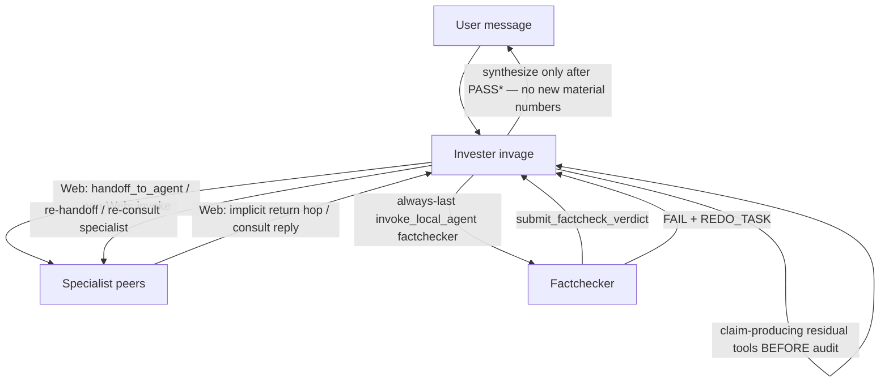
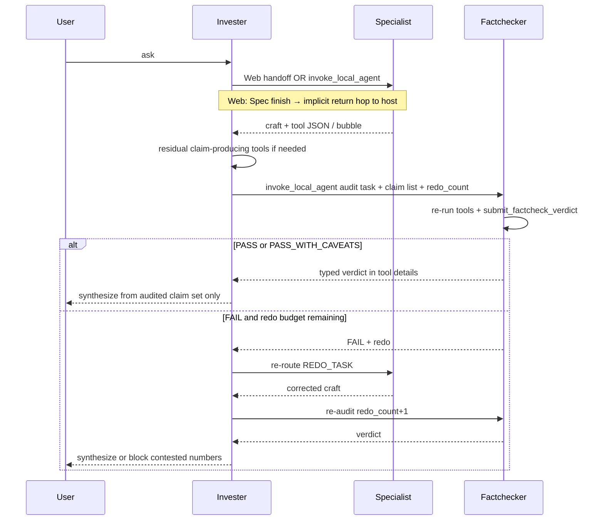

# Factchecker Agent — Wallet Street (Invage)

| Field | Value |
| --- | --- |
| **Title** | Factchecker agent for multi-local Wallet Street |
| **Author** | _(TBD)_ |
| **Date** | 2026-08-09 |
| **Status** | Implemented 2026-08-09 (design + code; no PR split) |
| **Product (WebUI)** | **Wallet Street** (`src/webapp/invage-webui.ts` → `productName: 'Wallet Street'`) |
| **Repo** | `/Users/zhengqingqiu/projects/invage` |
| **Permanent home** | `docs/plans/2026-08-09-factchecker-agent-design.md` |
| **Codebase verified against** | `src/index.ts`, `src/extension.ts`, `src/tools/index.ts`, `src/tools/{portfolio,household,projection,snapshot,payment_plan}.ts`, `src/agents/*`, `src/agents/help-first.ts`, `src/credit-rates.ts`, utarus `handoff-config.ts` / `handoff-harness.ts` / `local-agents.ts` / plan+handoff tools, peer design `docs/plans/2026-08-08-investment-expert-agent-design.md` |
| **Related** | `docs/data-model.md`, `docs/plans/2026-08-09-financial-database-ledger-design.md`, `docs/plans/2026-08-04-case-rehearsal-stakeholder-council-design.md` (do **not** merge factcheck into council) |
| **Revision** | 2026-08-09 r3 — Web invoke allowlist exception, multi-peer return ladder, journal n/a, verdict matrix |

---

## Overview

Wallet Street (Invage) is a multi-local Utarus host: **Invester** (`invage`) is the default orchestrator; specialists **Bookkeeper**, **FinancialPlanner**, **InvestmentAdvisor**, and **RealEstateExpert** own domain craft. User-visible numbers arrive through a mix of deterministic engines, live market tools, scraped pages, and LLM narrative. Accuracy is the product's top priority, but today nothing systematically re-checks peer output before the host synthesizes a final answer.

This design adds a fifth peer — **Factchecker** (`factchecker`, `@Factchecker`) — a **tool-backed auditor**, not a second storytelling specialist. Invester's purpose encodes an **always-last** workflow rule: after specialist craft and any **claim-producing** residual host tools, **audit before final synthesis**. Factchecker submits a typed **PASS / FAIL / PASS_WITH_CAVEATS** verdict (domain tool `submit_factcheck_verdict`) and may attach a **REDO_TASK**. Soft power for loop control in v1: host re-routes REDO; max redo is **channel-aware** and fits real hop accounting (implicit returns count). Hard harness gate of the final user answer is optional later (utarus).

**Recommended approach:** DomainExtension peer pattern as InvestmentAdvisor; `createFactcheckerTools()` **exact-name** read-only allowlist + `submit_factcheck_verdict`; **Web: specialists via handoff, Factchecker via `invoke_local_agent`** (avoid hop burn and implicit-return thrash); Telegram/Slack: sequential consults; purpose rewrites that override utarus implicit-return inject; no harness fork for v1 soft power.

---

## Background & Motivation

### Current multi-local layout (as of code)

| Agent | id | label (@mention) | LLM default | Tool factory |
| --- | --- | --- | --- | --- |
| Invester (host) | `invage` | Invester | `daily` | `createInvageTools()` residual only |
| Bookkeeper | `bookkeeper` | Bookkeeper | (host default — unset) | `createBookkeeperTools()` writes + books |
| FinancialPlanner | `financial-planner` | FinancialPlanner | `heavy` | `createFinancialPlannerTools()` |
| InvestmentAdvisor | `investment-advisor` | InvestmentAdvisor | `heavy` | `createInvestmentAdvisorTools()` |
| Real Estate Expert | `real-estate-expert` | RealEstateExpert | `heavy` | `createRealEstateExpertTools()` |

Registration: `src/index.ts` → `createFramework({ defaultAgentId: 'invage', agents: [...] })`. Labels must be single `@` tokens (`[A-Za-z0-9_-]+`); no spaces.

### Orchestration today

```
Route → Handoff (Web) / Consult (non-Web or short) → Residual host tools → Synthesize
```

| Path | Mechanism | Limits (utarus) |
| --- | --- | --- |
| Web, `UTARUS_AGENT_HANDOFF=true` | `handoff_to_agent` (+ optional `upsert_plan`) | `HANDOFF_MAX_HOPS = 8`, `HANDOFF_MAX_EDGE_REPEATS = 3`, `HANDOFF_MAX_CHAIN_MS = 10 min` |
| Telegram / Slack / short same-bubble / task runner | `invoke_local_agent` | `MAX_LOCAL_CONSULT_DEPTH = 1` (no nested consult; sequential consults in one turn OK) |

**Harness fact (critical):** every pending handoff — including **implicit return** specialist → host when the specialist finishes without `handoff_to_agent` — increments `hop_index` (`node_modules/utarus/src/webapp/chat/handoff-harness.ts` ~131–168, ~200–244). Implicit-return task text tells the host to *synthesize NOW* and *not start another peer hop unless the deliverable is missing* (`handoff-harness.ts` ~150–158). Caps from `handoff-config.ts`: `HANDOFF_MAX_HOPS = 8`, `HANDOFF_MAX_EDGE_REPEATS = 3`, `HANDOFF_MAX_CHAIN_MS = 10 * 60 * 1000`.

Selection rule (project + purpose): **intent + capability fit** from descriptions — **no keyword/synonym tables**.

Fact grounding already exists in `INVAGE_PURPOSE`: user-visible facts from peer/tool output only. That is necessary but not sufficient — peers can still mis-read tool JSON, transpose balances, or invent synthesis glue **after** audit if host adds new numbers.

### Number trust classes (problem surface)

| Class | Examples | Error mode | Factchecker posture |
| --- | --- | --- | --- |
| **A** Deterministic tools | `build_payment_plan` / `optimize_payment_plan`, `run_projection`, amortize, ledger balances, journal lines | Peer mis-summarizes tool output; arithmetic in prose | **Re-run tool** with same inputs; compare key fields |
| **B** Live market | `get_quote`, analyzer marks / multiples | Stale mark, wrong ticker, unit mix | Re-quote / re-analyze this turn; **fixed** drift band (see §5) |
| **C** Scraped facts | duties, filings, news via Firecrawl / `property_intel` | Wrong page, outdated policy | Re-fetch when claim is material; label as scrape class |
| **D** LLM narrative of A–C | "your debt-free date is …" without tool field | Highest error rate | Flag any material number not grounded in this-turn tool output |
| **E** Judgment / recommendation | BUY language, plan preference among valid options | Not pure fact | **Do not** re-litigate taste; only check supporting numbers |

### Pain points

1. Multi-peer chains have **no final integrity pass**.
2. Host synthesis can invent glue numbers while stitching peer bubbles — including **after** a naive audit if synthesis is unscoped.
3. Specialists say "tool-before-claim," but nothing independent forces redo.
4. Case Rehearsal / Stakeholder Council is multi-seat *opinion*, not audit — do not merge.

---

## Goals & Non-Goals

### Goals

1. Add **Factchecker** as a first-class multi-local peer (DomainExtension scaffolding).
2. Orchestrator **always places Factcheck before final user synthesis** when claim-producing work ran (workflow rule — not keywords).
3. Factchecker submits a **typed verdict** + optional **REDO_TASK**; host re-routes on FAIL within **channel-aware** redo budgets that fit hop reality.
4. Prefer **re-running tools** over re-reading prose alone; host should pass **structured claim lists** from peer tool JSON when available.
5. Fit **real** hop accounting (implicit returns count); Web Factcheck is **consult**, not handoff (see KD 16).
6. Factchecker **cannot nested-invoke** specialists (`MAX_LOCAL_CONSULT_DEPTH = 1`); redo always through Invester.
7. Implementable with Invage DomainExtension + purpose + tools + tests only for v1 soft loop control (no utarus harness hard gate).
8. Fail-fast / no silent fallbacks; verify data model first (YAML users + optional books DB).

### Non-Goals (v1)

| Non-goal | Why |
| --- | --- |
| Case Rehearsal / Stakeholder Council seats | Separate design; audit ≠ debate |
| Tax / licensed advice as advice | Hard out of scope product-wide |
| Inventing missing numbers when tools fail | Fail-fast / ask / REDO |
| Hard harness block of final answer without factcheck | Optional later (PR7 / utarus) |
| Nested specialist consults from Factchecker | Depth-1 limit |
| New PostgreSQL schema for audit log | Chat + tool details only |
| Full re-optimize of every payment plan on Factchecker | Cost; pinned `build_payment_plan` |
| Second InvestmentAdvisor / planner persona | Auditor only |
| Keyword/synonym trigger tables | Project rule |
| `family-treasury` / craft skills on Factchecker skill catalog | Scope creep; re-run tools without craft recipes |
| `list_snapshots` on Factchecker | Optional later; not primary audit path |
| Raising `HANDOFF_MAX_HOPS` in utarus | Out of Invage-only v1 |

---

## Proposed Design

### 1. Identity

| Field | Value |
| --- | --- |
| Agent id | `factchecker` |
| Label | `Factchecker` |
| Mention | `@Factchecker` (single token — WebUI `@${label}` + room parser `[A-Za-z0-9_-]+`) |
| Display prose | "Factchecker" (no spaces in label) |
| LLM routing | **`{ default: 'daily' }`** (+ empty heavy heuristics) |
| Billing / webUi | None (host owns shell + credits) |
| Skills | **`fact-audit` only** (v1) |

**LLM rationale:** careful claim-vs-tool compare (class A–D) → same class as FP/IA → **heavy**. Host stays **daily**. Cost accepted for accuracy; see Risks.

### 2. Sole responsibility

**In scope**

- Audit **claim sets** from: peer results this chain, residual host **tool** outputs, and the **draft bullets Invester will use** in final synthesis (host must put claim list in the FC task).
- Re-run read-only domain tools for class A–C.
- Classify A–E; call `submit_factcheck_verdict` every audit turn.
- Propose REDO_TASK for host; brief caveats; no product essay.

**Out of scope**

| Need | Owner |
| --- | --- |
| Journal / books write | `@Bookkeeper` via host redo |
| Payment plan craft | `@FinancialPlanner` |
| Thesis / discovery craft | `@InvestmentAdvisor` |
| Property research craft | `@RealEstateExpert` |
| Playbook wizard | Invester residual |
| Final product voice | Invester |
| Council seats | Separate design |
| Class E taste when numbers match | Not FAIL |
| Re-auditing freeform host prose **after** synthesis | v1 limit — prevent via “no new material numbers after PASS” |

### 3. Architecture (placement)





### 4. Tools surface — `createFactcheckerTools()`

**Principle:** explicit allowlist of **exact tool names** (InvestmentAdvisor tests use set/length equality). No mutations. Prefer re-running engines over trusting peer prose.

#### Exact domain tool name set (v1) — **18 tools (17 read + `submit_factcheck_verdict`)**

| # | Tool name | Factory / export | Audit use |
| --- | --- | --- | --- |
| 1 | `get_portfolio` | `createGetPortfolioTool()` | Class A holdings/cash/deposits |
| 2 | `list_journal_entries` | `createListJournalEntriesTool()` from `src/tools/portfolio.ts` (import in PR1; optional re-export from `index.ts`) | Class A journal / reconcile — **conditional call** (see books-DB policy below) |
| 3 | `get_household` | via `createHouseholdReadTools()` | Household snapshot |
| 4 | `get_treasury` | via `createHouseholdReadTools()` | Reporting currency |
| 5 | `list_cash_flows` | via `createHouseholdReadTools()` | Cash-flow lines |
| 6 | `get_projection_assumptions` | via `createHouseholdReadTools()` | Assumption claims |
| 7 | `get_playbook` | `createGetPlaybookTool()` | Caps / constraints |
| 8 | `get_scenario` | via `createProjectionReadTools()` | Named scenario |
| 9 | `list_scenarios` | via `createProjectionReadTools()` | Scenario inventory |
| 10 | `run_projection` | via `createProjectionReadTools()` | Class A projection |
| 11 | `compare_scenarios` | via `createProjectionReadTools()` | Scenario deltas |
| 12 | `get_quote` | `createQuoteTool()` | Class B marks |
| 13 | `portfolio_analyzer` | `createPortfolioAnalyzerTool()` | Class A/B metrics |
| 14 | `build_payment_plan` | `createPaymentPlanTool()` | Class A re-pin plan |
| 15 | `estimate_opportunity_cost` | `createOpportunityCostTool()` | Class A SOFT cost |
| 16 | `property_intel` | `createPropertyIntelTool()` | Class C comps/duties |
| 17 | `ura_carpark` | `createUraCarparkTool()` | Class C carpark |
| 18 | `submit_factcheck_verdict` | **new** Invage tool (this design) | Typed verdict submission |

**Composition sketch:**

```ts
export function createFactcheckerTools(): AgentTool[] {
  return [
    createGetPortfolioTool(),
    createListJournalEntriesTool(),
    ...createHouseholdReadTools(), // get_household, get_treasury, list_cash_flows, get_projection_assumptions
    createGetPlaybookTool(),
    ...createProjectionReadTools(), // get_scenario, list_scenarios, run_projection, compare_scenarios
    createQuoteTool(),
    createPortfolioAnalyzerTool(),
    createPaymentPlanTool(), // build_payment_plan only
    createOpportunityCostTool(),
    createPropertyIntelTool(),
    createUraCarparkTool(),
    createSubmitFactcheckVerdictTool(),
  ];
}
// tests: expect(names).toHaveLength(18) and exact set equality
```

**PR1 import note:** `createListJournalEntriesTool` lives in `src/tools/portfolio.ts` and is not currently re-exported from `src/tools/index.ts`. Either import from `./portfolio.js` inside `createFactcheckerTools` or re-export from `index.ts`.

#### `list_journal_entries` when books DB is unset (false-FAIL policy)

Tool fails with *“Books of record not configured (set INVAGE_BOOKS_DATABASE_URL)”* when `!isBooksEnabled()` (`src/tools/portfolio.ts`). YAML-only households are common.

| Rule | Behavior |
| --- | --- |
| When to call | Only if (a) claim set / host task mentions journal, reconcile, double-entry, books DB, or (b) host task explicitly sets `books_journal_expected: true` |
| When not to call | YAML portfolio / household / plan claims with no journal assertion — use `get_portfolio` / `get_household` only |
| Tool returns “not configured” | Treat journal class as **n/a** — do **not** FAIL the whole audit solely for missing `INVAGE_BOOKS_DATABASE_URL` |
| Peer asserted journal facts but DB unset | **PASS_WITH_CAVEATS** (or FAIL that finding as unverified journal claim) — never invent journal lines |
| Books enabled + journal claims | Re-run `list_journal_entries`; mismatch → normal FAIL path |

Encode in Factchecker purpose + `fact-audit` KB + tests that purpose mentions conditional journal use.

#### Explicitly **not** on Factchecker (v1)

| Tool / set | Decision |
| --- | --- |
| All Bookkeeper writes (`add_holding`, `set_cash`, `transfer_cash`, journal posts, property payment writes, scenario mutations, `save_snapshot`, …) | Denylist |
| `update_playbook`, `save_report`, `send_report` | Denylist |
| `optimize_payment_plan` | Denylist v1 — re-pin with `build_payment_plan`; FAIL if optimize fields missing |
| `list_snapshots` / `createSnapshotReadTools()` | **Exclude v1** — not primary path; promote later if snapshot claims matter |
| `assert_numeric_claims` pure helper | Deferred v1.1 |

#### Framework-injected tools (present on every local agent; not in domain factory)

| Tool | Factchecker rule |
| --- | --- |
| `list_local_agents` | Rarely needed |
| `invoke_local_agent` | **Purpose forbid** for specialist craft (depth-1 hard fail if nested anyway) |
| `handoff_to_agent` | Prefer finish in place after verdict; may return to host only; **never** hand off to craft peers |
| `upsert_plan` / plan tools | Host only (utarus enforces host-only upsert) |
| Firecrawl, KB, BinDrive, `create_task`, … | Firecrawl only for class C re-verify; **no** help-first deferred craft essays |

Purpose forbid for craft invoke/handoff is **soft** beyond depth-1 — note in Security.

#### `submit_factcheck_verdict` (new domain tool)

Typed, fail-fast validation of enum/required fields. Returns `details` the **host LLM can ground on** without freeform markdown parsing. Still **soft power** for whether host obeys (no harness gate).

| Param | Type | Notes |
| --- | --- | --- |
| `status` | enum `PASS` \| `FAIL` \| `PASS_WITH_CAVEATS` | required |
| `claims_checked` | number ≥ 0 integer | required |
| `claims_failed` | number ≥ 0 integer | required; bounds depend on status (matrix below) |
| `findings` | array of `{ claim, found, severity, trust_class }` | required (may be `[]` on trivial PASS) |
| `redo` | `null` or `{ target, task, reason }` | nullability depends on status (matrix below); **always pass key** — omit field → tool error |
| `caveats` | `string[]` | **Required array always** — pass `[]` when none; **omit → tool error** (no silent default) |
| `user_safe_summary` | string (non-empty) | 1–3 sentences, no tool names |
| `redo_count_seen` | number ≥ 0 integer | host-supplied count from task (echo) |

#### Validation matrix (fail-fast — implement in tool + tests)

| `status` | `claims_failed` | `redo` | `caveats` | Notes |
| --- | --- | --- | --- | --- |
| `PASS` | **must be 0** | **must be `null`** | `[]` or non-empty minor notes discouraged — prefer empty | No blockers |
| `PASS_WITH_CAVEATS` | **must be 0** | **must be `null`** | **must be non-empty** (`length ≥ 1`) | Caveats carry the “with caveats” meaning; no REDO |
| `FAIL` | **must be ≥ 1** | **must be non-null** object with non-empty `target`, `task`, `reason` | `[]` or list OK | Host may still skip redo if hop budget exhausted |

Any other combination → tool returns error (do not invent fixed-up verdict). Factchecker purpose: a successful audit turn **must** call this tool before ending; prose-only verdict is incomplete.

Markdown `### FACTCHECK_VERDICT` block remains **optional** human mirror of the tool args for the room; tool is source of truth.

### 5. Structured verdict semantics

| Status | Meaning | Orchestrator action |
| --- | --- | --- |
| **PASS** | Material claims grounded; re-runs match | Synthesize from **audited claim set only**; no redo |
| **PASS_WITH_CAVEATS** | No blockers; minor issues (`claims_failed=0`, `redo=null`, caveats non-empty) | Synthesize + surface caveats |
| **FAIL** | ≥1 blocker/material mismatch (`claims_failed≥1`, non-null `redo`) | If redo budget + hop headroom → route `redo`; re-audit. Else **block contested numbers** (see §8/§9) |

#### Tolerances (pinned purpose/KB — single B rule; not code silent defaults on money)

| Class | Match rule |
| --- | --- |
| A | Exact match on tool-returned integers/cents; FX only via tool reporting currency |
| B | **Single rule:** relative drift ≤ **0.5%** of re-fetched mark → `PASS_WITH_CAVEATS` (label drift + both prices/timestamps). Drift **> 0.5%** → FAIL if peer presented mark as current live without time context, else PASS_WITH_CAVEATS "mark moved." Peer who claimed an **exact** stale print as live → FAIL |
| C | Re-fetch; unavailable → FAIL or PASS_WITH_CAVEATS "unverified this turn" — never invent |
| D | Material $/%/date not in tool/peer structured fields this chain → FAIL |
| E | Supporting numbers only |

**Host task quality (reduces D false variance):** when building the FC `invoke_local_agent` task, Invester **must** include a **structured claim list** extracted from peer/residual **tool details** (fields + values), not only peer prose. Prefer copy-through of tool numbers.

**Fail-fast:** re-check tool errors → FAIL or PASS_WITH_CAVEATS with error in findings — never silent PASS. Exception: books-DB unset on `list_journal_entries` → n/a per §4 policy (not automatic whole-audit FAIL).

### 6. Orchestration contract

#### Always-last rule (workflow, not keywords)

```
Route → Specialist handoff/consult (by capability) → Residual claim-producing host tools → Factcheck (always last) → Synthesize (only after verdict; no new material numbers)
```

Capability of Factchecker = **integrity audit of claims about to be shown in the host final answer**.

**Always-last means after all planned craft specialists complete**, not after the first peer return on a multi-step plan.

#### Peer-return ladder (single ordered rule — inject override + multi-peer)

On every return from a peer (explicit handoff back or **implicit return** inject), host must follow this ladder **in order** — do not jump to Factcheck or final synthesize early:

| Step | Condition | Action |
| --- | --- | --- |
| **1. Continue craft** | Plan / user intent still has remaining craft specialists (capability fit) | `handoff_to_agent` (Web) or `invoke_local_agent` (non-Web) to **next** peer. **Do not Factcheck. Do not final-synthesize.** Intermediate specialist bubbles may stay provisional. |
| **2. Residual claims** | All craft done (or no peer craft); residual claim-producing host tools still needed | Run residual tools **now** (before audit) |
| **3. Factcheck** | Material claims will be user-visible; no PASS*/PASS_WITH_CAVEATS yet this chain for this claim set | **`invoke_local_agent` → Factchecker** with structured claim list + `redo_count` |
| **4. Synthesize / skip** | PASS* received, or skip policy allows | Final user answer from **audited claim set only**; or pure chitchat path |

**Redefine deliverable:** for material-claim chains, deliverable = **audited synthesis** after step 3. Inject text *“Synthesize NOW… do not start another peer hop unless the deliverable is missing”* is overridden as follows:

- Deliverable is **missing** until step 3 completes (or explicit skip).
- **Continuing to the next craft peer (step 1) is not optional thrash** — it is required plan completion; inject must not force synthesize after the first specialist.
- **Factcheck (step 3) uses `invoke_local_agent`**, not `handoff_to_agent`, so it is not “another peer hop” in the harness sense — but purpose must still forbid final synthesize before step 3.

Optional later utarus ask: soften inject when multi-local audit peers exist — Open Q7 / hard-gate PR; not a silent v1 dependency.

#### Conflict with utarus implicit-return inject

**Problem:** After a specialist finishes on the handoff harness, utarus injects (approx.): *Synthesize a clear user-facing answer from it NOW… Do not start another peer hop unless the deliverable is missing* (`handoff-harness.ts` ~150–158). Combined with today’s *invoke only for short lookups* allowlist, host will skip full Factcheck.

**Resolution:** Use the **peer-return ladder** above as the sole override text in purpose (copy the ladder into HANDOFF step 5 and the inject-override paragraph). Do not use a shortened “if material claims → Factcheck immediately” one-liner without step 1 (plan continuation).

#### Transport: Web vs Telegram/Slack (KD 16)

| Leg | Web (`UTARUS_AGENT_HANDOFF=true`) | Telegram / Slack / task runner |
| --- | --- | --- |
| Specialist craft | **`handoff_to_agent`** preferred (own bubble) | **`invoke_local_agent`** |
| Factcheck (always-last) | **`invoke_local_agent`** — **explicit long-consult exception** to the short-lookup allowlist | **`invoke_local_agent`** sequential after all craft |
| Specialist redo | **`handoff_to_agent`** if hop headroom ≥ 2 | **`invoke_local_agent`** |
| Re-audit after redo | **`invoke_local_agent`** Factchecker | **`invoke_local_agent`** |
| Direct `@Factchecker` | User may handoff/mention for visible FC bubble; still no nested craft | Consult works as direct |

**Why not handoff Factchecker on Web?** Counting **implicit returns**, handoff FC costs 2 hops per audit (host→FC, FC→host). Happy path single specialist becomes 4 hops; one full redo+re-audit needs ~8 and sits **at cap** with **no** second redo under policy; multi-peer (BK+FP) uses 6 hops before first audit if FC is also handoff. Consult-for-factcheck keeps audit off the hop counter.

**Web invoke allowlist (must change with KD 16):** Today `HANDOFF_ORCHESTRATION` says use `invoke_local_agent` **only** for (a) short same-bubble lookups, (b) Telegram/Slack, (c) task runner. That **forbids** full Factcheck consult on Web. Implementation **must** expand to:

> **Still use `invoke_local_agent` for:** (a) short one-shot lookups that must stay inside your same bubble; (b) Telegram/Slack (no handoff harness); (c) scheduled task re-runs; **(d) always-last Factchecker audit** — full claim-list consult via `invoke_local_agent` target `factchecker` / `Factchecker` after craft completes (not a “short lookup”; not optional when material claims exist).

Craft peers remain **handoff-preferred** on Web. Factcheck is the intentional long consult exception — not a license to DIY specialist craft via invoke.

#### Hop budget policy (implicit returns counted)

Constants: `HANDOFF_MAX_HOPS = 8`, `HANDOFF_MAX_EDGE_REPEATS = 3`.

**Worked example A — single specialist, consult Factcheck, max 1 redo (Web)**

| Step | Edge / action | hop_index after | Notes |
| --- | --- | --- | --- |
| Host → Spec | handoff | 1 | |
| Spec → Host | **implicit return** | 2 | inject says synthesize NOW — **override** |
| Host → FC | `invoke_local_agent` | **2** (unchanged) | audit |
| FAIL → Host → Spec | handoff redo | 3 | |
| Spec → Host | implicit return | 4 | |
| Host → FC | invoke re-audit | **4** | |
| Host synthesizes | — | 4 | Hops remain for another cycle (~6 after a second re-audit), but **v1 Web policy forbids a second full redo** — on further FAIL, block contested numbers / fail-fast UX |

**Worked example B — multi-peer BK + FP, consult Factcheck, at most 1 redo**

| Step | Edge / action | hop_index after | Notes |
| --- | --- | --- | --- |
| Host → Bookkeeper | handoff | 1 | |
| BK → Host | implicit return | 2 | Ladder step 1: **next peer FP**, not Factcheck |
| Host → FinancialPlanner | handoff | 3 | |
| FP → Host | implicit return | 4 | Craft complete → ladder 2–3 |
| Host → FC | invoke | 4 | |
| FAIL → Host → FP (redo) | handoff | 5 | only if remaining hops ≥ 2 |
| FP → Host | implicit return | 6 | |
| Host → FC | invoke re-audit | 6 | |
| Second full redo | — | — | **Forbidden by Web policy** (and hop risk) |

**Worked example C — four craft specialists (BK+FP+IA+RE), consult Factcheck**

| Step | hop_index after |
| --- | --- |
| Four × (host→spec + implicit return) | **8** |
| Host → FC | invoke still OK (no hop) |
| Specialist redo | **Impossible** — hop_index already at cap |

**Rule:** Web may attempt specialist redo **only if estimated remaining hops ≥ 2** (outbound handoff + implicit return). If craft already used ≥6–7 hops (or hop_index would hit 8 mid-redo), on FAIL **skip redo** and apply exhausted-budget UX (block contested numbers). Prefer not starting 4-handoff craft chains without a plan that accepts zero redo headroom; optional later: consult some craft legs on huge multi-peer asks (out of v1).

**If Factcheck were handoff (rejected for default Web path):**

| Step | hop after |
| --- | --- |
| Host→Spec, Spec→Host, Host→FC, FC→Host | 4 |
| + redo Spec round-trip + FC round-trip | **8** at cap — second redo impossible |

#### Redo budget (channel-aware) — KD 18

| Channel | Max full FAIL→specialist→re-audit cycles | Rationale |
| --- | --- | --- |
| **Web handoff chain** | **1** default, and only if **remaining hops ≥ 2**; multi-peer / four-specialist may have **0** redo headroom | Fit hop table; never thrash into max-hops stop mid-REDO |
| **Telegram/Slack consult** | **2** | No hop_index; sequential invoke only; still wall-clock + cost |
| **Edge `invage→same-peer`** | 3rd identical edge without `upsert_plan` version bump stops chain (`EDGE_REPEATS=3`) | REDO tasks must be distinct; bump plan version on multi-step redo |

**Tracking redo_count (soft but explicit):** host includes `redo_count: N` in every FC task (0 first audit). Factchecker echoes via `redo_count_seen` on `submit_factcheck_verdict`. No durable counter outside plan notes / task text in v1 — **best-effort LLM compliance**; tool makes status machine-readable.

**REDO enforcement honesty:** typed verdict **improves** host grounding vs freeform markdown only; **loop control remains purpose-level** (same class of risk as any soft orchestration). Tests lock purpose language + tool contract; optional PR6 fixtures for claim compare helpers. Document: *REDO is best-effort until PR7 hard gate.*

#### Skip policy (capability check, not keywords) — Issue 16

| Case | Skip Factcheck? |
| --- | --- |
| No peer craft, no residual claim-producing tools, and planned host reply has **no** user-visible portfolio/household/projection/market/plan fields | Yes (pure chitchat / meta) |
| Any peer tool result or residual `run_projection` / household / portfolio / quote / plan field will be user-visible | **Never skip** |
| Tool/handoff hard error before any claim | Skip; surface error |
| After PASS*/PASS_WITH_CAVEATS this chain | Skip second audit unless new claims added |
| User @-only specialist, no host synthesis | Host may skip; if host later synthesizes material claims → Factcheck then |

**Default rule:** if **any** peer tool result or residual projection/household/portfolio/market/plan field will be user-visible, factcheck. Do **not** implement a synonym list for "verify".

#### Residual-only path (no specialist)

```
User ask → residual host tools (playbook / get_household / run_projection) → Factcheck via invoke → Synthesize
```

Same always-last rule. Flowchart is not specialist-only.

#### No new material numbers after PASS (synthesis contract)

v1 Factchecker audits the **claim set in the FC task** (peer + residual tool fields + host draft bullets), **not** freeform prose the host invents later.

**Hard host rule:** after PASS / PASS_WITH_CAVEATS, final synthesis **must not introduce new material $ / % / dates / balances** that were not in the audited claim set or in tool details already attached to that set. If host needs new residual numbers, run tools **and re-invoke Factchecker** (counts as new audit; redo_count resets only if claim set is new — prefer `redo_count: 0` with note `reason: new_claims`).

Known residual risk if host violates this: uncaught invention — mitigated by purpose + tests, not harness.

#### Multi-peer + `upsert_plan`

- One Factcheck at **end** (not after every peer) — **peer-return ladder step 1** continues craft until plan specialists complete.
- Plan final step: `factcheck — invoke factchecker — audit claim list from prior steps`.
- On FAIL: reopen owning specialist step **only if remaining hops ≥ 2**; else block contested numbers; re-open factcheck after redo; **bump plan version** if edge_repeat risk.
- Four craft handoffs may leave **zero** redo headroom (example C) — plan must accept that.
- Host sole `upsert_plan` caller.

#### Exact INVAGE_PURPOSE / HANDOFF_ORCHESTRATION edit map (§13 detail)

| Region in `src/extension.ts` | Change |
| --- | --- |
| `SPECIALIST_TABLE` | Add Factchecker row: id `factchecker`; capability = integrity audit of material claims before final host answer; tools re-run; `submit_factcheck_verdict`; does not craft plans/theses |
| `HANDOFF_ORCHESTRATION` (handoff ON) **steps 1–5** | Step 5 = **peer-return ladder** (continue craft → residual → Factcheck invoke → synthesize). Never Factcheck mid multi-peer craft. |
| **`Still use invoke_local_agent` paragraph (~line 59)** | **Must expand** from only (a)(b)(c) to include **(d) always-last Factchecker full audit consult** on Web. Craft peers stay handoff-preferred. Without this row, KD 16 is unimplementable. |
| Implicit-return override paragraph (new) | Paste **peer-return ladder** (not “Factcheck immediately if any claims”). Deliverable = audited synthesis after all craft. |
| Non-handoff `HANDOFF_ORCHESTRATION` branch | Sequential consult **all** craft specialists then Factchecker then synthesize |
| `INVAGE_PURPOSE` **Workflow every turn** | `Route → Specialist(s) → Residual claim-producing tools → Factcheck → Synthesize` |
| **Success** bullet | Success requires Factcheck PASS* (or explicit skip) when material claims; peer result alone is not success |
| Return-from-peer rule (~line 121) | Replace immediate synthesize with **peer-return ladder**; do not stop after promising re-pull without tools |
| Residual host section | Claim-producing residual tools **before** Factcheck; never after PASS |
| Fact grounding rule | + no new material numbers after PASS |
| `investorContextPrefix` enrichMessage (~line 185) | **Rewrite** “invoke_local_agent only for short same-bubble consults” → invoke allowed for **Factcheck always-last** + task-runner sequential consults; craft on Web still handoff-preferred; no invent after audit |
| `HELP_FIRST` task templates (**PR3**) | Scheduled jobs: consult specialist(s) **then** Factchecker before user-facing result |

**Orchestrator tests (PR3):** assert purpose text **allows** `invoke_local_agent` + Factchecker for audit (e.g. match `/invoke_local_agent/` near Factcheck / always-last / `(d)`), **not** merely that the string `invoke_local_agent` appears somewhere while still saying “only short lookups.”

### 7. Web vs Telegram / Slack paths (summary)

| Channel | Specialist | Factcheck | Redo specialist |
| --- | --- | --- | --- |
| Web handoff ON | handoff | **invoke** | handoff (≤1 full cycle) |
| Telegram/Slack | invoke | invoke | invoke (≤2 cycles) |
| Task runner | invoke (host re-run) | invoke after specialist | same |

### 8. Help-first, provisional bubbles, FAIL-block (product rules)

1. **Specialist craft bubbles (Web)** may show provisional numbers immediately; they are **not** the final product voice.
2. **Host final voice** only after Factcheck PASS / PASS_WITH_CAVEATS (when material claims). Optional one-liner while consulting FC: "Re-checking numbers against books/tools…"
3. **FAIL after redo budget exhausted:** **block** contested material numbers (do not present them as fact). Still help-first for **non-numeric** next steps: what failed, what is missing, one clarifying ask, or schedule a re-run — **never invent** corrected figures.
4. **Factchecker purpose must NOT** append full `HELP_FIRST_AND_ASYNC_TASKS` unchanged. Tailor a short **auditor help-first**: fail clearly, one ask if blocked, no invent, no deferred craft essay, no payment-plan recipes. Task creation is host/specialist domain; FC may suggest host schedule re-check but does not own planner craft.
5. **PR3** updates shared task instruction examples: *Consult specialist(s) via invoke_local_agent; then consult factchecker with claim list; only then write user-facing result.*

### 9. Product UX

| Surface | Behavior |
| --- | --- |
| Web specialist bubbles | Provisional; user may see wrong numbers briefly until host final |
| Host final | After PASS*; caveats on PASS_WITH_CAVEATS; block contested numbers on exhausted FAIL |
| Web Factcheck default | Consult (no dedicated FC bubble) unless user `@Factchecker` |
| Telegram/Slack | Host line: numbers re-checked; no schema dump |
| `@Factchecker` direct | Allowed; audits last claim set / user-pasted claims; REDO still via **host only** (FC does not invoke specialists) — KD 19 |

### 10. Skills + agent KB seed

#### Skills (v1)

| Skill id | Role |
| --- | --- |
| `fact-audit` only | Trust classes, tolerances, verdict tool, redo protocol, anti-storytelling, claim-list discipline |
| **Not** `family-treasury`, `payment-planning`, `investment-analysis`, `playbook-setup` | Avoid craft recipe pull-in; projection/books re-check via tools alone |

Framework Firecrawl remains available for class C.

#### Agent KB (`kb-seed/agents/factchecker.yaml`)

1. Hard rules (tool re-run; must call `submit_factcheck_verdict`; never invent; no nested specialist)  
2. Trust class matrix + **pinned B 0.5%** rule  
3. Verdict tool params + validation matrix (PASS / PASS_WITH_CAVEATS / FAIL)  
4. Exact tools map + denylist + **conditional `list_journal_entries` / books DB n/a**  
5. REDO_TASK templates per target  
6. Not-a-FAIL (class E; minor B caveats; books DB unset without journal claims)  
7. Multi-peer end-only checklist (Factcheck only after all craft)  
8. Return control / finish after verdict  

Seed: add `factchecker` to `AGENTS` in `scripts/seed-agent-kb.mjs`.

### 11. enrichMessage

`` `${prefix}\n\n${ctx.text}` `` — never drop user text.

Prefix: slug/display name; holdings count; open liability count; cash hint; channel ids; **read-only**; **re-run tools**; **must submit_factcheck_verdict**; **no nested specialist**; **no product synthesis essay**; **no full help-first task recipes**.

### 12. Factchecker purpose — implementation checklist (PR1)

Near-final structure (author full purpose string in **PR1** from §2/§4/§5/§6; tests lock regexes):

1. Identity: Factchecker auditor on Wallet Street / Invester host — not advisor/planner/bookkeeper.  
2. Sole job: re-run tools vs claim list; submit typed verdict.  
3. Must call `submit_factcheck_verdict` every audit; validation matrix §4.  
4. Trust classes A–E + pinned B 0.5% rule.  
5. **`list_journal_entries` conditional** — n/a if books DB unset and no journal claims (do not whole-audit FAIL).  
6. FAIL fills `redo`; do not `invoke_local_agent` / handoff craft peers.  
7. Out of scope table (writes, craft, tax, invent, council).  
8. Voice: terse forensic CFO.  
9. Tailored auditor help-first (clear fail / one ask / no invent) — **not** full `HELP_FIRST_AND_ASYNC_TASKS`.  
10. Agent KB: `search_kb` on complex multi-claim audits.  

**Test regexes (minimum):** `/Factchecker/i`, `/submit_factcheck_verdict/`, `/PASS/`, `/FAIL/`, `/PASS_WITH_CAVEATS/`, `/0\.5%|0.5 percent/`, `/list_journal_entries|journal/`, `/never invent|Never invent/i`, `/invoke_local_agent/` (forbid nested craft), `/redo/i`, `/Tool-before-claim|re-run/i`.

### 13. Invester purpose deltas

See **Exact edit map** in §6. Summary: specialist table; HANDOFF steps 4–5; **invoke allowlist (d) Factcheck**; enrichMessage invoke rewrite; **peer-return ladder**; workflow; success; residual-before-factcheck; no numbers after PASS; help-first task templates (**PR3**).

### 14. Wiring checklist

| File | Change |
| --- | --- |
| `src/tools/index.ts` | `createFactcheckerTools()` exact set |
| `src/tools/factcheck_verdict.ts` (new) | `createSubmitFactcheckVerdictTool()` |
| `src/agents/factchecker.ts` | DomainExtension |
| `src/skills/knowledge/fact-audit.md` | Skill body |
| `src/index.ts` | Register peer |
| `src/extension.ts` | Purpose edit map |
| `src/agents/help-first.ts` | Task examples + note Factcheck; **do not** force full HELP_FIRST onto FC purpose |
| `kb-seed/agents/factchecker.yaml` | Seed |
| `scripts/seed-agent-kb.mjs` | `AGENTS` += factchecker |
| `tests/factchecker-agent.test.ts` | Set equality length 18, denylist, purpose, routing, label |
| `tests/invage-orchestrator.test.ts` | always-last, invoke Factcheck, no invent after PASS, implicit-return override language |
| `tests/factcheck-verdict-tool.test.ts` | Fail-fast validation on bad status / FAIL without redo |

**Deploy:** `~/.claude/skills/agent-ops/scripts/fast-deploy.sh` (`--services=invage,invage-drive`).

### 15. Tests contract

| Test | Assert |
| --- | --- |
| Tool set | Exact 18 names; set equality |
| Denylist | No mutations, no optimize, no save_report, no update_playbook, no list_snapshots |
| Verdict tool | Enum validation; FAIL requires redo object; PASS requires claims_failed=0 |
| Purpose FC | Checklist regexes §12; conditional journal / books DB n/a |
| Purpose host | Peer-return ladder; Factcheck only after craft complete; invoke allowlist includes Factcheck (d); no new material numbers after PASS; residual before factcheck |
| Verdict tool | Validation matrix: PASS / PASS_WITH_CAVEATS / FAIL rows |
| llmRouting | `{ default: 'heavy' }` |
| Label | `Factchecker` single token |
| Skills | only `fact-audit` |
| Cross-agent | FC has `list_journal_entries`; no Bookkeeper writes |

### 16. Data model

No schema change. YAML users + optional PG books journal. Verdicts in chat + tool details.

---

## API / Interface Changes

### Registration

```ts
{ id: 'factchecker', label: 'Factchecker', extension: factcheckerExtension }
```

### Tools factory

See §4 exact set (18 tools including `submit_factcheck_verdict`).

### Framework tools

Unchanged injection; purpose forbid craft invoke/handoff from FC.

---

## Data Model Changes

None. Migration N/A. Seed KB via existing script.

---

## Alternatives Considered

| Alt | Description | Pros | Cons | Verdict |
| --- | --- | --- | --- | --- |
| **A. Inline purpose-only on Invester** | Host self-check | Zero hops | Correlated errors | Reject sole |
| **B. Specialist self-check** | Peer end-of-turn audit | Cheap | Correlated; no stitch | Reject sole |
| **C. Harness hard gate** | Block stream without verdict | Strong | utarus change | Defer PR7 |
| **D. Deterministic recompute only** | Pure function | Perfect class A | Weak on prose/C | Helper later |
| **E. Factchecker peer + soft always-last** | This design | Fits architecture | Purpose compliance | **Adopt** with consult transport |
| **F. Merge into Case Council** | Seat | One story | Debate ≠ audit | Reject |
| **G. Consult-only Factchecker (all channels)** | Always `invoke_local_agent` for FC | Avoids hop/implicit-return for audit; simpler | No FC bubble by default | **Adopt for Factcheck leg** (specialists still handoff on Web) |
| **H. Host-owned recompute helper, no peer** | Host tool recompute | No heavy FC agent | Host daily model still narrates; no independent auditor identity | Reject as sole; optional helper later |

**Re-eval of E given hop math:** pure handoff-always-last for FC is **not** feasible with max 2 redos under hop=8 once implicit returns count. **E′ = E + G for the Factcheck leg** is the adopted hybrid.

---

## Security & Privacy Considerations

| Topic | Handling |
| --- | --- |
| Auth / isolation | Same channel resolve; fail-fast |
| Data | Read-only domain tools + typed verdict |
| Framework invoke/handoff | Still present; purpose forbid craft; depth-1 hard stop on nested consult |
| Injection | Verdict tool validates enums; no write tools |
| Secrets | No tool names in `user_safe_summary` |
| Redo thrash | Channel redo caps + edge_repeat + hop cap |

---

## Observability

| Signal | How |
| --- | --- |
| Verdict tool details | `status`, counts, redo_count_seen |
| Staging checklist | Count heavy turns + tool credits with always-last on; sample N sessions for skip-vs-audit |
| Skip detection | Manual transcript review v1; later log if host finalizes without verdict tool in chain |
| Latency / cost | p50/p95 E2E; heavy is 10× daily (`credit-rates.ts`) |
| Rollback | Unregister agent + revert purpose |

---

## Risks

| Risk | Severity | Mitigation |
| --- | --- | --- |
| Host ignores always-last / invents after PASS | High | Purpose override of inject; tests; "no new numbers" rule; PR7 later |
| Soft REDO non-compliance | High | Typed verdict helps; document best-effort; PR6 fixtures; PR7 gate |
| Hop exhaustion multi-peer + redo | Medium | Consult FC; max 1 Web redo; worked examples |
| Latency / heavy cost | High | Skip pure chitchat; no optimize on FC; staging credit checklist |
| False PASS / FAIL | Critical / Medium | Claim list from tool JSON; pinned B 0.5%; fail-fast tools |
| Provisional wrong specialist bubbles | Medium | UX rules; final host blocks contested numbers |
| Scope creep via family-treasury skill | Low | fact-audit only |
| Edge repeat thrash | Medium | Distinct REDO tasks; plan version bump |

---

## Rollout Plan

Aligns with **PR Plan** below (do not use a separate phase numbering for purpose-before-KB).

| Order | Scope | Gate |
| --- | --- | --- |
| Design | This doc r3 | Review closed |
| **PR1** | Tools + verdict + agent + register | vitest (18 tools, validation matrix) |
| **PR2** | KB seed | seed script |
| **PR3** | Host purpose edit map + help-first + invoke (d) | Staging Web + Telegram smoke |
| **PR4** | Docs land under `docs/plans/` | — |
| **PR5** | Verdict / purpose fixtures | vitest |
| **PR6** | Optional utarus hard gate | Product go-ahead |

No dead env flag with silent default. Staging: count heavy turns / tool credits with always-last on.

---

## Success Criteria

1. `@Factchecker` / consult works; typed verdict; no write tools.  
2. Host purpose mandates Factcheck before synthesis for material claims; override implicit-return inject.  
3. Happy path: specialist → invoke FC PASS → host synthesis without new numbers.  
4. FAIL path: one Web redo + re-audit or two consult redos; then block contested numbers.  
5. Exact tool set tests; `list_journal_entries` present.  
6. KB seeds.  
7. No host write regression.  
8. Multi-peer: one end Factcheck; hop examples hold.  
9. Staging: class A mis-summary caught as FAIL.

---

## Key Decisions

| # | Decision | Choice | Rationale |
| --- | --- | --- | --- |
| 1 | Product role | Tool-backed auditor peer | Independent tool re-run + REDO |
| 2 | Identity | `factchecker` / `Factchecker` / `@Factchecker` | Peer pattern; single-token label |
| 3 | LLM | **daily** (not heavy) | Accuracy from tool re-runs + typed verdict; heavy/k3 nested consults caused multi-minute hangs and Web "Connection error: network error" |
| 4 | Power model | Soft loop + **typed** `submit_factcheck_verdict`; hard gate later | Machine-readable status without utarus fork; REDO still best-effort |
| 5 | Placement | Always-last before final synthesis | Product requirement |
| 6 | Skip | Only when no claim-producing work / no user-visible money fields | Accuracy first; capability check not keywords |
| 7 | Redo budget | **Web: max 1** full redo **and only if remaining hops ≥ 2**; else 0; **consult channels: max 2** | Fits hop=8 + consult FC; four-specialist may have zero redo |
| 8 | Tools | Exact **18** domain tools (17 read + verdict); include conditional `list_journal_entries`; exclude snapshots & optimize | Journal audit without YAML-only FAIL noise |
| 9 | Pure verify helper | None beyond verdict submit | Avoid premature assert engine |
| 10 | Verdict format | **Typed tool** source of truth; optional markdown mirror | Fail-fast validation; host grounds on details |
| 11 | Multi-peer | One Factcheck at end | Hop + latency |
| 12 | Council | Do not merge | Audit ≠ debate |
| 13 | Data model | No new schema | Chat + tool details |
| 14 | Fail-fast | Tool errors → non-PASS | Project rule |
| 15 | UX | Provisional specialist bubbles; host final after PASS*; block contested on exhaust | Honesty + help-first non-numeric |
| 16 | **Transport** | **Web: handoff specialists; invoke Factcheck (allowlist exception (d)). All channels: invoke Factcheck.** | Avoid FC hop/implicit-return; keep specialist bubbles; requires purpose + enrich rewrite of “invoke only short” |
| 17 | **Help-first on FC** | **Tailored auditor snippet; do not paste full HELP_FIRST_AND_ASYNC_TASKS** | Prevent deferred craft / partial essay from auditor |
| 18 | **Redo per channel** | Web 1 / consult 2 (see KD 7) | Hop reality vs depth-1 sequential |
| 19 | **@Factchecker direct** | Allowed; REDO only via host re-route; FC never nested-invokes specialists | Depth-1 + single router |
| 20 | **Post-PASS synthesis** | No new material numbers without re-audit | Close host invention gap |
| 21 | **Skills v1** | `fact-audit` only | No craft skill bleed |

---

## Open Questions

| # | Question | Default if unanswered |
| --- | --- | --- |
| 1 | Always vs numeric-only triggers | **Claim-producing / user-visible money fields** (capability check) |
| 2 | Exhausted FAIL: block vs warn-and-show | **Block contested numbers**; help-first non-numeric next steps |
| 3 | Default FC bubble on Web | **No** (consult); yes only on `@Factchecker` |
| 4 | Promote optimize onto FC | No until measured |
| 5 | Task-runner factcheck | **Yes** when delivery includes numbers |
| 6 | New credit rate for FC | No; heavy usage as-is |
| 7 | Soften utarus implicit-return inject | Track as optional framework ask; v1 purpose override |

---

## References

- Peer scaffolding: `docs/plans/2026-08-08-investment-expert-agent-design.md`  
- Books: `docs/plans/2026-08-09-financial-database-ledger-design.md`  
- Council (do not merge): `docs/plans/2026-08-04-case-rehearsal-stakeholder-council-design.md`  
- Data model: `docs/data-model.md`  
- Host purpose: `src/extension.ts`  
- Registration: `src/index.ts`  
- Tools: `src/tools/index.ts`, `createListJournalEntriesTool` in `src/tools/portfolio.ts`  
- Consult depth: utarus `src/tools/local-agents.ts` (`MAX_LOCAL_CONSULT_DEPTH = 1`)  
- Handoff budgets + **implicit return counts as hop**: utarus `handoff-config.ts`, `handoff-harness.ts`  
- Product name: `src/webapp/invage-webui.ts`  
- Credits: `src/credit-rates.ts` (heavy 10× daily)  
- Help-first: `src/agents/help-first.ts`  

---

## PR Plan

Ordered, mergeable PRs. **PR3 is gated on design r3** (invoke allowlist exception + peer-return ladder + hop headroom).

### PR1 — Tools factory + verdict tool + Factchecker agent (merged slice)

| Field | Value |
| --- | --- |
| **Title** | `feat(factchecker): read-only tools, submit_factcheck_verdict, peer registration` |
| **Files** | `src/tools/index.ts`, `src/tools/portfolio.ts` (import path only if re-export), `src/tools/factcheck_verdict.ts`, `src/agents/factchecker.ts`, `src/skills/knowledge/fact-audit.md`, `src/index.ts`, `tests/factchecker-agent.test.ts`, `tests/factcheck-verdict-tool.test.ts` |
| **Depends on** | None |
| **Description** | Exact **18**-tool allowlist (incl. conditional `list_journal_entries`, excl. optimize/snapshots/writes); import `createListJournalEntriesTool`; typed verdict tool with **validation matrix** (PASS / PASS_WITH_CAVEATS / FAIL); DomainExtension purpose checklist (incl. journal n/a); heavy routing; enrichMessage; register `Factchecker`. |

### PR2 — Agent KB seed

| Field | Value |
| --- | --- |
| **Title** | `chore(factchecker): kb-seed and seed script entry` |
| **Files** | `kb-seed/agents/factchecker.yaml`, `scripts/seed-agent-kb.mjs` |
| **Depends on** | PR1 |
| **Description** | Seed rules/templates (incl. journal conditional, B 0.5%, verdict matrix); `AGENTS` += `factchecker`. |

### PR3 — Invester always-last + invoke allowlist (d) + peer-return ladder

| Field | Value |
| --- | --- |
| **Title** | `feat(orchestrator): always-last Factcheck via invoke; peer-return ladder; override inject` |
| **Files** | `src/extension.ts` (full edit map §6, **including** ~L59 invoke allowlist and ~L185 enrichMessage), `src/agents/help-first.ts` (task templates + FC note), `tests/invage-orchestrator.test.ts` |
| **Depends on** | PR1; **design r3 locked** |
| **Description** | Specialist table; **expand invoke allowlist with (d) Factcheck**; enrichMessage invoke rewrite; HANDOFF step 5 = peer-return ladder (no mid-plan Factcheck); residual-before-FC; no numbers after PASS; Web redo max 1 iff hops ≥ 2; four-specialist zero-redo note. Tests assert invoke+factchecker audit **allowed**, not “only short lookups.” **Highest risk PR.** |

### PR4 — Docs land

| Field | Value |
| --- | --- |
| **Title** | `docs: Factchecker agent design` |
| **Files** | `docs/plans/2026-08-09-factchecker-agent-design.md` only. **Do not** invent peer lists in `docs/architecture.md` / README. |
| **Depends on** | PR3 preferred; can land earlier as design-only |
| **Description** | Permanent design home. |

### PR5 — Behavioral fixtures for verdict / host purpose

| Field | Value |
| --- | --- |
| **Title** | `test(factchecker): verdict validation matrix + host REDO / ladder language` |
| **Files** | `tests/factcheck-verdict-tool.test.ts`, `tests/invage-orchestrator.test.ts` |
| **Depends on** | PR1, PR3 |
| **Description** | Full status×redo×claims_failed×caveats matrix; host purpose requires ladder + re-route on FAIL + invoke Factchecker before synthesize. Soft orchestration — no live LLM required. |

### PR6 (optional) — utarus hard gate / inject soften

| Field | Value |
| --- | --- |
| **Title** | `feat(handoff): optional require audit / soften synthesize-NOW inject` |
| **Files** | utarus harness (+ Invage flag only if fail-fast true/false) |
| **Depends on** | PR3 + product go-ahead |
| **Description** | Cross-repo. No silent defaults. |

---

## Copy path note

**Final home in repo:** `docs/plans/2026-08-09-factchecker-agent-design.md`  
Primary artifact at the design-runner path; content suitable to land under `docs/plans/`.
