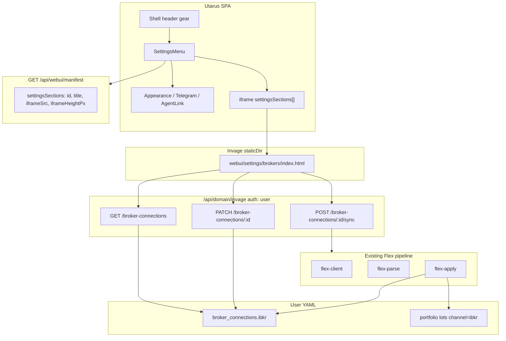
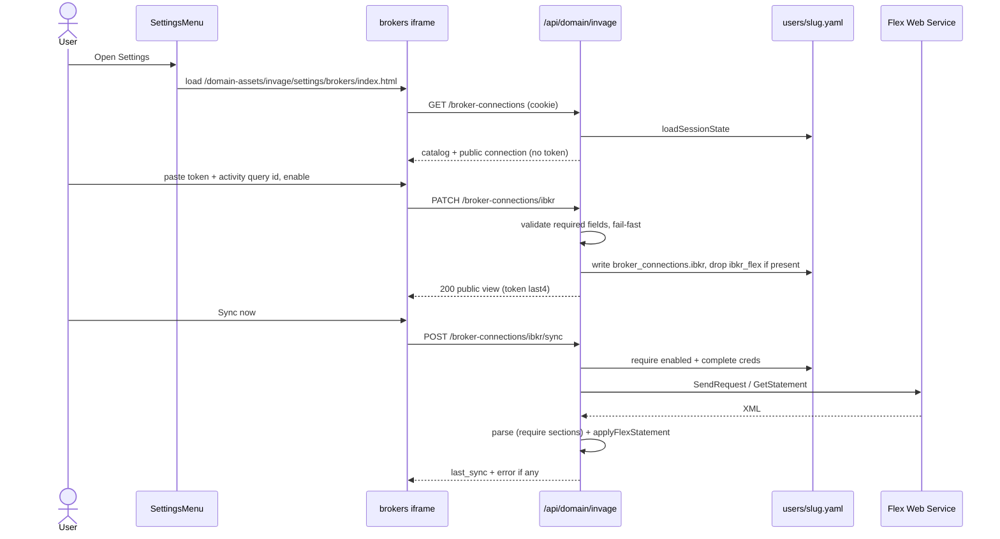
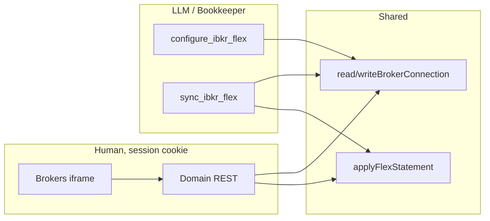

# Broker connections in the WebUI Settings popup

| Field | Value |
|-------|--------|
| **Author** | Zhengqing Qiu |
| **Date** | 2026-08-22 |
| **Status** | Draft |
| **Branch** | Cut from current Wallet Street mainline. Conversation started on `feat/aideal-on-walletstreet`; do not block this work on that branch if Aideal has already landed. |
| **Product** | Wallet Street (Invage on Utarus) |
| **Companion research** | `/Users/zhengqingqiu/projects/research/ibkr/ibkr-flex-solution.md` |

---

## Overview

Wallet Street users must enable an IBKR (and later Tiger, Moomoo, Webull, …) **ingest channel** and paste credentials in the **existing Settings popup** (gear → `SettingsMenu`), not only via Bookkeeper chat tools. Today `SettingsMenu` is a hardcoded React dialog (Appearance, Notifications, Agent connections) with **no domain extension hook**. IBKR Flex config lives as a top-level YAML blob `ibkr_flex` written only by `configure_ibkr_flex`.

This design adds a **Utarus settings-section seam**: the domain registers a Brokers iframe inside the Settings dialog. Invage owns a **connector catalog** keyed by connector `id` (capability description, not keyword routing), a `broker_connections` map on the user file, and **session-authenticated** GET/PATCH/sync APIs that never echo secrets. Chat tools remain for Bookkeeper/automation and write the same store. Turning a channel **off** stops sync; it does **not** delete lots.

---

## Background & Motivation

### Current Settings popup (Utarus)

File: `/Users/zhengqingqiu/projects/utarus/web/src/components/SettingsMenu.tsx`

- Modal: Appearance (conversation font size), Notifications (`TelegramLinkSettings`), Agent connections (`AgentLinkSettings`).
- Mounted **only** from Chat header in `web/src/pages/Chat.tsx` (hidden for `admin`). Dashboard / Watch List iframe pages have no gear.
- Credential-ish pattern already exists: `TelegramLinkSettings` loads session APIs (`GET /api/channels`, mint link code), shows status, never treats the model as the writer.
- `DomainWebUiExtension` (`utarus/src/extension.ts`) already supports `nav`, `routes` (`pageKind: 'iframe'`), `apiRouters` (`auth: 'user'`), `staticDir` → `/domain-assets/<agentKey>/`. **There is no `settingsSections` (or equivalent).**

Invage already uses that WebUI surface for product pages:

- `src/webapp/invage-webui.ts` — Dashboard + Watch List iframe routes, `createDashboardApiRouter()` at `/api/domain/invage`, `staticDir` = `webui/`.
- Iframes fetch with `credentials: 'include'` (`webui/dashboard/app.js`, `webui/watchlist/app.js`).
- Domain APIs are mounted with `requireAuth` (`utarus/src/webapp/server.ts`).

Wallet Street currently pins `utarus` `github:Judeqiu/utarus#v3.0.0-beta.26` (`package.json`). Local Utarus mainline is `3.0.0-beta.40` (`v3_beta`). That is **14 betas**, not a seam-only bump (webUi, billing, widgets, auth). Absorbing beta.27–beta.40 in the same PR as the Brokers iframe is an unrelated compatibility risk.

TypeScript: Invage `createInvageWebUi()` cannot type `settingsSections` until the pin includes the seam. **Runtime** on beta.26: `buildWebUiManifest` does **not** reject unknown `webUi` fields — an extra `settingsSections` key is **dropped**, it does not throw at boot.

Prerequisite: pin Invage onto current tagged `v3_beta` **before** the Brokers UI PR (see PR Plan). The seam itself is then a one-tag bump.

### Current IBKR ingest (Invage)

Read-only Flex Web Service (no TWS/Gateway). Implemented:

| Module | Role |
|--------|------|
| `src/ibkr/flex-client.ts` | SendRequest / GetStatement `v=3`, User-Agent required, ≥1.1s spacing |
| `src/ibkr/flex-parse.ts` | XML → Open Positions + Cash Report; IBKR error envelopes fail |
| `src/ibkr/flex-map.ts` | Lots tagged `channel: ibkr` (`IBKR_CHANNEL` hardcoded) |
| `src/ibkr/flex-apply.ts` | Replace **only** `ibkr` lots + journal cash (`post_opening_balance` / `post_adjustment` when books on); never `set_cash` as the books path |
| `src/ibkr/flex-config.ts` | Read/write top-level `ibkr_flex: { token, activity_query_id, tradeconf_query_id? }` |
| `src/tools/ibkr_flex.ts` | Bookkeeper tools `configure_ibkr_flex`, `sync_ibkr_flex` |

Holdings already have `channel` (e.g. `AAPL@ibkr`). Dashboard filters by channel (`docs/data-model.md`, `webui/dashboard/app.js`). Sync replaces lots + free cash **on that channel only**. Token must never be echoed (tool results already omit it).

Pain:

1. Connecting IBKR is a chat ritual. Users who never talk to Bookkeeper cannot paste a Flex token.
2. `ibkr_flex` is a one-off top-level key. Tiger would become `tiger_foo` beside it.
3. Enable vs “delete my IBKR lots” is undefined.
4. Settings is Chat-only; Dashboard users have no gear.

---

## Goals & Non-Goals

### Goals

1. Settings popup is the **user-facing home** for enable + credentials (chat tools remain).
2. Multi-broker **catalog**: `id`, display name, capability description, enable toggle, credential field schema, status (`off` / `needs_credentials` / `connected` / `error`) + last-sync metadata.
3. Select connectors by **id + capability description**. No keyword/synonym routers in UI, tools, or ingest.
4. Secrets: token never in GET; PATCH is replace-on-write; GET shows `configured: true` plus `last4` only when `token.length >= 4` (omit `last4` otherwise — no `"set"` field), plaintext `value` for non-secrets (query ids).
5. Disable ≠ `remove_holding`. Off stops sync; lots and cash on that channel stay.
6. Fail-fast: incomplete credentials fail save; missing Flex **sections** fail sync (tighten parser; see § Proposed Design / IBKR).
7. IBKR v1 fields: Flex token, activity query id, optional trade-confirmation query id, IP-restriction note with Client Portal steps.
8. Utarus seam so gpteacher / other agents do not fork `SettingsMenu`.
9. Generalize `ibkr_flex` → `broker_connections.<connector_id>` with an explicit migration.
10. Settings writes are the **signed-in session user**, not the LLM. APIs are session-auth and **must not** be registered as agent tools.
11. Optional **Sync now** in the IBKR card, same apply path as `sync_ibkr_flex`.

### Non-Goals (v1)

- Trading, TWS, Client Portal Gateway, live IBKR quotes (Yahoo remains the dashboard mark).
- Implementing Tiger / Moomoo / Webull connectors (catalog + YAML shape must not need a rewrite when they land).
- Stub “coming soon” broker rows (empty capability). Ship IBKR only; add a row when the connector module exists.
- Native JSON-schema form renderer inside the Utarus SPA (rejected for v1; see Alternatives).
- A top-nav “Brokers” page as the **primary** UX (rejected as the sole surface; optional later).
- Encrypting YAML at rest, vault, or KMS (same file-secret model as today).
- Auto-scheduler in Settings. Enabling a channel does **not** create a `create_task`. v1 ingest trigger is **Sync now** plus whatever Bookkeeper/`create_task` the user already has.
- An explicit **Clear / forget token** control. Rotation is paste a new token and Save. Empty secret inputs are omitted (keep), not delete.
- Hiding Off channels from the dashboard channel strip. Lots still exist; the filter is holdings, not ingest state.
- Caching Flex XML or Yahoo marks.
- Admin impersonation (`targetSlug` / `?slug=`) on secret APIs.
- Refusing Settings/tool sync when books are off. Sync now uses current `applyFlexStatement` (including `setCash` when books are off).

---

## Key Decisions

| ID | Decision | Rationale |
|----|----------|-----------|
| **KD-1** | **Seam = declared iframe sections in Settings** (`DomainWebUiExtension.settingsSections`). Not a JSON form engine. Not a Brokers-only nav tab. | Matches Dashboard/Watch List (same-origin iframe + `auth: 'user'` APIs). Broker UX is domain-specific (help copy, Sync now, last-4, per-connector fields). A framework form builder would grow `secret` / `action` / `status` types and still need domain APIs. A dedicated route fails the product ask (Settings popup is the home). |
| **KD-2** | **Lift the gear into the Shell header** (all product pages), not Chat-only. Font size is **user-profile scoped**, not conversation-scoped. **Shell is the only owner** of font state. | Dashboard is where users *see* `AAPL@ibkr`. Gear visibility: client `isDomainUserSession` in `utarus/web/src/types.ts` (`session.slug && session.slug !== 'admin'`). The prefs router guard in `onboard.ts` is **non-exported** — do not import it from the SPA. Font lives on `profile.webui.conversation_font_size` via `GET/PATCH /api/onboard/profile/preferences`. **Shell** loads and patches prefs, holds `conversationFontSize`, passes `fontSize` / `saving` / `onFontSizeChange` into **SettingsMenu (props-only)** and into Chat/`ThreadView`. SettingsMenu must **not** GET/PATCH prefs itself. Chat unmounts on Dashboard (`showChat` false) so Chat cannot remain the source of truth. Do **not** disable Appearance with “Open Chat to change message size.” All-agent chrome (gpteacher included). |
| **KD-3** | **Connector catalog is Invage code**, keyed by `id`. User YAML stores **connection state** only. | Catalog has display name, capability paragraph, credential schema, channel tag. YAML must not duplicate capability text. Lookup is `catalog.get(id)` — never “if message contains ibkr”. |
| **KD-4** | **Channel tag === connector `id` for v1** (`ibkr` → lots `AAPL@ibkr`). A second IBKR account is a **new connector id / channel** (e.g. `ibkr-ira`), not a keyword split of `ibkr`. | Dashboard already filters on `channel`. One string identity for ingest + holdings. Multi-`FlexStatement` XML stays unsupported (existing throw) until that second connector exists. |
| **KD-5** | **Session APIs only; never agent tools.** Tools `configure_ibkr_flex` / `sync_ibkr_flex` stay for Bookkeeper. They share the store. Settings HTTP is not in the tool list. | The model must not scrape or rewrite Flex tokens via a tool wrapper around GET. `TelegramLinkSettings` already follows this split. |
| **KD-6** | **`loadSessionState(req)`** for broker APIs. **No `targetSlug`.** | Utarus documents `targetSlug` as Management / BinDrive only (`src/webapp/auth.ts`). Dashboard JSON currently uses `targetSlug` — **do not copy that** onto secret writes. The signed-in slug is the only principal. |
| **KD-7** | **Disable keeps lots.** No YAML delete, no books close, no dashboard rewrite. Off does **not** hide `ibkr` from the dashboard channel strip. | Off = pause ingest. User may still hold IBKR stock; the channel filter is about holdings, not ingest state. Removing lots is `remove_holding` — out of v1. No Clear/forget-token control. |
| **KD-8** | **Migrate `ibkr_flex` → `broker_connections.ibkr` on write; both present is an error.** Reads accept exactly one of the two shapes. | Fail-fast on ambiguity. Not a silent default: old blob is the previous schema, mapped with `enabled: true` (they had configured Flex to use it). |
| **KD-9** | **Do not sandbox the Settings iframe.** Same as Shell domain routes, not chat widgets. | Widget host (`WidgetPanelHost`) uses a guest `postMessage` bridge and is the wrong trust model for cookies + secrets. Settings iframe is same-origin `/domain-assets/invage/...` and calls `/api/domain/invage/...` with cookies. |
| **KD-10** | **Flex parse contract (four cases).** (1) Missing `<OpenPositions` or `<CashReport` **wrapper** → fail. (2) Wrapper present, **zero** `OpenPosition` rows → valid (flat book; apply may remove all `ibkr` lots). (3) `<CashReport` present with **zero** `CashReportCurrency` rows → **fail** (incomplete query, not $0 cash). (4) One `CashReportCurrency` with `endingCash="0"` → valid. | Today `parseFlexQueryXml` only collects row tags (`flex-parse.ts`) and `applyFlexStatement` **replaces all `ibkr` lots** then leaves cash unchanged when `doc.cash.length === 0`. Missing wrappers look like empty rows → silent wipe. IBKR still emits `endingCash="0"` for a flat cash sleeve; that is not the same as a missing currency row. Fixtures in `tests/ibkr-flex.test.ts` for all four cases. |
| **KD-11** | **Sync now = shared `syncBrokerConnection(state, id)`** wrapping fetch → parse → `applyFlexStatement`. Do **not** refuse sync when books are off; inherit current apply (`setCash` when books off). | UI and `sync_ibkr_flex` must not diverge. Apply still journals/archives; the wrapper writes `last_sync` (attempt ISO time) on the same in-memory state after success or on throw without apply. |
| **KD-12** | **Non-secret query ids may round-trip in GET.** Token never does. Mask: `last4` only if `token.length >= 4`; else `{ configured: true }` with **no** `last4` key. Never 500 GET because the token is short. No `"set"` string field. | Query ids are useless without the token. Short stored tokens still GET 200. |

---

## Proposed Design

### Architecture



Utarus does not know “IBKR”. It renders 0..N domain sections from the manifest. Invage registers one section (`brokers`). Adding Tiger is another **card inside that iframe** plus a catalog entry — no SettingsMenu fork.

### UX flow



**Popup layout** (same chrome as today: `max-w-lg`, `max-h-[min(90vh,40rem)]`, stacked sections):

1. Appearance (unchanged)
2. **Brokers** (new, only if `settingsSections` non-empty — Invage registers it)
3. Notifications (Telegram)
4. Agent connections

Each connector card is **catalog-driven** (loop `GET.connectors`, render `credential_fields`). v1 catalog has one row (`ibkr`). Layout of one card:

- Title: `display_name`
- Capability one-liner (`capability`)
- Enable toggle (**dirty until Save** — does not PATCH on click)
- Status chip from last successful GET/PATCH: Off / Needs credentials / Connected / Error
- Inputs from `credential_fields` (secret fields: empty placeholder when `configured`; typing a new value is replace-on-write)
- Help: `<details>` “How to get IBKR Flex credentials” (Client Portal steps + IP note). **Collapsed by default.**
- Last sync line: if `last_sync === null` → **Never synced** (even when chip is Connected); else `as_of`, account id, lots, error
- Buttons: Save, Sync now, Refresh

Disable copy: “Stops Flex pulls. Holdings tagged `ibkr` stay on the dashboard.”

#### Client contract (iframe `app.js`)

Save, enable, and Sync now are easy to get wrong because PATCH treats omitted secrets as “keep” and empty string as 400.

1. **Enable toggle does not persist until Save.** Changing the switch only dirties the form.
2. **PATCH body — secrets:** include a secret key (`token`) **only** when the input is non-empty after trim. Never send `token: ""`. Non-secret fields: send trimmed value; optional field cleared with `null` only when the user explicitly clears it.
3. **PATCH is a deep merge** of `enabled` and per-credential keys (server). The client may send `{ enabled }` alone, `{ credentials: { activity_query_id } }` alone, or both.
4. **Sync now uses server state**, not unsaved inputs. Disable Sync now unless the **last successful GET or PATCH** shows `enabled === true` and all required credentials `configured: true`. If the form is dirty, disable Sync now and show “Save before sync”.
5. **Save** POSTs PATCH, then replaces local public state with the response (clears dirty). Incomplete required creds while `enabled: true` → 400, keep dirty, show `message`.
6. **Refresh** is GET; discarding dirty fields requires confirm if dirty.
7. **In-flight lock:** disable Save, Sync now, and Refresh while a PATCH or POST sync `fetch` is pending (including until abort/response). Do not overlap requests.
8. **fetch timeout** for POST sync: **90s** (`AbortController`). Server poll budget is ~70s+ (`flex-client.ts`: 10 × 6000ms + SendRequest + ≥1.1s spacing). **Abort does not cancel** `syncBrokerConnection` (Flex poll + apply + two `saveState`s). On abort: do **not** POST sync again. Copy: “Request still running on the server — wait, then Refresh.” Re-enable **Refresh only**; keep Save/Sync disabled until a successful GET. A second POST while the helper is still running → HTTP **409** `sync_in_progress` (server lock; see POST `/sync`). Do not silently retry in a loop.

### Utarus settings seam (PR 1)

Add to `DomainWebUiExtension` in `utarus/src/extension.ts`:

```ts
export interface DomainSettingsSection {
  /** Stable id, unique among settingsSections. */
  id: string;
  title: string;
  description?: string;
  /** Lucide-style key, same convention as DomainWebNavItem.icon. */
  icon?: string;
  /**
   * Same-origin iframe. Must start with `/domain-assets/<agentKey>/`.
   * Not sandboxed. Guest uses credentials: 'include'.
   */
  iframeSrc: string;
  /**
   * CSS pixel height of the iframe **element** in the dialog (the slot).
   * Required, finite, > 0. Guest document uses overflow-y: auto — this
   * is not a clip. No postMessage auto-resize in v1.
   */
  iframeHeightPx: number;
}

export interface DomainWebUiExtension {
  // ...existing fields...
  /**
   * Extra sections in SettingsMenu, after Appearance, before Notifications.
   * Omit or [] → current three-section dialog.
   * Duplicate ids / empty title / bad iframeSrc fail at createFramework().
   */
  settingsSections?: DomainSettingsSection[];
}
```

Boot validation (`buildWebUiManifest` / `registerWebUiShellFromExtension` — fail at `createFramework()`):

- `id` non-empty, unique among `settingsSections`
- `id` not in reserved set: `appearance`, `notifications`, `agents` (framework-owned section ids)
- `title` trimmed non-empty
- `iframeSrc` starts with `/domain-assets/${agentKey}/`
- `iframeHeightPx` finite number `> 0`
- `agentKey` required when `settingsSections` is non-empty
- `icon` if set must be in the SettingsMenu allow-list (`landmark`, `star`, plus existing Shell `iconFor` keys). **Unknown icon fails at boot**, not a silent Chat/`MessageSquare` fallback. SettingsMenu maps the key to a Lucide icon on `SectionLabel` (do not rely on Shell `iconFor` alone — nav never renders settings section icons).

Expose on `GET /api/webui/manifest` as `settingsSections` (always an array after this ships — `[]` when omitted — so the SPA does not special-case `undefined`). Extend `WebUiManifest` in `web/src/pages/Shell.tsx` to match.

`SettingsMenu.tsx` is **props-only** (no prefs fetch, no manifest fetch):

- `settingsSections` from Shell (Shell already fetched the manifest).
- `fontSize`, `saving`, `onFontSizeChange` from Shell — same shape as today’s Chat-owned props. SettingsMenu must **not** call `GET/PATCH /api/onboard/profile/preferences`.
- For each section: `SectionLabel` + rounded card + `<iframe title={title} src={iframeSrc} height={iframeHeightPx} className="w-full border-0" />` (not sandboxed). The iframe **element** is `iframeHeightPx` tall; the **guest document** is `overflow-y: auto`.
- Update dialog subtitle when sections exist (“Appearance, brokers, notifications, and agent connections”).

**Shell lift:** move `<SettingsMenu>` from `Chat.tsx` into `Shell.tsx` header (right cluster). Visibility: **`isDomainUserSession` from `web/src/types.ts`** (not the non-exported onboard.ts guard). **Shell** loads `GET /api/onboard/profile/preferences` on session, PATCHes from `onFontSizeChange`, holds `conversationFontSize`, passes `fontSize` into SettingsMenu **and** `ChatPage` / `ThreadView`. Chat local state must not diverge after the lift. Appearance stays enabled on Dashboard.

**Cross-agent UX:** every Utarus agent with a Shell gets the gear on Dashboard/Tasks/Notes/etc., not only Wallet Street. That is intended. Agents with `settingsSections: []` still get Appearance + Telegram + Agent connections from every product page.

Do **not** render Brokers via `pageKind: 'iframe'` nav as the v1 home. A hidden route is optional later for deep links; product home is the popup.

### Invage connector catalog (PR 2)

New module e.g. `src/brokers/catalog.ts`. **Not** a router over user text.

```ts
export type CredentialFieldType = 'secret' | 'text';

export interface CredentialFieldDef {
  id: string;
  label: string;
  type: CredentialFieldType;
  required: boolean;
  /** Shown under the input. Plain text. */
  help?: string;
}

export interface BrokerConnectorDef {
  id: string;
  displayName: string;
  /** Holdings / cash channel tag. v1: equal to id. */
  channel: string;
  /**
   * Capability for humans and for agents that *describe* this connector.
   * Selection is by this id, never by matching words in the user turn.
   */
  capability: string;
  credentialFields: CredentialFieldDef[];
  helpNotes?: string[];
  helpHref?: string;
  /** Catalog field id whose stored value is the Flex query id for Sync now. IBKR: activity_query_id. */
  syncQueryFieldId?: string;
}

export const BROKER_CATALOG: readonly BrokerConnectorDef[] = [
  {
    id: 'ibkr',
    displayName: 'Interactive Brokers',
    channel: 'ibkr',
    capability:
      'Read-only IBKR Flex Web Service. Pulls Open Positions and Cash Report into channel ibkr. Cannot trade or submit orders. Activity data is prior-day; dashboard marks stay Yahoo.',
    credentialFields: [
      {
        id: 'token',
        label: 'Flex Web Service token',
        type: 'secret',
        required: true,
        help: 'Numeric token from Client Portal → Settings → Flex Web Service. Shown once at generation.',
      },
      {
        id: 'activity_query_id',
        label: 'Activity Flex Query ID',
        type: 'text',
        required: true,
        help: 'Info icon on the Flex Queries list. Query must include Open Positions and Cash Report, XML.',
      },
      {
        id: 'tradeconf_query_id',
        label: 'Trade Confirmation Flex Query ID',
        type: 'text',
        required: false,
        help: 'Optional. Stored for later intra-day confirms. Sync now uses the Activity query only.',
      },
    ],
    helpNotes: [
      'Max token life is 1 year (IBKR 1012 when expired). Query IDs survive rotation.',
    ],
    helpHref: 'https://www.interactivebrokers.com/campus/ibkr-api-page/flex-web-service/',
    syncQueryFieldId: 'activity_query_id',
  },
];

export function getBrokerConnector(id: string): BrokerConnectorDef {
  const found = BROKER_CATALOG.find((c) => c.id === id);
  if (!found) {
    throw new Error(`Unknown broker connector "${id}".`);
  }
  return found;
}
```

`IBKR_CHANNEL` in `flex-map.ts` stays `'ibkr'` and **must equal** `getBrokerConnector('ibkr').channel`. Test that invariant.

### Data flow (session vs tools)



The REST layer and tools both call `syncBrokerConnection` / `writeBrokerConnection`. The tools are **not** HTTP clients of the REST layer (avoids the model growing a “call settings API” tool).

---

## API / Interface Changes

Mount on the existing `createDashboardApiRouter()` **or** a sibling router in `apiRouters` with `auth: 'user'`, base `/api/domain/invage`. Prefer a dedicated `createBrokerConnectionsRouter()` composed from `invage-webui.ts` so dashboard read code does not grow secret-handling.

**Auth:** `requireAuth` (framework) + `loadSessionState(req)`. 401 if no session. Never read `?slug=`.

### `GET /broker-connections`

Returns the catalog **merged** with this user’s public connection state. Token material never appears. The iframe **must** be able to render a card from this payload alone (loop `connectors` + `credential_fields`) — do not hardcode IBKR field ids in `app.js`.

Deployment-wide (not per connector):

```json
{
  "egress_ipv4": null,
  "connectors": [ ]
}
```

`egress_ipv4`: from `readFlexEgressIpv4()` in **`src/brokers/egress.ts`**. Reads `INVAGE_FLEX_EGRESS_IPV4`, trimmed. Unset or empty → `null`. Non-empty must be a dotted-quad IPv4 with each octet 0–255; otherwise **throw** (no localhost default). **Boot:** `createInvageWebUi()` calls `readFlexEgressIpv4()` so a bad env fails at `createFramework` / process start, not on first GET. GET uses the same function. Used only for IBKR IP-note copy.

**Read failures** (unknown connector key, unknown credential key, both `ibkr_flex` and `broker_connections` present): HTTP **500** `{ "error": "broker_connections_invalid", "message": "<exact throw text>" }`. Do **not** auto-drop keys. Operator deletes the unknown YAML key or the extra top-level blob. Test: GET JSON **never** contains the raw token string (search the serialized body).

Never-configured example (`enabled` default false → **`off`**, not `needs_credentials`):

```json
{
  "egress_ipv4": "203.0.113.10",
  "connectors": [
    {
      "id": "ibkr",
      "display_name": "Interactive Brokers",
      "channel": "ibkr",
      "capability": "Read-only IBKR Flex Web Service. …",
      "enabled": false,
      "status": "off",
      "credential_fields": [
        {
          "id": "token",
          "label": "Flex Web Service token",
          "type": "secret",
          "required": true,
          "help": "Numeric token from Client Portal → Settings → Flex Web Service. Shown once at generation."
        },
        {
          "id": "activity_query_id",
          "label": "Activity Flex Query ID",
          "type": "text",
          "required": true,
          "help": "Info icon on the Flex Queries list. Query must include Open Positions and Cash Report, XML."
        },
        {
          "id": "tradeconf_query_id",
          "label": "Trade Confirmation Flex Query ID",
          "type": "text",
          "required": false,
          "help": "Optional. Stored for later intra-day confirms. Sync now uses the Activity query only."
        }
      ],
      "credentials": {
        "token": { "configured": false },
        "activity_query_id": { "configured": false },
        "tradeconf_query_id": { "configured": false }
      },
      "last_sync": null,
      "sync_query_field_id": "activity_query_id",
      "help_notes": ["Max token life is 1 year (IBKR 1012 when expired). Query IDs survive rotation."],
      "help_href": "https://www.interactivebrokers.com/campus/ibkr-api-page/flex-web-service/"
    }
  ]
}
```

Enabled + missing required token → `needs_credentials`:

```json
"enabled": true,
"status": "needs_credentials",
"credentials": {
  "token": { "configured": false },
  "activity_query_id": { "configured": true, "value": "123456" },
  "tradeconf_query_id": { "configured": false }
}
```

Configured secret (token length ≥ 4):

```json
"token": { "configured": true, "last4": "6789" }
```

Token length `< 4` and present: `{ "configured": true }` — **omit** `last4`. GET stays **200**.

Status evaluation order (stop at the first match):

1. `enabled === false` → `off`
2. any **required** catalog field missing in stored credentials → `needs_credentials`
3. `last_sync.ok === false` → `error` (`last_sync.error` **required** on persist; missing error string is a writer bug and must throw before save)
4. else → `connected` (includes never-synced: `last_sync === null`)

Do **not** derive `error` from a bare `last_sync.error` while ignoring `ok`. Persist path: `ok: true` omits `error`; `ok: false` requires non-empty `error` with **no** token and no Flex URL `t=`.

`last_sync` object (`null` if never attempted):

```ts
{
  at: string;           // ISO timestamp of the **attempt**, not statement toDate / apply log.ts
  ok: boolean;
  as_of?: string;       // statement toDate; success only
  account_id?: string;
  lots_upserted?: number;
  lots_removed?: number;
  error?: string;       // required iff ok === false; user-facing; no token
}
```

### `PATCH /broker-connections/:id`

`:id` is the connector id (`ibkr`). Unknown id → **404** `{ error: "unknown_connector", message: "Unknown broker connector \"…\"." }`.

Body (JSON). **Deep merge** of `enabled` and **per-credential keys**. Omitted keys unchanged. PATCH **never writes `last_sync`** (rotating the token keeps prior last-sync; chip may stay Connected with stale `as_of` until the next sync).

```ts
{
  enabled?: boolean;
  credentials?: Record<string, string | null>;
  // key must be a catalog field id.
  // string: trim; empty string → 400.
  // null: allowed only for optional fields (clears). null on required → 400.
}
```

Rules:

- Unknown credential keys → **400** (fail-fast; do not ignore).
- Resulting required credentials after merge must be complete **if the resulting `enabled` is true**. Incomplete → **400**, no write. Error text uses the field `label` (`Flex Web Service token is required.`).
- `enabled: false` may be saved with incomplete credentials (user parked the form).
- **Empty body `{}`:** existing row → **200 no-op** (same public view). Missing row → **200** with catalog default (`enabled: false`, no creds) **without persisting** a YAML row.
- Response = same public connector object as one GET item (include `credential_fields`).
- Logs / `state.log`: action `broker_connection_patch`, **never** token, never last-4. Log `{ connector, enabled, token_set: boolean }`.

### `POST /broker-connections/:id/sync`

Shared helper `syncBrokerConnection(state, id)` (tools + HTTP). Write order:

1. Resolve connector + connection (migrate-in-memory if only `ibkr_flex`).
2. If required creds missing → throw existing not-configured error (HTTP **400** `not_configured`). **Do not** call this “not configured” when the token is present but `enabled === false`.
3. If creds complete and `enabled === false` → throw **exactly**  
   `` `${displayName} channel is off. Enable it in Settings before sync.` ``  
   HTTP **409** `{ error: "channel_off", message }` (displayName, not a hardcoded `"IBKR"`).
4. `at = new Date().toISOString()` (attempt time).
5. `fetchFlexStatement` → `parseFlexQueryXml` → `applyFlexStatement`. `applyFlexStatement` already `saveState`s lots on success **without** `last_sync`.
6. **Success:** set `last_sync = { at, ok: true, as_of, account_id, lots_* }` on the same in-memory state (this write also deletes `ibkr_flex` if present), `saveState` again.
7. **Throw before/during fetch/parse/apply:** do **not** call apply if fetch/parse failed. Set `last_sync = { at, ok: false, error }` (strip token/`t=`), persist `broker_connections` (this **also migrates** `ibkr_flex` → `broker_connections` on a failed sync — call that out in tests), `saveState`, then HTTP error. Do not 200.

**In-flight (process-local):** a `Set` keyed by `${slug}:${connectorId}` around the helper. If the key is present, do not start a second fetch/apply — HTTP **409** `{ error: "sync_in_progress", message: "A Flex sync is already running for this connector. Wait, then Refresh." }`. Tool `sync_ibkr_flex` uses the same lock and `fail()` that message. Clear the key in `finally`. No queue. A browser AbortController does **not** remove the key.

HTTP map:

| Case | Status | `error` |
|------|--------|---------|
| Unknown `:id` | 404 | `unknown_connector` |
| Off with complete creds | 409 | `channel_off` |
| Incomplete required creds | 400 | `not_configured` |
| `FlexHttpError` (incl. exhausted 1019/1021) | 502 | `flex_http` (`message` includes IBKR code, never token) |
| Parse / missing wrappers / zero CashReportCurrency | 400 | `flex_parse` |
| Apply user-data (multi-ccy, short stock) | 400 | `flex_apply` |
| In-flight sync for this slug+id | 409 | `sync_in_progress` |
| Unexpected apply/IO | 500 | `flex_apply` |

Success body: public connector + apply summary (lots, cash, as_of). No token.

Do not add `GET /broker-connections/:id/token`. Do not add these routes to `createInvageTools()` / Bookkeeper.

### Tool changes (same PR as store)

`writeIbkrFlexConfig` writes `broker_connections.ibkr` with `enabled: true` (user asked Bookkeeper to connect).

Shared read for sync (HTTP and `sync_ibkr_flex`):

1. No complete required creds → existing not-configured throw / `fail(text)`.
2. Complete creds and `enabled === false` → off message (same string as HTTP 409 `message`). Tool: `fail(text)` (not an HTTP status). Scheduled `create_task` for `sync_ibkr_flex` **keeps failing** after the user turns the channel off in Settings — intended. Bookkeeper copy (PR 4) must say so.

Do **not** throw “not configured” when the token is present but the channel is off.

Tool **response text** still must not include the token (already).

---

## Data Model Changes

### Today

`InvestorState` (`src/state/portfolio-state.ts`) does not type `ibkr_flex`. `flex-config.ts` casts:

```ts
(state as InvestorState & { ibkr_flex?: unknown }).ibkr_flex
```

YAML:

```yaml
ibkr_flex:
  token: "123456789123456789"
  activity_query_id: "111222"
  tradeconf_query_id: "333444"   # optional
```

### Target

Add an explicit field on `InvestorState`:

```ts
export type BrokerConnectionStatusError = string;

export interface BrokerConnectionLastSync {
  at: string;
  ok: boolean;
  as_of?: string;
  account_id?: string;
  lots_upserted?: number;
  lots_removed?: number;
  error?: BrokerConnectionStatusError;
}

export interface BrokerConnection {
  enabled: boolean;
  credentials: Record<string, string>; // keys = catalog field ids; secrets stored here
  last_sync?: BrokerConnectionLastSync;
}

export interface InvestorState extends UserState {
  // ...existing...
  /**
   * Per-connector ingest config. Key = BrokerConnectorDef.id.
   * Unknown keys fail on read (catalog lookup).
   */
  broker_connections?: Record<string, BrokerConnection>;
}
```

YAML:

```yaml
broker_connections:
  ibkr:
    enabled: true
    credentials:
      token: "123456789123456789"
      activity_query_id: "111222"
      # tradeconf_query_id omitted when unset
    last_sync:
      at: "2026-08-22T04:12:00.000Z"
      ok: true
      as_of: "2026-08-21"
      account_id: "U1234567"
      lots_upserted: 12
      lots_removed: 1
```

**Unknown connector keys** in YAML → throw on read (`Unknown broker connector "foo" in broker_connections.`). Do not skip. **Unknown credential keys** for a known connector → throw. **Missing `enabled`** → throw (boolean required once the new shape is present). **`credentials` must be a mapping.** GET/PATCH/sync surface that throw as HTTP **500** `{ error: "broker_connections_invalid", message }` with the **exact** throw text. Operator recovery: edit the user YAML and delete the unknown key or the extra `ibkr_flex` blob. **Do not auto-drop.** Same freeze-out if both top-level blobs exist.

`ibkr_flex` is **not** kept as a supported long-term alias after the first write.

### Migration

Read path (`readBrokerConnections(state)`):

1. If `broker_connections` and `ibkr_flex` **both** present → throw (`Conflicting IBKR config: both broker_connections and ibkr_flex are set.`).
2. If only `broker_connections` → validate against catalog; return.
3. If only `ibkr_flex` → map in memory:
   - `enabled: true`
   - credentials from existing `readIbkrFlexConfig` rules (token + activity_query_id required)
   - no `last_sync`
4. If neither → empty map. IBKR card: **`enabled: false`, `status: "off"`**. Never-configured does **not** show `needs_credentials`.

Write path (PATCH that persists, `configure_ibkr_flex`, successful **or failed** sync that updates `last_sync` — failed sync still migrates):

- Persist `broker_connections`.
- **Delete** `ibkr_flex` if present (migration completes).
- `saveState`.

No background sweep of all user files. No silent fill of empty tokens.

Update `docs/data-model.md` in the Invage PR that introduces the field (Layer 2 user file). Holdings `channel` semantics unchanged.

### Enable vs lots

| Action | Lots `*@ibkr` | Cash on `ibkr` | Next Flex pull |
|--------|----------------|----------------|----------------|
| Enable off | unchanged (still on dashboard channel strip) | unchanged | refused (409) |
| Enable on + Sync | replace from statement | journal/replace per `flex-apply.ts` (incl. `setCash` if books off) | runs |
| `remove_holding` | that lot | n/a | n/a |
| Clear credentials | **not in v1** | — | — |

v1 has no Clear/forget-token control. Rotation is paste a new token and Save. Empty secret inputs are omitted on PATCH (keep stored value), not delete. Sending `token: ""` while enabled is 400. Enabling the channel does **not** schedule `create_task`.

---

## IBKR v1 Settings copy and fields

From Client Portal (research doc), shown in the iframe — not inferred from keywords:

1. Log in to Client Portal (live username that owns the Flex templates).
2. Settings → Account Report → **Flex Web Service** → enable → **Generate New Token**. Capture the numeric token (not shown again).
3. **Valid for IP Address** — only if GET `egress_ipv4` is a string: “Paste this IPv4 into Client Portal → Flex Web Service → Valid for IP Address: `<egress_ipv4>`. A stolen token then fails from elsewhere (IBKR 1013).” If `egress_ipv4` is `null`: **do not** tell users to whitelist. Copy: “Leave Valid for IP Address blank unless ops gave you a static egress IP. Setting an IP with rotating egress returns IBKR 1013.” No silent localhost.
4. Performance & Reports → Flex Queries → Activity query, **XML**, sections **Open Positions** and **Cash Report** (required for our apply path). Copy Query ID from the Info icon.
5. Optional Trade Confirmation query for later; not used by Sync now in v1.

These steps live inside a collapsed `<details>` in the card (not always-visible). Fields come from `credential_fields`. Sync now: activity query only (`fetchFlexStatement({ token, queryId: activity_query_id })`).

Parser tightening in `parseFlexQueryXml` (KD-10). Tests in `tests/ibkr-flex.test.ts`:

| Fixture | Result |
|---------|--------|
| No `<OpenPositions` wrapper | throw (do not treat as empty lots) |
| `<OpenPositions>` with zero `OpenPosition` rows | valid; `openPositions: []` |
| No `<CashReport` wrapper | throw |
| `<CashReport>` with zero `CashReportCurrency` rows | throw (`IBKR Flex CashReport has no currency rows.`) |
| One row `endingCash="0"` | valid `{ currency, endingCash: 0 }` |

Keep existing fail on multiple `FlexStatement`s and multi-currency cash (`applyFlexStatement` still throws on `doc.cash.length > 1`).

If product later wants “positions-only queries”, that is a catalog/capability change, not a silent skip. This parser change **can fail previously “successful” incomplete Flex queries** (empty tag lists used to wipe lots). Changelog for Bookkeeper in PR 2.

---

## Invage WebUI registration

`createInvageWebUi()`:

```ts
settingsSections: [
  {
    id: 'brokers',
    title: 'Brokers',
    description: 'Connect read-only brokerage channels',
    icon: 'landmark', // SettingsMenu allow-list; unknown icons fail at boot
    iframeSrc: '/domain-assets/invage/settings/brokers/index.html',
    iframeHeightPx: 280,
  },
],
apiRouters: [
  { mountPath: '', router: createDashboardApiRouter(), auth: 'user' },
  { mountPath: '', router: createBrokerConnectionsRouter(), auth: 'user' },
],
```

Static page: `webui/settings/brokers/index.html` + `app.js` (vanilla, `credentials: 'include'`, fail on non-OK with `body.message`). Loop `connectors` / `credential_fields`. Sync now is `POST /broker-connections/:id/sync` — the **server** reads `syncQueryFieldId` from the catalog; the iframe does not hardcode `activity_query_id`. Include `sync_query_field_id` on GET if the UI needs to label it; it must not invent field ids.

Visual: match Settings cards (stone borders, 11px buttons). **Do not reuse dashboard.css.**

**Height target:** `iframeHeightPx: 280` is the **dialog slot** (iframe element height), **not a clip**. Guest CSS: `html, body { overflow-y: auto; }`. Help stays collapsed (`<details>`). The optional trade-confirm field, error text, and a second connector **may** push content past 280px — the inner document scrolls. Do not set `overflow: hidden` on the guest except to contain a specific widget. Do not grow the **declared** slot past ~320 without revisiting the dialog. No postMessage auto-resize v1.

---

## Alternatives Considered

### A. Domain iframe section in SettingsMenu (chosen)

**Pros:** Generic seam; domain owns fields/actions; same cookie+static pattern as Dashboard; adding Tiger does not bump Utarus again; secrets never pass through SPA **React state** in the parent.

**Cons:** Nested scroll in a small dialog; visual mismatch risk; iframeHeight is a declared constant; **same-origin** parent can read `iframe.contentDocument` (unlike widget `sandbox="allow-scripts"`).

**Mitigation:** Slot 280px; guest `overflow-y: auto`; help collapsed. Lift gear to Shell. Do not `postMessage` secrets to `window.parent` (v1 has no bridge). Treat parent DOM access as same trust as the SPA itself (session user).

### B. JSON form schema on `DomainWebUiExtension`

Domain would declare fields; Utarus SPA would render native inputs (closer to `TelegramLinkSettings`).

**Pros:** Native focus, no iframe chrome, font inherited.

**Cons:** Sync now, status chips, last-sync, markdown-ish help, replace-on-write secrets, and per-connector extra actions are **not** a JSON Schema. We would invent a second UI protocol (`actions[]`, `statusEnum`, `secretField`) in the framework, then still need domain POST endpoints. Every new connector quirk becomes a Utarus release. Violates “framework does not know IBKR”.

**Rejected for v1.** Revisit only if three+ domains need the same Brokers-like form and the schema stays dumb (no actions).

### C. Brokers page as iframe route only

Add `nav: [{ id: 'brokers', path: '/brokers' }]` like Watch List.

**Pros:** Full-width, no modal height fight; no SettingsMenu change.

**Cons:** Product explicitly wants the **existing Settings popup**. A nav tab is another product surface to explain (“is this Watch List or Brokers?”). Other domains still cannot put settings in the gear.

**Rejected as the primary v1 UX.** A non-nav deep-link route may be added later without removing the popup section.

### D. Fork `SettingsMenu` in an Invage SPA

**Rejected.** Invage must not vendor the Utarus web package. Architecture doc: generic shell stays in Utarus.

### E. Keep chat-only `configure_ibkr_flex`

**Rejected.** Product ask is Settings. Tools stay as the automation/Bookkeeper path.

---

## Security & Privacy Considerations

| Threat | Severity | Mitigation |
|--------|----------|------------|
| Token in GET JSON / tool `details` / logs | **High** | Public DTO only; tool text already omits token; log `token_set` boolean only; review `saveState` YAML is expected (file is the secret store, same as today) |
| LLM registered tool wrapping GET | **High** | Do not export REST handlers as `AgentTool`. Bookkeeper tools write/sync but never print token |
| Admin `?slug=` reads another user’s Flex token | **High** | `loadSessionState` only. No `targetSlug` |
| XSS in brokers iframe exfiltrating token from a password input | **Medium** | Same-origin static files we ship; assign error strings with `textContent`, not `innerHTML`. **No Content-Security-Policy** in `utarus/src/webapp` today — do not claim a CSP default. Same-origin parent SPA can read `iframe.contentDocument` (token input). Do not postMessage secrets to `window.parent`. |
| CSRF on PATCH/sync | **Medium** | Session cookie is `sameSite: 'lax'` (`auth.ts` `bindrive_session`). **No CSRF token** on `POST /api/channels` today. Same as Telegram link: JSON POST + Lax cookie. Do not invent a second CSRF scheme in this feature. Confirm Lax in Utarus PR 1 (OQ-6 closed as “already Lax; no token”). |
| Disabled channel still “looks connected” to the model | **Low** | `sync_ibkr_flex` / POST sync refuse when `enabled === false` with the **same `message` string** (`${displayName} channel is off. Enable it in Settings before sync.`). Tools `fail(text)`; HTTP 409. |
| last-4 of a short token | **Low** | `last4` only if `token.length >= 4`; else `{ configured: true }` with no `last4`. GET 200. |
| Domain-assets HTML is world-readable | **Info** | No secrets in static files; only UI chrome |
| Token in Flex URL query string (`t=`) | **Info** | IBKR protocol requires query param (`flex-client.ts`). Egress logs on the host may contain it — existing issue, not introduced by Settings. Do not log the Flex URL |

**Authz:** the session user is the investor. The LLM is not a principal on these routes.

**Privacy:** last_sync `account_id` is IBKR account number — treat as PII in support dumps; still OK in the user’s own UI.

---

## Observability

- **Logs:** `broker_connection_patch` / `ibkr_flex_sync` (existing apply log) with slug, connector id, enabled, ok, as_of, lots counts, error **code** (Flex `1012`/`1015`/…). Never token, never full URL with `t=`.
- **Metrics (no new cache; counters only if the host already exposes them):** skip new metrics infrastructure in v1 unless Utarus already has a pattern. Prefer log lines.
- **User-visible:** status chip + last-sync line (`Never synced` / error / as_of). Fail-fast messages from Flex (`FlexHttpError`) pass through `message`.
- **Alerting:** none in v1. Token expiry (1012) is an Error chip, not a pager.

---

## Rollout Plan

1. **Invage pin PR (prerequisite).** Bump `utarus` `v3.0.0-beta.26` → current tagged `v3_beta` (today `v3.0.0-beta.40` or whatever is tagged at implement time). Gate: `npm test` in Invage against that tag. No Brokers UI. Deploy if the pin is required for production to stay current. This absorbs beta.27–40 **without** the settings iframe.
2. **Utarus seam PR** on `v3_beta`, then tag whatever the next release is (**implement-time**; do not invent a beta number in this doc). Agents that omit `settingsSections` are unchanged (`[]`). Gear-on-Shell is all-agent chrome.
3. **Invage store/API/parser PR.** Mergeable **before** the seam tag. Parser tightening changes production `sync_ibkr_flex` / `create_task` behavior — **deploy after this PR** via `fast-deploy.sh --services=invage,invage-drive` even if Settings UI is not up yet. Changelog: incomplete Flex queries that used to apply empty lots now fail.
4. **Invage Brokers iframe + one-tag pin** (40→seam tag). TypeScript needs the seam types. Runtime on old utarus would **drop** `settingsSections`, not throw — do not ship the iframe against beta.26. Gate: `npm test`; Settings smoke in `tests/webui-e2e.mjs` (puppeteer-core already in Invage) when `AUTH_TOKEN` is available. Deploy `fast-deploy.sh --services=invage,invage-drive`.
5. **Migration** is lazy on first Settings save, configure tool, or sync (including **failed** sync). Existing `ibkr_flex` users keep working through the read adapter.
6. **Rollback:** revert Invage pin + code. If YAML already migrated, **keep the read adapter**. Forward-only store; no reverse migration. Operator recovery for unknown keys: edit YAML (HTTP 500 message is the throw text).
7. Feature flag: **none**. Settings section present = feature on. Incomplete catalog must not ship.

---

## Risks

| Risk | Severity | Mitigation |
|------|----------|------------|
| Empty Flex XML wipes `ibkr` lots | **High** | KD-10 four-case contract + fixtures |
| Modal iframe too short / double scroll | **Medium** | Slot 280px; guest `overflow-y: auto`; help collapsed; optional fields may inner-scroll |
| Overlapping Sync now after 90s abort | **Medium** | Client in-flight disable; abort → Refresh only; server 409 `sync_in_progress` |
| Utarus pin 14-beta jump | **Medium** | Prerequisite pin PR onto current `v3_beta`; Brokers UI is a one-tag bump |
| Users confuse Off with delete | **Medium** | Explicit copy; no lot mutation on toggle |
| `configure_ibkr_flex` and PATCH diverge | **Medium** | Single `writeBrokerConnection` / `syncBrokerConnection` |
| Chat unmount loses font after Shell lift | **Medium** | Shell holds prefs; pass `fontSize` into Chat (KD-2) |
| GET 500 from unknown YAML keys | **Medium** | Exact throw text; operator deletes the key; no auto-drop |
| Trade-confirm query stored but unused | **Low** | Help text states v1 Sync uses Activity only |

---

## Open Questions

1. **Daily auto-sync when enabled?** **Resolved: No.** v1 is Sync now + existing `create_task`. Enabling the channel does not schedule a task. (Non-Goals.)
2. **Explicit Clear / forget token UI?** **Resolved: No in v1.** Rotation is paste a new token and Save. Empty secret fields are omitted on PATCH (keep), not delete. (Non-Goals; Enable vs lots.)
3. **Off hide `ibkr` from the dashboard channel strip?** **Resolved: No.** Lots still exist; the filter is holdings, not ingest state. (KD-7.)
4. **Font API conversation-scoped?** **Resolved (closed).** Font is `profile.webui.conversation_font_size` via `/api/onboard/profile/preferences`. KD-2: Shell is the **only** owner; SettingsMenu is props-only (`fontSize`, `saving`, `onFontSizeChange`). Gear visibility: `web/src/types.ts` `isDomainUserSession`. Do not disable Appearance off Chat.
5. **Utarus tag number?** **Resolved: implement-time.** PR 0 pins the **existing tagged `v3_beta` mainline**. PR 1 tags whatever the next Utarus release is after the seam merges. This doc does **not** invent a beta number.
6. **CSRF SameSite?** **Resolved (closed).** Cookie is `sameSite: 'lax'`; no CSRF token on Telegram POSTs. Brokers JSON POST matches that. Confirm in PR 1 review; do not add a token in v1.
7. **Multi-account IBKR future model?** **Resolved: Yes — a second connector id / channel** (e.g. `ibkr-ira`), not a keyword split of `ibkr`. Multi-`FlexStatement` XML stays a throw until that connector exists. (KD-4.)
8. **Books off path?** **Resolved: keep current `applyFlexStatement` behavior**, including `setCash` when books are off. Settings Sync now inherits it. Do not refuse sync when books are off. (KD-11.)

---

## References

- `/Users/zhengqingqiu/projects/research/ibkr/ibkr-flex-solution.md`
- `utarus/web/src/components/SettingsMenu.tsx`
- `utarus/web/src/components/TelegramLinkSettings.tsx`
- `utarus/src/extension.ts` — `DomainWebUiExtension`
- `utarus/src/webapp/webui-manifest.ts`, `webui-router.ts`, `server.ts` (domain mount + static)
- `utarus/src/webapp/auth.ts` — `loadSessionState` vs `targetSlug`; session cookie `sameSite: 'lax'`
- `utarus/src/webapp/chat/profile-preferences.ts`, `onboard.ts` — `conversation_font_size` on `profile.webui`; server prefs guard (non-exported)
- `utarus/web/src/types.ts` — client `isDomainUserSession` (gear visibility)
- `invage/src/webapp/invage-webui.ts`, `dashboard-api.ts`
- `invage/src/ibkr/*`, `invage/src/tools/ibkr_flex.ts`
- `invage/docs/data-model.md` — `channel`, dashboard dimension
- `invage/src/skills/knowledge/bookkeeping.md` — IBKR Flex hard rule
- `invage/package.json` — `utarus` pin `v3.0.0-beta.26`

---

## PR Plan

Independently reviewable. Do not mix the Utarus seam with IBKR YAML in one repo dump. **Do not** absorb beta.26→beta.40 inside the Brokers iframe PR.

### PR 0 — Invage: pin Utarus to current `v3_beta` (no Brokers feature)

| | |
|--|--|
| **Title** | `chore: pin utarus to v3.0.0-beta.40` (tag = latest tagged `v3_beta` at implement time) |
| **Repo** | `invage` |
| **Depends on** | none |
| **Files** | `package.json`; lockfile if present |
| **Description** | Jump beta.26 → current mainline **without** `settingsSections`. Gate: `npm test` against the new tag. Fixes the 14-beta compatibility risk so PR 3 is a one-tag bump. Deploy only if production should track that pin. |

### PR 1 — Utarus: Settings section seam + gear in Shell

| | |
|--|--|
| **Title** | `webui: DomainWebUiExtension.settingsSections iframe seam` |
| **Repo** | `utarus` |
| **Depends on** | none |
| **Files** | `src/extension.ts`; `src/webapp/webui-manifest.ts`; `src/webapp/webui-router.ts` (if typing); `web/src/components/SettingsMenu.tsx` (props only: `settingsSections`, `fontSize`, `saving`, `onFontSizeChange` — **no** prefs self-fetch); `web/src/pages/Shell.tsx` (`WebUiManifest.settingsSections`, gear via `isDomainUserSession` from `web/src/types.ts`, fontSize state + prefs GET/PATCH, pass into SettingsMenu and Chat); `web/src/pages/Chat.tsx` (remove gear; accept `fontSize` from Shell); `tests/webui-shell-nav.test.ts` (existing manifest pattern: array always present, reserved ids, iframeSrc prefix, unknown icon throws) |
| **Description** | Add `settingsSections` with fail-fast boot checks (reserved ids `appearance` / `notifications` / `agents`; icon allow-list). Manifest always includes an array. SettingsMenu renders same-origin unsandboxed iframes with declared **slot** height; guest pages scroll. **Lift gear to Shell for all agents** (intended: Settings from Dashboard, not only Wallet Street). Hide when `!isDomainUserSession`. Shell is the only font-prefs owner. No Invage/IBKR strings. Tag a beta after merge. Confirm cookie `SameSite=Lax`; no new CSRF token. |

### PR 2 — Invage: `broker_connections` store + session API (no Settings UI)

| | |
|--|--|
| **Title** | `brokers: generalize ibkr_flex to broker_connections + session API` |
| **Repo** | `invage` |
| **Depends on** | none for the store (REST unused by UI until PR 3). **Can merge before the seam tag.** |
| **Files** | `src/state/portfolio-state.ts`; `src/brokers/catalog.ts` (new); `src/brokers/connections.ts` (new, read/write/migrate); `src/brokers/egress.ts` (new: `readFlexEgressIpv4()`); `src/ibkr/flex-config.ts` (delegate); `src/ibkr/flex-parse.ts` (KD-10); `src/ibkr/flex-client.ts` (unchanged poll budget, cited in timeout); `src/tools/ibkr_flex.ts` (`syncBrokerConnection`, honor `enabled`, in-flight lock); `src/webapp/broker-api.ts` (new; 409 `sync_in_progress`); `src/webapp/invage-webui.ts` (mount router; **call `readFlexEgressIpv4()` at boot**); `tests/ibkr-flex.test.ts` (wrapper-absent / empty-inner / `endingCash=0`); `tests/broker-connections.test.ts` (**GET JSON never contains the raw token**; bad `INVAGE_FLEX_EGRESS_IPV4` throws); `docs/data-model.md` |
| **Description** | Catalog keyed by id. GET includes `credential_fields` + `egress_ipv4`. `readFlexEgressIpv4()` at `createInvageWebUi()` boot (unset → null; bad dotted-quad throws). Migrate `ibkr_flex` on write **including failed sync**; conflict if both present → 500 exact throw. PATCH deep-merge; empty `{}` no-op. Disable does not touch lots. Sync refuses when off with `${displayName} channel is off…`. Overlapping sync → 409 `sync_in_progress`. Parser KD-10 (changelog: incomplete Flex queries that used to apply now fail). Tools share helpers; `fail(text)` for off vs not-configured. **Do not** register REST as tools. **Deploy** `fast-deploy.sh --services=invage,invage-drive` after merge (parser + `create_task` behavior). |

### PR 3 — Invage: Brokers iframe + seam pin

| | |
|--|--|
| **Title** | `webui: broker connectors in Settings popup` |
| **Repo** | `invage` |
| **Depends on** | PR 0 pin landed; PR 1 tagged; PR 2 merged (or stacked) |
| **Files** | `package.json` (utarus pin **one tag** to the seam); `src/webapp/invage-webui.ts` (`settingsSections`); `webui/settings/brokers/index.html`; `webui/settings/brokers/app.js` (+ css); unit test that the extension includes the section; `tests/webui-e2e.mjs` Settings smoke (puppeteer-core already used — **required** when `AUTH_TOKEN` is set, not optional) |
| **Description** | Register Brokers iframe (`iframeHeightPx: 280`, help in `<details>`). Catalog-driven cards; client Save/Sync contract; IP note from `egress_ipv4`. Pin is **not** the 14-beta jump. Deploy `fast-deploy.sh --services=invage,invage-drive`. |

### PR 4 — Docs / Bookkeeper copy alignment (small, can fold into PR 2)

| | |
|--|--|
| **Title** | `docs: broker_connections + Settings vs configure_ibkr_flex` |
| **Repo** | `invage` |
| **Depends on** | PR 2 |
| **Files** | `docs/data-model.md`; `src/skills/knowledge/bookkeeping.md`; `src/agents/bookkeeper.ts` purpose |
| **Description** | YAML shape, migration, Settings **or** tools. Disable ≠ delete. **`create_task` `sync_ibkr_flex` keeps failing after Settings Off** — intended; cancel or disable the task. Never echo token. No keyword routing language. Parser changelog: missing Flex sections now fail sync. |

**Not a PR:** Tiger/Moomoo/Webull connectors. When they exist, they are a new catalog row + apply module + card in the same iframe (GET already has `credential_fields`), no Utarus change.

---

## Revision History

| Date | Notes |
|------|--------|
| 2026-08-22 | Initial draft |
| 2026-08-22 | Review pass: GET status examples; KD-10 four-case parse; profile-scoped font + Shell state; Save vs Sync client contract; pin PR 0; catalog-driven GET fields; egress IPv4 env; sync write-order and HTTP map; off vs not-configured helper; YAML 500 recovery; iframe 280 + collapsed help; Lax/no CSP; last4 rule; PATCH merge/no-op; PR plan files/gates |
| 2026-08-22 | Pass 2: SettingsMenu props-only + `web/src/types.ts` gear guard; iframe slot vs `overflow-y: auto`; abort ≠ cancel + 409 `sync_in_progress`; `src/brokers/egress.ts` boot validation |
| 2026-08-22 | User resolved OQ 1, 2, 3, 7, 8 (no auto-sync; no Clear; Off does not hide dashboard channel; second account = new connector id; keep apply including `setCash` when books off). OQ 5: implement-time tag, no invented beta number. |
