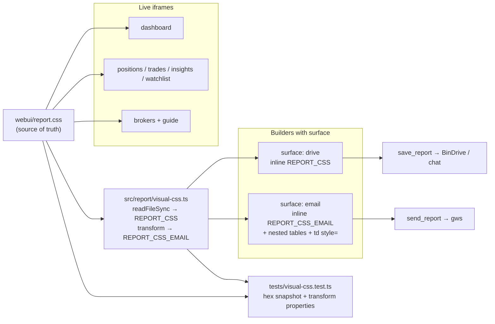
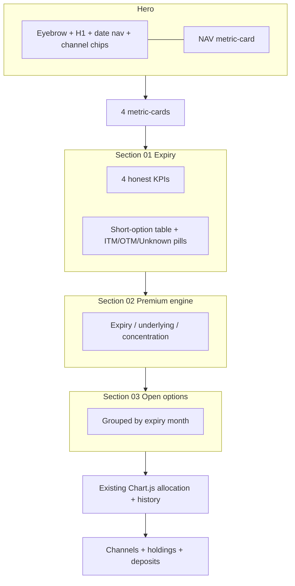

# Visual restyle: Invage / Velovest reports toward the Lovable Wheel Desk

| Field | Value |
|---|---|
| **Author** | Invage systems design (`feat/victor-consultant`) |
| **Date** | 2026-09-21 |
| **Status** | Draft (rev 3) |
| **Repo / branch** | `/home/zqiu/projects/invage` · `feat/victor-consultant` |
| **Reference UI** | [https://velovest-ai.lovable.app/](https://velovest-ai.lovable.app/) (crawled 2026-09-21; CSS dump `/tmp/grok-zqiu/velovest-ref/styles.css`) |
| **This document is** | Design only. Do not edit product source to implement it until a follow-up PR. |

---

## Overview

The live Velovest prototype at `velovest-ai.lovable.app` is a paper-light options desk: Instrument Serif headings, Inter UI, JetBrains Mono eyebrows, dual radial brand wash, metric cards, risk pills, and a wide `max-w-[1600px]` canvas. Invage already copied most of that **token and IA layer** into `webui/report.css` and the Positions / Trades / Insights / Brokers iframes. Two surfaces did not finish the job: (1) the live Dashboard iframe still overlays a leftover slate/Inter system on top of `report.css`; (2) frozen BinDrive / email HTML from `buildAnalysisReport` and `buildDashboardReport` is still GitHub-dark (`#0d1117` / `#161b22` / `#3fb950`).

This design restyles every report surface onto **one visual system** that looks like the prototype, while **refusing to copy its analytics**. Lovable shows Black-Scholes Prob. ITM, IV, “Act now” pills, emotion journals, and behavioral coaching. Invage books have lots, cash, marks, `OptionSpec`, contingent assignment size, and (IBKR-only) `option_executions`. Missing data is an empty state or an honest “not modeled” card — never invented Greeks, IV, or assignment probability.

Copy and options-desk sections are **profile-aware** (`readProductProfile()`: `consultant` vs `full`). Same CSS. Wheel Desk narrative is consultant/Velovest only.

---

## Background & Motivation

### Why this change

The user asked to make existing reports look like the Lovable prototype **without rushing into code**. Production today is a three-look product:

1. **Paper-light iframes** (`webui/positions`, `trades`, `insights`, `watchlist` in part, `brokers`) using `report.css` tokens that already match Lovable `:root` almost 1:1.
2. **Dashboard iframe** (`webui/dashboard/index.html`) that loads `report.css` **and** ~700 lines of local slate tokens (`--ink: #0f172a`, Chart.js CDN, sticky header, old KPI/table chrome).
3. **Frozen HTML** (`src/report/template.ts`, `src/report/dashboard-template.ts`) still GitHub-dark, still footered “Generated by WalletStreet”.

Emailed reports and chat-inline BinDrive HTML therefore look like 2022 GitHub, while the live desk looks like 2026 Lovable.

### Current state (facts)

| Layer | Path | Look today |
|---|---|---|
| Shared iframe tokens | `webui/report.css` | Paper-light oklch tokens, dual radial wash, `.metric-card`, `.pill-*`, `.label-eyebrow`, `.section-gap h2 .bar`, `max-width: 1600px` |
| Shared iframe helpers | `webui/report.js` | `loadDashboard`, `metricCard`, `sectionHead`, `channelButtons`, `dteDays`, `money` |
| Dashboard iframe | `webui/dashboard/` | Mixed: hero already serif; rest is slate KPI/tables + Chart.js |
| Positions / Trades / Insights | `webui/{positions,trades,insights}/` | Mostly on `report.css`; density and grouping lag the prototype |
| Brokers | `webui/brokers/index.html` | Tokens duplicated inline (does **not** link `report.css`) |
| Brokers guide | `webui/brokers/guide/index.html` | Tokens duplicated inline |
| Settings → Brokers | `webui/settings/brokers/index.html` | Unrelated stone/white 13px form; not on the visual system |
| Frozen analysis | `src/report/template.ts` → `buildAnalysisReport` | GitHub-dark 3-axis + options block |
| Frozen dashboard | `src/report/dashboard-template.ts` → `buildDashboardReport` | GitHub-dark hero, sparkline SVG, holdings, channels, history |
| Delivery | `src/tools/save_report.ts`, `src/tools/send_report.ts` | Same HTML; email via `gws gmail +send --html` |
| Tests | `tests/dashboard.test.ts` (`buildDashboardReport`) | Asserts copy/values, not theme |
| Nav | `src/webapp/invage-webui.ts` `createInvageWebUi()` | Dashboard, Positions, Watch List, Trades, Insights, Brokers (+ `/brokers/guide`) |
| Chat chrome | Utarus SPA | Out of scope (see Non-Goals) |

Prior docs this restyle must not contradict:

- `docs/plans/2026-07-17-portfolio-dashboard-design.md` — frozen dashboard is self-contained HTML, inline SVG sparkline, no CDN.
- `docs/webui-chat-design.md` — domain pages are iframes; Utarus owns the React SPA.
- `docs/data-model.md` — dashboard channel dimension; `save_report` kinds `analysis` \| `dashboard`.
- `docs/architecture.md` — `src/report/` is pure investor HTML.
- `docs/plans/2026-09-16-victor-execution-journal.md` — fills are `option_executions`; never infer history from holdings.

### Pain points

1. **Visual split** between live desk and emailed/saved reports.
2. **Dashboard leftover slate** fights `report.css` (two `--ink` values, two table systems, sticky header vs prototype topbar).
3. **Prototype density gap**: Lovable groups open options by expiry month, shows premium-by-underlying bars, assignment obligations by ticker. Invage has the data (`LivePosition.option.expiry`, `weightPct`, `contingentCashObligation`) but Positions/Trades/Dashboard do not present it that way.
4. **Honesty risk**: dashboard already has a “Probability-weighted exposure” card that correctly shows `—` / “Not modeled”. Restyle must keep that discipline while looking as finished as Lovable’s filled radar.
5. **Product split**: forcing “Wheel Desk · Interactive Brokers” onto Invage household (`INVAGE_PRODUCT_PROFILE=full`) would be a copy bug, not a visual win.

---

## Goals & Non-Goals

### Goals

1. One visual language (tokens, type, components) shared by live iframes and frozen HTML.
2. Dashboard iframe finishes the Lovable restyle: delete leftover slate, reuse `report.css` components, keep date replay / Chart.js as live-only.
3. Frozen `save_report` / `send_report` HTML moves to paper-light; email remains readable when clients strip `<style>`.
4. Page IA matches the prototype **where books can populate it**; otherwise empty or omitted — never fake IV / Prob. ITM / emotion.
5. Profile-aware copy: `consultant` may use desk/assignment language; `full` uses investor/household language. Same CSS.
6. Positions page stops duplicating Watch List (already its own nav) and gains an assignment-obligations block when option lots exist.
7. Brokers / guide / settings brokers join the same CSS file instead of forked `:root` blocks.
8. Verification is specified (browser + email + tests). UI PRs are not “done” from code review alone.

### Non-Goals

- Forking or restyling the Utarus React SPA (sidebar, chat composer, login). Domain pages stay iframes (`docs/webui-chat-design.md`).
- Data-model or broker-ingest changes (no new YAML fields, no IV on `OptionSpec`, no emotion tags).
- Implementing Black-Scholes, IV rank, assignment probability, or “Act now” scores.
- Replacing Chart.js on the **live** dashboard in this restyle (optional later PR to SVG). Frozen HTML stays SVG / CSS bars — no new CDN in email.
- Dark-theme toggle (decided: paper-only, Key Decision 4).
- Merging `kind=analysis` into the live Insights page (decided: restyle frozen analysis in place; Insights does not grow 3-axis targets).
- Changing Utarus nav icons, route ids, or iframe mount paths.
- Wallet Street (`origin/walletstreet`) in this series unless a later explicit backport.

---

## Key Decisions

1. **Look like Lovable; compute like Invage.** Visual system copies the prototype. Dashboard/Positions/Insights numbers come only from `DashboardPayload` (`DashboardModel` / `LivePosition` / `OptionSpec` / `connectionMetrics` / `equityPrices`). Fill history comes only from `GET /api/domain/invage/trades` (`buildExecutionJournal`). Rationale: user constraint #1; OptionsExpert already forbids invented Greeks (`src/skills/knowledge/options-analysis.md`, `src/tools/options_insight.ts`).

2. **Iframe restyle, not SPA rewrite.** Keep `DomainExtension.webUi` iframe routes in `createInvageWebUi()`. Rationale: Utarus owns chrome; a React rewrite is a different product.

3. **`webui/report.css` is the only token source.** Iframes `<link>` that file. `src/report/visual-css.ts` `readFileSync`s it at report-build time (`REPORT_CSS`) and derives `REPORT_CSS_EMAIL` with an explicit transform (hex custom properties only; strip `oklch` / `color-mix` / sticky / hover / fixed attachment / `@keyframes`). Tests assert transform properties and the hex snapshot, **not** a duplicated 200-line template string that must byte-match the file. Hex fallbacks are converted from the same `oklch(L C H)` (L as 0–1, matching `report.css`) and appear in CSS as a dual cascade (`--background: #f7fafe; --background: oklch(0.985 0.006 250);`) so old clients keep hex. Rationale: emailed HTML cannot `<link>` the file; Gmail strips `oklch` / `color-mix`; a giant lockstep string will drift.

4. **Paper-only in this series.** No dark theme. GitHub-dark is retired for both email and BinDrive. Rationale: matching the prototype; dual themes double the email matrix. Dark can return later as an explicit toggle. (Closes former Open Question 1.)

5. **Profile-aware copy, shared layout.** `DashboardPayload` gains tiny additive `productProfile: 'full' | 'consultant'` and `productName: string` from `readProductProfile()` / `productDisplayName()` (env, not books). **Every** return of `loadDashboardForSlug` includes them, including `empty: true`. Consultant may say “desk” in eyebrows; H1 stays `Portfolio snapshot` until the user picks “Wheel Desk” (Open Question 2). Options-desk sections render when `optionCount > 0`. This CSS/report series does **not** rewrite chat empty-state household starters. Rationale: constraint #4; WebUI currently has **no** profile in `webui/**`; empty books still need copy gates.

6. **ITM is quote-vs-strike, never probability.** Keep and visually upgrade the existing `renderExpiryRisk` logic in `webui/dashboard/app.js` (short put ITM if last < strike; short call ITM if last > strike). Pills: `ITM` / `OTM` / `Unknown quote` — not `Act now`. Probability-weighted card stays `—`.

7. **Positions = long book + obligations; Watch List stays its own tab.** Drop the watchlist table from `webui/positions/` (duplication). Add “If assigned” grouped by underlying from existing contingent fields.

8. **Trades keeps two views.** Prototype `/trades` is the open-contract ledger. Invage already has a real fill journal (`GET /api/domain/invage/trades` → `buildExecutionJournal`). Keep **Execution journal** and **Open option positions**; restyle the open-positions view to expiry-month grouping. **Flex XML import stays on both profiles** (`POST /api/domain/invage/trades/import` on `webui/trades/index.html` today). Default view (after `productProfile` is on the dashboard JSON): `consultant` → open positions when `optionCount > 0`, else journal; `full` → journal if `journal.available`, else open positions. Client loads dashboard **and** journal on first paint so the default is not hardcoded `view = 'journal'`.

9. **Insights stays honest.** Rename prototype “Behavioral patterns you’re repeating” → “Book patterns” (counts we can compute). Omit emotion section for `full`; consultant shows the existing empty card, not a fake journal. “Recommended actions” = books hygiene + optional “short lot mark ≤ 10% of premium received” (book math), never a close/roll instruction framed as model output.

10. **Velovest (`consultant`) first, then Invage (`full`).** Same PRs, feature-flagged only by profile/copy, but **verify first** on chat.velovest.lextok.com. Rationale: the prototype is a wheel desk; consultant is the matching product.

11. **Every user-visible “WalletStreet” in report tools goes through `productDisplayName()` (or explicit `opts.productName`).** That includes HTML footers in `template.ts` / `dashboard-template.ts` **and** `send_report`’s custom-html default subject (`'Report from WalletStreet'` at `src/tools/send_report.ts` ~line 132). Tests pass `{ productName: 'Victor Consultant' }` so they do not require `UTARUS_AGENT_NAME` (`productDisplayName()` throws without it).

12. **Two frozen HTML surfaces, one builder each.** `buildAnalysisReport` / `buildDashboardReport` take `opts.surface: 'drive' | 'email'` (required in implementation; tests pass it explicitly). `save_report` → `drive` (inline `REPORT_CSS` **plus a frozen override sheet**, analysis max-width 800px / dashboard 900px, CSS grid/flex OK). `send_report` → `email` (inline `REPORT_CSS_EMAIL` + nested tables + compact inline `td`, analysis 640px / dashboard 720px). Email HTML **target ≤ 80KB**: compact cell styles first; if still over, apply the drop order below; only then fail. Keep writing a temp file; at implementation check `gws gmail +send --help` for a body-file flag and use it if present so CSS is not stuffed through argv. Rationale: Gmail clips ~102KB and strips `oklch`/grid; BinDrive is a real browser; a wheel book with many lots must still email.

13. **Dashboard never shows “Premium · daily.”** That figure lives only on the Trades journal view (`GET /api/domain/invage/trades`, `daily[].net_premium` as **decimal strings**). Dashboard KPI “Premium · open” is `live.optionsPremiumCollected` (open-book dollars, a number). No extra `/trades` fetch from the dashboard page.

---

## Inventory: current surfaces vs prototype

Legend — **Look**: visual closeness. **Data**: whether Invage can populate with honest books. **Action**: restyle / populate / empty / omit.

### Live WebUI (iframes)

| Prototype | Invage now | Look | Honest data we have | Gap | Action |
|---|---|---|---|---|---|
| `/` Dashboard — “Wheel Desk · Interactive Brokers”, NAV hero, platform chips, expiry radar, premium engine, open options by expiry | `webui/dashboard/` — “Portfolio snapshot”, NAV hero + date replay, KPI mix, Chart.js allocation, leftover slate tables | Tokens started; chrome is slate | NAV, cash, P/L, channels, option counts, premium collected/paid, contingent cash/shares, ITM vs `equityPrices`, `connectionMetrics.buying_power`, snapshot history, SPY benchmark | Fake: Prob. ITM, IV, Act now, probability-weighted $. Missing UI: expiry table, premium-by-month bars, open options grouped by month | Finish restyle. Radar = ITM vs quote. Premium engine = open-book buckets. Probability card stays empty. Copy profile-aware |
| `/positions` — long stock + assignment obligations. Prototype `<title>` (curl 2026-09-21): “Shares held, covered-call coverage, and the assignment bill…”. Visible H1 in the crawl: “Shares you own, and what you owe.” | `webui/positions/` — long equity/funds + **Watch List table** | Close (report.css) | Equity/fund lots, cost, marks, P/L, channels. Coverage **%** = `min(1, longEquityUnits / shortCallDeliverableShares)` when both legs exist; `uncoveredShares = max(0, deliverable − long)`. Omit the cell when either leg is missing (never show 0). Cash-if-assigned = sum `contingentCashObligation` per underlying | Watch List duplicated (own nav). No obligations table. No coverage % | Drop watchlist from this page. Add obligations with the formula above |
| `/trades` — “Every open contract, journaled.” | `webui/trades/` — execution journal (hardcoded default `view = 'journal'`) + open-option toggle + Flex XML import for **all** profiles | Close | `option_executions` (IBKR Flex Trades/Executions only). Open lots with DTE, strike, premium, mark, P/L, if-assigned. Risk class today: `assigned > 0 && DTE ≤ 21` → `risk-warning` | Prototype is open book grouped by expiry + mark/premium %. Journal is extra (keep). Default view must use profile + lots + `journal.available` | Restyle open view: expiry groups + `shortMarkOverPremium`. Keep journal **and** Flex import on both profiles |
| `/insights` — risks, behavioral patterns, actions, book stats, premium/P&L by underlying | `webui/insights/` — NAV/P&L/cash/assignment cards; risks = dashboard warnings; concentration; books actions; inventory counts; **emotion empty** | Close | Warnings, weights, option/equity/fund counts, channels, contingent cash vs cash, premium/P&L by underlying (derive from lots) | No emotion tags anywhere in state. No win-rate model. Prototype risks use 82% ITM language | Rename patterns. Omit emotion on `full`. Risks from ITM+DTE+coverage, not % |
| `/chat` — “Ask your book anything.” | Utarus SPA + `chatEmptyStateFor(readProductProfile())` in `invage-webui.ts`. `l10n/en.json` still has `chat.empty.title` = “Your investment analyst — with household books” | N/A (SPA) | Starters already profile-aware; consultant still includes household/house-affordability bullets | Prototype chat is a mock desk analyst. Which of `webUi.chatEmptyState` vs `l10n/en.json` the SPA prefers is **not verified in this repo** (Utarus owns the SPA) | **Do not copy** in this CSS series. Optional later copy PR must touch **both** `invage-webui.ts` and `l10n/en.json` and verify the SPA |
| `/brokers` — prototype meta/H1 “Connect once. Sync forever.” | `webui/brokers/` live H1 is **“Connect once. Sync on demand.”** + guide + `settings/brokers`. `IMPORTS` in `app.js` does **not** claim IV (good) but omits IBKR fills and `connectionMetrics`. `UPCOMING = [{ name: 'Webull' }]` is gated on `display_name`; catalog `displayName` is `'Webull'` (`src/brokers/catalog.ts`) so the card should already hide when the API lists Webull — still stale copy | Brokers page is paper but CSS is **forked**; settings is old stone | Catalog connectors (IBKR, Tiger, MooMoo, Webull), last sync, holdings counts | Prototype import list claims IV/Prob. ITM — **false for Invage**. Stale Webull “coming soon” | Keep live H1 (“on demand”, more honest than “forever”). Extend `IMPORTS`. Delete `UPCOMING` Webull. No IV/Prob. ITM |
| *(no prototype)* Watch List | `webui/watchlist/` | Mixed: `report.css` + leftover slate header (same pattern as old dashboard) | Playbook products + Yahoo quotes | Leftover `--ink: #0f172a` local block | Restyle onto `report.css` only; keep as extra nav |

### Frozen HTML (BinDrive + email + chat inline)

| Report | Builder | Consumers | Look | Data | Action |
|---|---|---|---|---|---|
| Analysis (3-axis) | `buildAnalysisReport` in `src/report/template.ts` | `save_report` default (`surface: 'drive'`), `send_report` default (`surface: 'email'`) | GitHub-dark, max-width 800px, emoji section titles | `runFullAnalysis` + option obligation block. Equities only in laggards/overpriced/opportunities | Two surfaces. Keep 3-axis content. Footer = `opts.productName` |
| Dashboard | `buildDashboardReport` in `src/report/dashboard-template.ts` | `save_report kind=dashboard` (`drive`), `send_report kind=dashboard` (`email`) | GitHub-dark, max-width 900px, inline SVG sparkline | Same `DashboardModel` as live tab | Two surfaces. Hero + options metrics + channels + history sparkline + holdings. No Chart.js. CSS width bars for top-N weights (email + drive) |
| Chat delivery | BinDrive signed URL / inline HTML | `l10n/en.json` empty footer; Utarus renders HTML | Inherits frozen template | n/a | Comes along when templates change |

### Data APIs (unchanged math)

| Endpoint | Source | Used by |
|---|---|---|
| `GET /api/domain/invage/dashboard` | `loadDashboardForSlug` → `DashboardPayload` (`model`, `equityPrices`, `connectionMetrics`, `benchmark`, `warnings`) | All live pages except brokers |
| `GET /api/domain/invage/trades` | `buildExecutionJournal(state.option_executions)` | Trades journal view |
| `GET /api/domain/invage/watchlist` | `loadWatchlistForSlug` | Watch List, (today) Positions section 02 |
| Broker connections API | `createBrokerConnectionsRouter` | Brokers / settings |

**Additive fields (this design, no books schema change):**

- `DashboardPayload.productProfile` and `productName` on **every** return, including empty.
- No `executionJournal` on the dashboard JSON (see Key Decision 13).

---

## What we will **not** copy from Lovable

Cite-backed. If a section cannot be backed, it is omitted, empty, or deferred — never silently filled.

| Prototype feature | Why we will not copy | Evidence in this tree |
|---|---|---|
| Prob. ITM from Black-Scholes \(N(d2)/N(-d2)\), including “est.” | No probability model on lots; Yahoo chain has no Greeks | `src/market/options-insight.ts`: “Never invent IV, OI, volume, or Greeks”; insight text “Greeks … not in Yahoo chain payload — unavailable, not invented.” `OptionSpec` (`src/market/types.ts`) has right/side/strike/expiry/multiplier/underlying/settlement/mark — **no IV, no delta**. Dashboard already: “Assignment probability is not modeled” (`webui/dashboard/index.html` `#expiryLead`, `renderExpiryRisk`) |
| IV column / IV rank vs “levels I usually sell at” | IV is ephemeral from `options_insight`, not stored on holdings | `docs/data-model.md`: “`options_insight` … payload is **not** stored on the user file.” Skill: `src/skills/knowledge/options-analysis.md` |
| “Act now >60%” / “Caution 45–60%” / “Comfortable” pills | Those thresholds are probability bands | Same as Prob. ITM. Replacement pills: `ITM` / `OTM` / `Unknown` / `DTE ≤ 7` (calendar), using quote vs strike |
| Probability-weighted exposure | Would require P(ITM) | `renderExpiryRisk` already hard-codes `'—'` and “Not modeled — no assignment probability on the books” |
| Emotion journal / “Which emotional tags have cost me the most” | No emotion field on investor state | `webui/insights/app.js` already: “No emotion tags are stored on household books.” No `emotion` in `InvestorState` |
| Behavioral coaching as psychology | We have inventory counts, not a journal of mistakes | Rename to Book patterns; only show countable facts |
| “Premium · daily” as a dashboard hero KPI | Prototype itself blanks this when trade dates are missing. Invage journal is a **different API** (`GET /api/domain/invage/trades`), `daily[].net_premium` is a **decimal string**, not on `DashboardPayload` | **Do not show this KPI on Dashboard.** Trades journal view already has “Daily short-option net premium”. Dashboard “Premium · open” = `live.optionsPremiumCollected` only |
| Brokers “Risk metrics: IV and probability of finishing ITM, solved per contract” | Connectors do not import IV/Prob | `src/skills/knowledge/broker-integration.md`: lots + IBKR fill history only |
| Chat mock (“I can see your live IBKR book…”) as a domain page | Chat is Utarus SPA | `docs/webui-chat-design.md`; `createInvageWebUi().chatEmptyState` |
| Wheel Desk as the only product voice | Invage `full` profile is household + Aideal + real estate | `PRODUCT_PROFILES` in `src/agents/roster.ts` |

### Honest substitutes (allowed — book math)

These look “desk-like” without new models:

| UI | Formula (existing fields) |
|---|---|
| DTE | `dteDays(option.expiry)` already in `webui/report.js` |
| Moneyness % | `(spot - strike) / strike` when `equityPrices[underlying]` exists; else `—` |
| If assigned (puts) | `LivePosition.contingentCashObligation` |
| If assigned (calls) | `contingentShareObligation` shares; $ = shares × spot when spot known |
| Premium collected / paid | `live.optionsPremiumCollected` / `optionsPremiumPaid` (open book, not lifetime) |
| Mark / premium received (shorts) | One helper, both sides **$ per contract** (`OptionSpec.mark` / `LivePosition.avgCost` — do **not** multiply by `multiplier` again): `shortMarkOverPremium(p) => p.option?.side === 'short' && p.avgCost > 0 ? p.price / p.avgCost : null`. Display as percent, **no cap** except display clamp at 999% if `mark ≫ avgCost`. `avgCost === 0` → `—`. Longs → `—`. Ratio > 1 means the short has gone against you. Column label **“Mark / premium received”** only — never “captured”, “edge”, or win-rate |
| Expiry month buckets | `option.expiry.slice(0, 7)` (`YYYY-MM`) |
| NAV concentration | `weightPct` (and cash weight) |
| Covered-call coverage | Per underlying, when **both** long equity units `L` and short-call deliverable shares `D` exist: `coveragePct = min(1, L / D)`; `uncoveredShares = max(0, D − L)`; `coveredShares = min(L, D)`. Omit the cell (do not show 0%) if either leg is missing |
| High-risk ITM $ | Existing `renderExpiryRisk` sum |
| High-risk coverage | `cash / itmExposure` when both known |
| Daily premium (Trades journal **only**) | `buildExecutionJournal(…).daily[].net_premium` (decimal **string**). Latest broker date in that array. Not on dashboard |
| Near expiry | DTE ≤ 21 (warning) / ≤ 7 (danger) — calendar, not probability |

---

## Target visual system

### Tokens

Iframe CSS already matches Lovable `:root` oklch (L as 0–1 in `webui/report.css`). Hex values below are **converted from those oklch triples** (OKLab → sRGB, channel clipped 0–1), not eyeballed. Implementation must generate them from the same function (checked-in snapshot in `tests/visual-css.test.ts`) so Gmail and iframes do not re-split.

`:root` cascade (hex first, then oklch — last-wins on supporting browsers):

```css
:root {
  --background: #f7fafe;
  --background: oklch(0.985 0.006 250);
  --foreground: #171f30;
  --foreground: oklch(0.24 0.035 265);
  --ink: #060e23;
  --ink: oklch(0.17 0.045 265);
  --card: #ffffff;
  --card: oklch(1 0 0);
  --muted: #ebf1fa;
  --muted: oklch(0.955 0.014 260);
  --muted-foreground: #626c81;
  --muted-foreground: oklch(0.53 0.035 265);
  --border: #d8e0ed;
  --border: oklch(0.905 0.02 262);
  --brand: #5b50f8;
  --brand: oklch(0.55 0.24 278);
  --brand-2: #00b4ca;
  --brand-2: oklch(0.68 0.17 205);
  --success: #00a852;
  --success: oklch(0.63 0.19 155);
  --warning: #eb9500;
  --warning: oklch(0.74 0.17 72);
  --danger: #ea0030;
  --danger: oklch(0.585 0.245 22);
}
```

| Token | oklch (live) | Hex (email / fallback) | Role |
|---|---|---|---|
| `--background` / `--paper` | `oklch(0.985 0.006 250)` | `#f7fafe` | Page |
| `--foreground` | `oklch(0.24 0.035 265)` | `#171f30` | Body text |
| `--ink` | `oklch(0.17 0.045 265)` | `#060e23` | Headings, metric values |
| `--card` | `oklch(1 0 0)` | `#ffffff` | Cards |
| `--muted` | `oklch(0.955 0.014 260)` | `#ebf1fa` | Chip fill |
| `--muted-foreground` | `oklch(0.53 0.035 265)` | `#626c81` | Eyebrows, lead |
| `--border` | `oklch(0.905 0.02 262)` | `#d8e0ed` | Hairlines |
| `--brand` | `oklch(0.55 0.24 278)` | `#5b50f8` | Eyebrow accent |
| `--brand-2` | `oklch(0.68 0.17 205)` | `#00b4ca` | Gradient end |
| `--success` | `oklch(0.63 0.19 155)` | `#00a852` | Up / OK |
| `--warning` | `oklch(0.74 0.17 72)` | `#eb9500` | Caution / DTE |
| `--danger` | `oklch(0.585 0.245 22)` | `#ea0030` | Down / ITM |
| `--gradient-brand` | `linear-gradient(120deg, var(--brand), var(--brand-2))` | same (uses the vars) | Section bar |
| `--shadow-card` | existing oklch | `0 1px 2px rgba(6,14,35,.06), 0 12px 30px -18px rgba(6,14,35,.28)` | Cards |
| `--shadow-glow` | existing color-mix | `0 0 0 1px rgba(91,80,248,.22), 0 18px 40px -22px rgba(91,80,248,.60)` | Hover / active (iframes only) |

**Delete from dashboard/watchlist local `:root`:** `--ink: #0f172a`, `--accent: #1e293b`, `--positive: #047857`, Inter-as-`--font`, slate KPI `.kpi.accent` dark slab.

Type:

- Headings: `--font-serif: "Instrument Serif", ui-serif, Georgia, serif` (weight 400)
- UI: `--font-sans: "Inter", ui-sans-serif, system-ui, sans-serif`
- Eyebrows / table headers / numbers: `--font-mono: "JetBrains Mono", ui-monospace, monospace`
- Iframes: Google Fonts stylesheet already linked on most pages (keep).
- Frozen HTML: same `<link>` for BinDrive/browser; email falls back to Georgia / system-ui / ui-monospace (Gmail often drops webfonts).

Canvas: `.page { max-width: 1600px; }` (dashboard currently mixes 1440px container vs 1600px page).

Background: keep dual radial wash on `body` (`report.css` lines 25–31). Frozen HTML: same in `<style>`; email: solid `--background` hex only (gradients often stripped).

### Components (shared class names)

Extend `webui/report.css` (do not invent a second set of names on dashboard).

| Class | Use |
|---|---|
| `.label-eyebrow` | Mono uppercase kicker |
| `.hero` + `h1` serif | Page title; second line muted date |
| `.section-gap` + `h2 .bar` | Numbered sections (“Section 01”) |
| `.metric-card` / `.metric-value` / `.metric-sub` | KPI tiles; hover may use `--shadow-glow` (iframes only) |
| `.pill` `.pill-success` `.pill-warning` `.pill-danger` `.pill-muted` | Status. Add `.pill-brand` from Lovable |
| `.chip-btn` / `.chip-btn.on` | Channel / right filters. Optional: active = ink fill (already) not brand gradient (Utarus nav owns gradient chrome) |
| `table.report` + `.table-card` + `.table-scroll` | All tabular views. Dashboard must **drop** `.detail-table` |
| `.empty` | Centered empty state inside a card |
| `.risk-danger` `.risk-warning` | Row emphasis. **Add** `.risk-ok` (left success bar) matching Lovable `.risk-row-ok` |
| `.pulse-dot` | Only for DTE ≤ 7 **and** ITM vs quote (calendar + moneyness). Never for a fake 60% score |
| `.help-dot` | Keep dashboard `?` titles that explain NAV / cash / not-modeled |

Add a small HTML helper in `webui/report.js`:

```js
function riskPill(kind, label) {
  // kind: 'ok' | 'warning' | 'danger' | 'muted'
}
function emptyCard(text) { /* .metric-card.empty */ }
function shortMarkOverPremium(p) {
  // p.option?.side === 'short' && p.avgCost > 0 ? p.price / p.avgCost : null
}
```

Frozen templates get equivalent functions in `src/report/html-kit.ts` (escape, money, metric card, section head, table wrap) so analysis + dashboard reports do not re-hardcode hex.

### Accessibility

- Do not rely on color alone: pills have text (`ITM`, `DTE 2d`).
- `pulse-dot` is `aria-hidden`; the pill text carries the meaning.
- Contrast: ink on paper meets WCAG for body; success/danger text on white needs the darkened mix already in `.pill-*` (`color-mix(..., black)`).
- Sticky table headers stay in iframes; email tables are static.
- Respect `prefers-reduced-motion`: disable `pulse-dot` animation.

---

## Shared CSS strategy (iframes vs self-contained HTML)

**Single source of truth:** `webui/report.css` (the file iframes already load). No codegen of that file from TypeScript.



`visual-css.ts` responsibilities:

1. `REPORT_CSS = readFileSync(webui/report.css)` (resolve path from `import.meta.url` / `src/report` → `../../webui/report.css`).
2. `REPORT_CSS_EMAIL = toEmailCss(REPORT_CSS)`:
   - Keep only the hex custom-property declarations (drop the following `oklch` / `color-mix` lines for each token).
   - Drop `position: sticky`, `:hover`, `background-attachment: fixed`, `@keyframes`, `pulse-dot` animation, `color-mix`, `oklch(`.
   - Do **not** keep CSS grid/flex rules that email layout will not use (email HTML is nested tables).
3. Export `HEX_TOKENS` (the snapshot table above) used by `html-kit.ts` for inline `td` styles.

Tests (`tests/visual-css.test.ts`):

- `HEX_TOKENS.background === '#f7fafe'` (and the rest of the snapshot).
- `REPORT_CSS` contains both `#f7fafe` and `oklch(0.985 0.006 250)`.
- `REPORT_CSS_EMAIL` contains `#f7fafe` and does **not** contain `oklch(` or `color-mix`.
- Do **not** assert `REPORT_CSS === file` via a duplicated string literal.

### Iframes

- Pages that already `<link rel="stylesheet" href="../report.css" />` keep doing that.
- Brokers + guide: link `../report.css` (or `../../report.css` from `brokers/guide/`) and **delete** duplicated `:root`. **Keep a local override** `.page { max-width: 1100px; }` so PR 1 does not jump Brokers from 1100px to 1600px. Dual radial wash from `report.css` `body` **will** appear — that is an accepted, small visible change in PR 1 (tokens, not IA).
- Settings brokers stays stone until the brokers/settings PR (not PR 1).
- Google fonts `<link>` stays in each HTML head (iframes can network).
- Dashboard **deletes** its local ~705-line `<style>` except a thin page-specific sheet (date-nav, chart heights, help-dot) that references shared tokens only.

### Frozen HTML / email

Builders take `opts.surface`:

| `surface` | Consumer | CSS | Layout | Width |
|---|---|---|---|---|
| `drive` | `save_report`, BinDrive, chat-inline | `<style>` = `REPORT_CSS` **then** `FROZEN_DRIVE_OVERRIDE` | Same card/table classes as iframes; grid/flex OK | analysis 800px / dashboard 900px |
| `email` | `send_report` only | `<style>` = `REPORT_CSS_EMAIL` **and** compact inline `style=` on `td` | Nested `<table>` only (no grid/flex) | analysis 640px / dashboard 720px |

**Drive override (required).** `webui/report.css` today has `.page { max-width: 1600px; }` and `table.report { min-width: 860px; }`. Inlining that file unchanged would either ignore the 800/900 spec or wrap at 800px and force a horizontal scrollbar. After `REPORT_CSS`, builders append:

```css
/* FROZEN_DRIVE_OVERRIDE — html-kit.ts, not in report.css */
.page { max-width: 800px; }          /* dashboard: 900px */
table.report { min-width: 0; }
```

Do not change iframe `report.css` min-width for this. Email does not use `.page` / `table.report`.

Email rules:

- Metric “cards” = nested tables.
- Sparkline = existing inline SVG (`buildSparklineSvg`); stroke `#00a852` / `#ea0030`.
- No Chart.js, no Google Fonts required for correctness.
- **Compact `td` styles:** set `font-family` once on the wrapper `<table>` (Georgia / system-ui fallback). Each `td` / metric cell inlines only `padding`, `border-bottom`, `color` (and `text-align:right` on nums). Do **not** repeat `font-family` or `background` on every cell unless the row is a section header.
- **Size budget:** warn at 60KB. Target ≤ **80KB** after compact styles. If still over, drop in this order (never omit hero metrics, channel summary totals, or the footer):
  1. Value-history rows after the **last 8** snapshots (keep sparkline from the full series if it still fits; else sparkline from the kept 8).
  2. Holdings / full-portfolio rows after the **top 25** by `|value|` (caption: “Showing 25 of N by value”).
  3. Analysis 3-axis tables: keep all laggards/overpriced/opportunities; if a single axis still blows the cap, keep top 15 by |P/L %| with the same caption.
  4. Only if still > 80KB after 1–3: **fail** `send_report` with the byte size (pathological). `save_report` / `surface: 'drive'` has **no** 80KB cap.
- **CI fixtures:** (a) 1-position email HTML ≤ 80KB; strip `<style>`, a metric `td` still has `style="` + hex. (b) **Many-row fixture** (e.g. 80 holdings + 20 history rows) still ≤ 80KB **after drop**, hero NAV/P/L still present, caption “Showing 25 of 80”. Manual Gmail send remains a PR checklist item.
- `gws`: currently `--body` argv after `/tmp/invage_report_*.html`. Use a body-file flag if `gws gmail +send --help` documents one.

### Chart.js

- **Keep** on live dashboard only (`https://cdn.jsdelivr.net/npm/chart.js@4.4.1/dist/chart.umd.min.js` in `webui/dashboard/index.html`).
- Restyle chart card chrome to `.metric-card`; palette from brand/success/danger, not the current pastel `COLORS` array, in the same dashboard PR.
- Frozen reports **and** dashboard Section 02 premium engine: **CSS width bars only** (no extra Chart.js instances). See Premium engine spec below.
- Later optional PR: replace remaining Chart.js allocation/history with SVG. Not blocking.

---

## Information architecture (after restyle)

Profile + data gates. `P = productProfile`. `hasOptions = live.optionCount > 0`.

### Copy matrix (closed)

Use `payload.productProfile` even when `empty: true`. `hasOptions` is false on empty. Do not hardcode “Interactive Brokers”; join `live.channels` (`default` → `Unassigned`). “Last refresh · {generatedAt}” plus channel chips replaces prototype “Live sync · Interactive Brokers”.

Chat empty-state strings are **out of this series** (optional later PR). Household starters in `chatEmptyStateFor` stay.

| Slot | `consultant` | `full` | Empty books (`empty: true`) |
|---|---|---|---|
| Dashboard eyebrow | `{channelLabel} desk` or `Multi-broker desk` | `Multi-broker` | `consultant`: `Desk`; `full`: `Household books` |
| Dashboard H1 | `Portfolio snapshot` (not “Wheel Desk” unless the user answers Open Question 2) | `Portfolio snapshot` | same H1 |
| Dashboard lead | `{n} holdings — {e} equity, {o} option, {f} fund` | same counts, no wheel language | payload `message` (already: “No holdings or fixed deposits yet…”) |
| Dashboard KPI labels | `Premium · open`, `Buying power`, `Cash available`, `Margin used` | same | values `—`, subs “No option lots” / “Not recorded” (already) |
| Expiry section title | `Expiry calendar & assignment risk` | `Option expiries & obligations` | hide section if `!hasOptions` |
| Expiry empty | `No short option lots in this view.` | same | n/a (hidden) |
| Probability KPI | always `—` / `Not modeled — no assignment probability on the books` | same | same |
| Premium engine title | `Premium engine` | `Premium by expiry` | hidden if `!hasOptions` |
| Positions H1 | `Shares you own, and what you owe.` | `Shares and funds you own.` | same H1; table empty card |
| Positions S1 title | `Long stock & fund positions` | same | — |
| Positions S2 title | `Assignment obligations` | same (only if `hasOptions`) | hidden |
| Positions S2 empty | `No short options — nothing to assign.` | same | n/a |
| Trades H1 (open view) | `Every open contract, journaled.` | `Open option lots.` | `No option lots on the books.` |
| Trades H1 (journal view) | `Each trade, recorded separately.` (keep current) | `Option fills.` | journal empty copy already in `app.js` |
| Trades Flex import label | `Import historical Flex XML` (both profiles) | same | same |
| Insights H1 | `Where the book stands.` | `Where the books stand.` | same H1 |
| Insights eyebrow | `Books briefing · {date}` (not `Hello, {name}.` as H1) | same | `Daily briefing` |
| Insights lead | `{n} lots, NAV {money}. Insights below are computed from that slice only.` | same | payload `message` |
| Insights S1 title | `Today's risks` | same | same |
| Insights S2 title | `Book patterns` | `Book patterns` | hide if nothing countable |
| Insights S3 title | `Recommended actions` | same | same |
| Insights S04 title | `Book statistics` (replace live `Your personal edge` in `webui/insights/app.js`) | same | same |
| Insights S04 lead | `Live inventory counts from this slice, not win rates or closed-trade edge.` (replace “Continuous learning from closed trades…”) | same | n/a |
| Insights S5 title | `Premium and P&L by underlying` | same; hide if `!hasOptions` | hide |
| Insights emotion | one empty card: `No emotion tags are stored on these books.` | **omit the section** | omit / empty per profile |
| Insights actions empty | `No books actions flagged from this slice.` | same | `No actions — the books have no positions to reconcile.` |
| Watch List H1 | `Watch List` (keep current `webui/watchlist/index.html`) | same | n/a |
| Watch List eyebrow | `Playbook / named products` | same | n/a |
| Brokers H1 | **Keep live copy:** `Connect once. Sync on demand.` (do not switch to prototype “forever”) | same | n/a |
| Frozen footer | `Generated by {productName} · Equities: Yahoo Finance · Options: stored marks · Not financial advice` | same | n/a |
| `send_report` default subject (generated) | `Portfolio Dashboard — {userName}` / `Portfolio Analysis Report — {userName}` (already) | same | n/a |
| `send_report` custom-html default subject | `Report from {productDisplayName()}` (replace `WalletStreet`) | same | n/a |

### Dashboard (live)

```
┌─ breadcrumb: Dashboard / Portfolio overview ─────────────────────────┐
│  EYEBROW (profile)                                                    │
│  Portfolio snapshot                                                   │
│  {long date}                                                          │
│  lead: counts from live (N holdings — n equity, m option, k fund)     │
│  [date nav] [Refresh] [Auto 60s]   ┌ metric-card NAV ─────────────┐   │
│  (chips) All platforms · ibkr · …  │ Portfolio value  $…          │   │
│                                    │ Δ vs last snapshot or live P/L│   │
│                                    └──────────────────────────────┘   │
│  KPI row (4): Premium · open | Buying power | Cash | Margin used      │
│               (— if unknown; never 0). Not “Premium · daily”.         │
│                                                                       │
│  Section 01  Expiry calendar …                                        │
│  4 honest KPIs (ITM $, “not modeled”, cash+BP, coverage)              │
│  TABLE: short options, DTE sort, pills ITM/OTM/Unknown/DTE            │
│  empty: “No short option lots in this view.”                          │
│                                                                       │
│  Section 02  Premium engine   [only if hasOptions]                    │
│  Four CSS width-bar cards (no Chart.js):                              │
│    premium sold by expiry month | NAV concentration (top 8)           │
│    premium by underlying (top 8) | open P&L by expiry month           │
│                                                                       │
│  Section 03  Open options · broker view  [hasOptions]                 │
│  Grouped by expiry month + monthly totals (book sums)                 │
│  else: skip section                                                   │
│                                                                       │
│  Allocation / performance charts (existing Chart.js, restyled cards)  │
│  Channels table (table.report)                                        │
│  Holdings table (table.report)                                        │
│  Fixed deposits (if any)                                              │
│  Methodology (keep; investor-honest)                                  │
└───────────────────────────────────────────────────────────────────────┘
```

Date replay and archive snapshots stay — they are Invage-only and better than the prototype. Archive dates that lack option specs show empty option sections rather than guessing.

#### Premium engine (CSS bars — live dashboard and frozen drive)

No new Chart.js charts. Each card is a list of rows: label + numeric + a `div` whose `width` is `% of max in the set` (CSS only).

| Card | Series | Sort | Top-N | Empty |
|---|---|---|---|---|
| Premium sold by expiry month | Sum `premiumAbsolute` for `option.side === 'short'` grouped by `expiry.slice(0,7)` | month ascending | all months present (typically few) | hide Section 02 |
| Open P&L by expiry month | Sum `pl` of option lots in that month | same month keys | all | hide Section 02 |
| Premium by underlying | Sum short `premiumAbsolute` by `option.underlying` | descending premium | **top 8**; remainder not shown (caption: “Top 8 underlyings”) | hide Section 02 |
| NAV concentration | `weightPct` per position **plus** cash weight if known | descending weight | **top 8** | hide card if no positions |

Bar color: brand gradient via `background-image: var(--gradient-brand)` on iframes; email/frozen drive may use solid `#5b50f8`. Negative open P&L: danger hex, bar width from absolute value vs max abs in the set.

### Frozen dashboard report

Same sections for `drive` and `email`; **layout differs** (`surface`).

1. Header: `{opts.productName}` · `{userName}` · generated-at UTC · merged channels.
2. Hero metrics: Positions, Live NAV, P/L vs cost, Period change.
3. Options strip if `optionCount > 0`: count, premium collected, contingent cash. One line: “Short option lots: N · contingent cash: $X. ITM vs spot is live-dashboard only.”
4. Optional CSS width bars for top-8 NAV concentration (`drive` and `email`).
5. By channel table.
6. Value history + SVG sparkline.
7. Holdings table.
8. Footer: product name · Yahoo · options stored/live marks · not advice.

No expiry radar table in frozen v1 (width + no underlying spot on the template today).

### Frozen analysis report

Keep three axes (`laggards` / `overpriced` / `buyOpportunities`) + options section + full portfolio. Visual: paper cards with left brand/danger/warning/success bars instead of emoji `🔴🟡🟢`. Width: `drive` 800px / `email` 640px. Options section uses the same obligation numbers already computed in `optionsSection()`.

### Positions (live)

```
Section 01  Long stock & fund positions
  KPI: market value, cost, unrealized, lots
  table.report + channel chips
Section 02  Assignment obligations   [hasOptions]
  KPI: cash if all puts assigned, shares callable, coverage vs free cash
  table grouped by underlying: long shares L, short-put cash, short-call deliverable D,
  coveredShares = min(L,D), uncoveredShares = max(0, D−L), coveragePct = min(1, L/D)
  omit coverage cells when L or D missing (never 0)
  empty: “No short options — nothing to assign.”
```

Watch List is **not** on this page after restyle.

### Trades (live)

Filters (both profiles): Execution journal | Open option positions | Import historical Flex XML (`POST /api/domain/invage/trades/import`).

**First paint:** `Promise.all` journal fetch + `loadDashboard()`. Then pick default view from Key Decision 8. Do not leave `view = 'journal'` hardcoded.

Open view:

- Channel + right chips (already).
- Group `<tbody>` by expiry month; group row = counts, assignment cash, earliest DTE, premium received, MTM, open P&L.
- Columns: contract, right/side, strike, expiry, DTE, contracts, avg premium, mark, P/L, **Mark / premium received** (`shortMarkOverPremium`), if assigned, channel.
- Row class: `risk-danger` if ITM vs `equityPrices` **or** DTE ≤ 7; `risk-warning` if DTE ≤ 21.

Journal view: keep current tables (executions, daily short-option net premium as decimal strings, cumulative `<details>`). Restyle to `table.report` only. This is the **only** place “daily premium” appears.

### Insights (live)

| Section | Content | Empty |
|---|---|---|
| 01 Today’s risks | Dashboard warnings + ITM shorts with DTE ≤ 21 + contingent cash > free cash | “No books risks on this slice.” |
| 02 Book patterns | e.g. “32 of 139 contracts expire within 30 days”; “Largest weight: AMD 29.6% NAV” | Hide if nothing countable |
| 03 Recommended actions | Missing cash; missing marks; “{contract} mark is 1% of premium received” | “No books actions flagged.” Never “candidate to close or roll” as if the product decided |
| 04 Book statistics | Title **must** be `Book statistics`, not live `Your personal edge`. Lead: inventory counts, not win rates. Cards: equity/fund/option counts, put/call split, avg DTE, cash weight, LEAP count (expiry > 365d) | zeros allowed as counts |
| 05 Premium and P&L by underlying | From option lots | Hide if `!hasOptions` |
| Emotion | **Omit** on `full`. Consultant: one empty card, no table chrome | — |

### Brokers

**H1 stays** `Connect once. Sync on demand.` (live `webui/brokers/index.html`; more honest than prototype “forever”).

Replace/extend `IMPORTS` in `webui/brokers/app.js` with:

- Open positions — equity / fund / option lots, cost, mark, P/L on that channel
- Cash — ISO sleeves on that channel
- Channel snapshot — sync replaces lots and cash on that channel only
- Marks — dashboard marks stay Yahoo
- Assignment size — computed from strike × multiplier × contracts (not a vendor “risk metric”)
- Account metrics when the connector set them — `buying_power` / `excess_liquidity` / `maintenance_margin` (`connectionMetrics`)
- Fills — IBKR Flex Trades at Executions level only; Tiger/MooMoo/Webull omit `option_executions`
- Not imported — futures, short stock, combo options, incomplete option rows
- Secrets — reporting-only credentials, never echoed

Explicitly **do not** list IV or Prob. ITM.

**Delete** `UPCOMING = [{ name: 'Webull' }]`. Catalog id `webull` / `displayName: 'Webull'` already ships (`src/brokers/catalog.ts`). The live-name gate (`payload.connectors[].display_name`) should already hide the card; the array is still a lie if the API is slow or naming drifts.

Settings iframe: restyle onto `report.css`. Measure height after restyle **before** changing `iframeHeightPx: 760`.

### Watch List

Hero + `table.report` of named products. Remove local slate header/controls.

### Chat

No domain `/chat` route. Consultant empty-state may later swap title to “Ask your book anything.” in a **copy-only** PR; not part of visual CSS work.

---

## Component sketches

### Dashboard layout



### Analysis report (frozen)

```
┌ paper page ──────────────────────────────────────────┐
│  EYEBROW  Analysis report                             │
│  {Name} · {timestamp}                                 │
│  ┌ pos ┐ ┌ value ┐ ┌ P/L ┐ ┌ opportunities ┐         │
│  Options card (if any): premium / contingent          │
│  ── Laggards (danger bar)  table                      │
│  ── Overpriced (warning bar) table                    │
│  ── Buy opportunities (success bar) table             │
│  ── Full portfolio table                              │
│  footer productDisplayName · not advice               │
└───────────────────────────────────────────────────────┘
```

### Insights

```
eyebrow: Books briefing · {date}
H1: Where the book stands. / Where the books stand.
lead: {n} lots, NAV {money}. …from that slice only.
[NAV] [P/L] [Cash] [Assignment cash]
01 Risks          02 Book patterns
03 Actions
04 Stats (grid-4)
05 Premium/P&L by underlying (table)
(emotion: consultant empty card only; omit on full)
```

Do **not** use `Hello, {displayName}.` as the H1 (current `webui/insights/app.js`). Display name may stay in the lead if useful.

---

## API / Interface Changes

No new REST resources. Additive JSON only:

```ts
// DashboardPayload in src/webapp/dashboard-data.ts
export interface DashboardPayload {
  slug: string;
  displayName: string;
  generatedAt: string;
  empty: boolean;
  message?: string;
  model: DashboardModel | null;
  benchmark: BenchmarkData | null;
  warnings?: DashboardIssue[];
  equityPrices?: Record<string, number>;
  connectionMetrics?: Record<string, BrokerConnectionMetrics>;
  /** NEW: env profile, for copy/section gates. Not a books field. */
  productProfile: 'full' | 'consultant';
  /** NEW: UTARUS_AGENT_NAME, for frozen-report footers if reused client-side. */
  productName: string;
}
```

`loadDashboardForSlug` sets `productProfile` / `productName` on **both** the populated return and the empty return (`tickers.length === 0 && deposits.length === 0`).

`buildAnalysisReport` / `buildDashboardReport` signatures:

```ts
type ReportSurface = 'drive' | 'email';

buildDashboardReport(model: DashboardModel, userName: string, opts: {
  productName: string;
  productProfile?: ProductProfileId;
  surface: ReportSurface;
}): string;

buildAnalysisReport(result: AnalysisResult, userName: string, opts: {
  productName: string;
  surface: ReportSurface;
}): string;
```

`save_report` passes `surface: 'drive'` and `productName: productDisplayName()`. `send_report` generated path passes `surface: 'email'` and the same name. Custom-html path does not rebuild; only the default subject changes to `Report from ${productDisplayName()}`. Tests **must** pass `opts` explicitly (`productName: 'Victor Consultant'`, `surface: 'drive' | 'email'`) so they do not require `UTARUS_AGENT_NAME`.

**No change** to `OptionSpec`, `Holding`, `option_executions`, or broker mappers.

Client-only grouping (no API change): expiry month, put/call split, coverage %, `shortMarkOverPremium` — all derived in `webui/*.js` from `live.positions` (+ `equityPrices` already on the dashboard payload). Daily premium is **not** client-derived from lots; it stays on the trades journal JSON.

---

## Data Model Changes

**None** in investor YAML / snapshots.

Optional later (explicit follow-up, not this restyle): persist Yahoo `impliedVolatility` on insight overlay. Out of scope.

Migration: none. Old BinDrive HTML files stay GitHub-dark until the user regenerates `save_report`.

---

## Alternatives Considered

### 1. Full SPA rewrite of domain pages in Utarus React

- **Pros:** One chrome, shared nav active state with `bg-[image:var(--gradient-brand)]` like Lovable, no iframe seam.
- **Cons:** Forks Utarus; large PR; contradicts `docs/webui-chat-design.md`; blocks Velovest/Invage until SPA ships.
- **Decision:** Reject for this series. Iframe CSS restyle is independently mergeable.

### 2. Dark theme toggle / keep GitHub-dark for email

- **Pros:** Email clients; existing tests; “terminal” aesthetic some traders like.
- **Cons:** Permanent two-look product (the actual user complaint); Gmail handles light tables at least as well as dark; prototype is paper.
- **Decision:** Paper-only. Email uses hex paper + inline td styles, not GitHub-dark.

### 3. Copy Lovable analytics “for demo density”

- **Pros:** Pixel-match screenshots.
- **Cons:** Violates OptionsExpert contract, factchecker, and user constraint #1. Unrecoverable trust bug on a consultant product.
- **Decision:** Reject. Empty/not-modeled is a first-class visual state (muted card, not a hole).

### 4. Generate frozen HTML by screenshotting the iframe

- **Pros:** Perfect visual match.
- **Cons:** Needs a browser on the agent host; fails `send_report`; huge HTML; not email-safe.
- **Decision:** Reject. Dual `surface` builders instead.

### 4b. One HTML for drive and email (always email-safe tables)

- **Pros:** One builder, no `surface` flag, BinDrive always Gmail-readable.
- **Cons:** BinDrive would never match iframe density (720px nested tables vs 1600px canvas). User asked reports to look like the prototype **and** email to stay readable.
- **Decision:** Reject. Two surfaces (Key Decision 12).

### 4c. Duplicate `REPORT_CSS` as a TypeScript template string that byte-matches `webui/report.css`

- **Pros:** No `readFileSync` at report-build time.
- **Cons:** Quotes/newlines/comments drift on the first CSS edit; mermaid “TS → FILE” implies codegen PR 1 never listed.
- **Decision:** Reject. File on disk is source of truth; TS reads it.

### 5. Keep dashboard’s local slate CSS; only restyle other pages

- **Pros:** Smaller first live PR.
- **Cons:** Dashboard is the default nav tab (`defaultPath: '/dashboard'`). Leftover slate is the loudest **live** inconsistency. The loudest **cross-surface** inconsistency is frozen GitHub-dark email/BinDrive.
- **Decision:** After CSS lockstep, **frozen paper HTML ships next**, then dashboard chrome. Live leftover slate is acceptable for one PR while emailed reports stop looking like 2022 GitHub.

---

## Security & Privacy Considerations

| Topic | Notes |
|---|---|
| Threat | Restyle does not change auth. APIs stay `auth: 'user'` on `createDashboardApiRouter` / broker router. |
| PII | Reports already include display name, holdings, cash. Paper theme does not add fields. Email still goes through existing `gws gmail +send`. |
| Third-party | Google Fonts and Chart.js CDN remain iframe-only. Do **not** add CDNs to emailed HTML (tracking + availability). |
| XSS | Keep `escapeHtml` / `esc()` on every interpolated field. New grouping code must not innerHTML unsanitized tickers. |
| Profile leak | `productProfile` is instance env, not user secret. Safe to put on the dashboard JSON. |

---

## Observability

- No new metrics required for CSS.
- Keep dashboard `warnings` banner; restyle to `.pill-warning` list, not a yellow slate box.
- CSS tests: hex snapshot + `REPORT_CSS_EMAIL` has no `oklch(`; drive HTML contains `max-width: 800px` or `900px` and `table.report { min-width: 0; }`; email HTML ≤ 80KB after drop; email HTML with `<style>` stripped still has inline hex on a metric `td`; many-row fixture still emails.
- `send_report` failures remain the existing `gws` stderr path. Log byte size of email HTML (warn if > 60KB; drop then fail if still > 80KB).
- Optional log line when frozen report is built: kind, surface, byte size, `productProfile`.

Alerting: none. Visual regressions are caught by the verification checklist, not by Prometheus.

---

## Risks

| Risk | Severity | Mitigation |
|---|---|---|
| Iframe paper vs Utarus SPA chrome mismatch (sidebar may stay dark/neutral) | Medium | Accept in Non-Goals. Domain iframe background wash will still read as Lovable. Do not double-paint a second topbar inside the iframe that fights the SPA header |
| Chart.js CDN outage blanks allocation charts | Low | Charts are progressive; tables remain. Frozen path has no CDN |
| Gmail strips `oklch` / grid / webfonts → unreadable email | High | Separate `surface: 'email'` builder; hex + nested tables + inline `td`; CI strips `<style>` and still finds hex; 80KB cap; manual Gmail send on the frozen-HTML PR |
| Email HTML + inline CSS exceeds Gmail ~102KB / `gws --body` argv | Medium | Compact wrapper `font-family`; drop history after 8 then holdings after 25; fail only if still over; prefer gws body-file flag if it exists; many-row fixture in PR 2 |
| Consultant copy leaks onto Invage household | Medium | Gate on `productProfile` on **empty and full** payloads; copy-matrix tests |
| Empty dashboard omits profile → `undefined` gates | Medium | Required fields on every `DashboardPayload` return |
| “ITM” pill misread as assignment probability | Medium | Help text on section lead. Pill text is `ITM` not `Act now 82%` |
| Dashboard chrome PR is large (`app.js` ~2037 lines; local `<style>` ~705) | Medium | Chrome restyle and expiry/premium IA are separate PRs, after frozen HTML |
| Brokers page CSS fork drifts again | Low | Delete inline tokens; link `report.css` |
| Old BinDrive files stay dark | Low | Document “regenerate save_report”; do not rewrite historical drive files |
| `% of premium` on long options is confusing | Low | `shortMarkOverPremium` only; longs and `avgCost === 0` → `—`; never label “captured” |
| `pulse-dot` animation accessibility | Low | `prefers-reduced-motion` |

---

## Rollout Plan

### Sequence

Matches the PR Plan (visual split first: emailed/BinDrive GitHub-dark vs paper).

1. CSS source-of-truth + hex cascade + email transform + `productProfile` on every dashboard JSON (including empty). Brokers/guide link `report.css` with **1100px** `.page` override.
2. Frozen paper HTML (`surface: 'drive' | 'email'`), Gmail send, CI strip-`<style>` fixture, 80KB cap. After this, emailed reports are no longer GitHub-dark.
3. Dashboard iframe chrome (kill leftover slate) on **Velovest** — verify in browser.
4. Dashboard expiry ledger + CSS premium bars (honest ITM, no Prob. ITM).
5. Positions obligations + Watch List restyle; Trades grouping + default view; Insights honesty.
6. Brokers `IMPORTS` + delete Webull upcoming; settings brokers onto `report.css` (measure iframe height before changing `iframeHeightPx`).
7. Confirm Invage `full` copy (chat.investor.lextok.com) does not say Wheel Desk.

Open Question 2 (Wheel Desk H1) does **not** block scheduling: H1 is `Portfolio snapshot` until the user says otherwise.

No feature flag service. Profile env is the flag. Rollback = revert the PR; CSS is additive.

### Verification (required for every UI PR)

User rule: UI work must be verified, not inferred from code.

**Local (iframe)**

1. Run the webapp with `INVAGE_PRODUCT_PROFILE=consultant` and a fixture/slug that has option lots + cash + at least one IBKR journal row if available.
2. Open `/dashboard`, `/positions`, `/trades`, `/insights`, `/brokers`, `/watchlist` inside the SPA (not `file://`).
3. Checklist vs Lovable:
   - Serif H1, mono eyebrow, gradient section bar, paper wash, metric-card radius/shadow
   - No slate sticky header, no `#0f172a` ink, no GitHub-dark
   - Channel chips; empty states use `.empty` not blank
   - Expiry section: ITM/OTM/Unknown only; probability KPI is `—`
   - Trades open view groups by expiry; journal still loads
   - Insights has no emotion table on `full`
4. Repeat with `INVAGE_PRODUCT_PROFILE=full` and a household-like book (equities + FD, zero options): options sections hidden/empty, no “Wheel” / “Act now”.
5. Narrow viewport (~390px): tables scroll inside `.table-scroll`; hero stacks.

**Frozen / email**

1. `save_report kind=dashboard` and `kind=analysis`; open the BinDrive HTML in Chrome. Confirm paper theme, `productDisplayName()` footer, sparkline visible.
2. `send_report` to a Gmail inbox; confirm tables readable **without** depending on webfonts (disable remote CSS in a second pass if possible).
3. `tests/dashboard.test.ts` call sites pass `{ productName: 'Victor Consultant', surface: 'drive' }` (and an `email` case). Assert HTML contains `Victor Consultant` and `#f7fafe`. Reject `#0d1117`, `WalletStreet`, and `Generated by Wallet Street` (`tests/setup.ts` defaults `UTARUS_AGENT_NAME` to `'Wallet Street'` with a space — the no-space needle is not enough). New `tests/analysis-report.test.ts` for `buildAnalysisReport`. Email: strip `<style>` and still find `style="` + hex on a `td`. Many-row email fixture applies drop order and stays ≤ 80KB with hero intact.
4. `tests/dashboard-webui.test.ts`: empty (`bob`) and non-empty payloads include `productProfile` and `productName` (PR 1).

**Production**

1. Velovest first: chat.velovest.lextok.com — Dashboard default tab.
2. Then Invage: chat.investor.lextok.com.
3. Do not ship Wallet Street in this series.

---

## Open Questions

**Decided in this revision (no longer blocking):**

- Theme = paper-only (Key Decision 4).
- Analysis report stays a frozen HTML artifact; Insights does not grow 3-axis targets in this series.
- Trades default view = Key Decision 8; Flex import stays on both profiles.
- Daily premium is Trades-only (Key Decision 13).

**Still open:**

1. **How close is “Wheel Desk” copy on Velovest?** Draft H1 is `Portfolio snapshot`; consultant eyebrow may say “desk”. Should Velovest H1 become `Wheel Desk` when `optionCount > 0`? Does **not** block PRs.
2. **Active nav gradient** lives in Utarus SPA. Ask Utarus for a token hook, or live with iframe-only restyle?
3. **Remaining Chart.js** (allocation / history on live dashboard): restyle chrome now (in the dashboard chrome PR), replace with SVG later — confirm the later PR is wanted.
4. **Historical BinDrive HTML:** leave GitHub-dark until the user regenerates, or add a one-shot regenerator? Draft: leave.
5. **Settings brokers iframe height** (`iframeHeightPx: 760`) — measure after restyle before changing.
6. **Which empty-state source the SPA uses** (`webUi.chatEmptyState` vs `l10n/en.json`) — only matters if a later chat-copy PR is scheduled. This series does not change those files.

---

## References

- Live prototype: https://velovest-ai.lovable.app/ (routes `/`, `/positions`, `/trades`, `/insights`, `/chat`, `/brokers`; CSS dump `/tmp/grok-zqiu/velovest-ref/styles.css`). **Prototype analytics copy (Prob. ITM, Act now, emotion) is from meta/titles, CSS classes (`.pill-*`, `.risk-row-*`, `.pulse-dot`), and the 2026-09-21 text crawl of the SSR shell — not a fully hydrated React DOM audit.** Live Lovable is a client SPA; assignment-% strings are not all in the raw HTML dump.
- `webui/report.css`, `webui/report.js`, `webui/dashboard/index.html`, `webui/dashboard/app.js` (`renderExpiryRisk` ~1123–1174)
- `src/report/template.ts` (`buildAnalysisReport`), `src/report/dashboard-template.ts` (`buildDashboardReport`, `buildSparklineSvg`)
- `src/report/dashboard-model.ts` (`DashboardModel`, `LivePosition`, `ChannelTotals`)
- `src/webapp/invage-webui.ts` (`createInvageWebUi`, `chatEmptyStateFor`)
- `src/webapp/dashboard-api.ts`, `src/webapp/dashboard-data.ts` (`DashboardPayload`)
- `src/market/types.ts` (`OptionSpec`)
- `src/market/options-insight.ts`, `src/tools/options_insight.ts`
- `src/brokers/option-executions.ts` (`buildExecutionJournal`, decimal-string `net_premium`), `docs/plans/2026-09-16-victor-execution-journal.md`
- `src/brokers/catalog.ts` (`webull` / `displayName: 'Webull'`)
- `src/agents/roster.ts` (`readProductProfile`, `PRODUCT_PROFILES`)
- `src/tools/save_report.ts`, `src/tools/send_report.ts` (custom-html subject `Report from WalletStreet`)
- `l10n/en.json` (`chat.empty.*`)
- `docs/plans/2026-07-17-portfolio-dashboard-design.md`
- `docs/webui-chat-design.md`
- `docs/data-model.md` (dashboard dimension, save_report kinds)
- `docs/architecture.md` (`src/report/`)
- `tests/dashboard.test.ts`, `tests/dashboard-webui.test.ts` (empty `bob`), `tests/setup.ts` (`UTARUS_AGENT_NAME` default `'Wallet Street'`)

---

## PR Plan

Incremental, independently reviewable. Order follows the Overview pain (frozen GitHub-dark vs live paper) then leftover dashboard slate, then density. Profile JSON is in PR 1 so later UI PRs are not blocked. **Do not schedule until paper-only and “analysis stays frozen” are accepted** (they are the draft defaults). Wheel Desk H1 (Open Question 1 remaining) does not block.

### PR 1 — Visual CSS + profile JSON

- **Title:** `feat(webui): report.css hex cascade, email transform, dashboard profile fields`
- **Files:** `webui/report.css` (hex-then-oklch cascade, `.pill-brand`, `.risk-ok`, `.pulse-dot`, `prefers-reduced-motion`), `src/report/visual-css.ts` (new: `readFileSync` + `toEmailCss` + `HEX_TOKENS`), `webui/report.js` (`riskPill`, `emptyCard`, `shortMarkOverPremium`), `webui/brokers/index.html`, `webui/brokers/guide/index.html` (link `report.css`, delete forked `:root`, **keep** `.page { max-width: 1100px; }`), `src/webapp/dashboard-data.ts` (`productProfile` + `productName` on **every** return including empty), `tests/visual-css.test.ts` (new), **`tests/dashboard-webui.test.ts`** (existing empty `bob` / non-empty cases: assert `productProfile` and `productName` present)
- **Depends on:** none
- **Changes:** File-on-disk is source of truth. Brokers/guide pick up shared wash; canvas stays 1100px. No dashboard IA. No frozen HTML yet (email still GitHub-dark until PR 2).

### PR 2 — Frozen paper HTML (drive + email)

- **Title:** `feat(report): paper-light analysis and dashboard HTML with drive vs email surfaces`
- **Files:** `src/report/html-kit.ts` (new), `src/report/template.ts`, `src/report/dashboard-template.ts`, `src/tools/save_report.ts` (`surface: 'drive'`), `src/tools/send_report.ts` (`surface: 'email'`; custom-html subject via `productDisplayName()`; 80KB guard; gws body-file if available), `tests/dashboard.test.ts`, `tests/analysis-report.test.ts` (new)
- **Depends on:** PR 1 (`REPORT_CSS` / `REPORT_CSS_EMAIL` / `HEX_TOKENS`)
- **Changes:** Replace GitHub-dark. Two surfaces. Drive appends `FROZEN_DRIVE_OVERRIDE` (`.page` 800/900px, `table.report { min-width: 0; }`). Email compact `td` + drop order. Sparkline retint. Footer `{productName}`. Tests: `Victor Consultant` present; `#f7fafe` present; `#0d1117`, `WalletStreet`, and `Generated by Wallet Street` absent; drive CSS override present; email ≤ 80KB after drop; many-row fixture; strip `<style>` still leaves hex on `td`. Manual Gmail send in the PR notes.

### PR 3 — Dashboard iframe: kill leftover slate

- **Title:** `feat(webui): restyle dashboard onto report.css`
- **Files:** `webui/dashboard/index.html`, `webui/dashboard/app.js`
- **Depends on:** PR 1
- **Changes:** Remove local slate `:root` (~705-line `<style>`), sticky header/controls chrome, `.kpi` / `.detail-table` / `.deposits-table` in favor of `.metric-card`, `.chip-btn`, `table.report`. Keep date nav, auto-refresh, existing Chart.js allocation/history, `renderExpiryRisk` honesty. Profile-aware eyebrows from payload (PR 1). Verify on Velovest. No new expiry table yet.

### PR 4 — Dashboard: honest expiry table + CSS premium bars

- **Title:** `feat(webui): dashboard expiry ledger and premium buckets from books`
- **Files:** `webui/dashboard/index.html`, `webui/dashboard/app.js`
- **Depends on:** PR 3
- **Changes:** Section 01 table of short options with ITM/OTM/Unknown/DTE pills (no Prob. ITM). Section 02 **CSS width bars** (not extra Chart.js): expiry month, top-8 underlying, top-8 concentration, open P&L by month. Section 03 group-by-expiry open options. Hide 02/03 when `optionCount === 0`. Probability-weighted KPI remains `—`. No daily-premium KPI.

### PR 5 — Positions & Watch List IA

- **Title:** `feat(webui): positions obligations; watchlist off the positions page`
- **Files:** `webui/positions/index.html`, `webui/positions/app.js`, `webui/watchlist/index.html`, `webui/watchlist/app.js`
- **Depends on:** PR 1 (profile JSON + `riskPill`); uses copy matrix
- **Changes:** Positions = long equity/funds + assignment obligations by underlying using `coveragePct = min(1, L/D)` / `uncoveredShares = max(0, D−L)`; omit cells when a leg is missing. Remove watchlist section from Positions. Restyle Watch List off leftover slate.

### PR 6 — Trades density + default view

- **Title:** `feat(webui): group open option lots by expiry on Trades`
- **Files:** `webui/trades/index.html`, `webui/trades/app.js`
- **Depends on:** PR 1 (profile JSON; `shortMarkOverPremium`)
- **Changes:** First paint loads journal **and** dashboard. Default view per Key Decision 8. Open-positions grouped by expiry month with monthly totals and Mark / premium received. Keep execution journal + Flex import on **both** profiles. Row risk from DTE + ITM vs `equityPrices`. Daily premium stays on the journal view only.

### PR 7 — Insights honesty pass

- **Title:** `feat(webui): insights book patterns without emotion theatre`
- **Files:** `webui/insights/index.html`, `webui/insights/app.js`
- **Depends on:** PR 1 (profile JSON)
- **Changes:** H1 from copy matrix (not `Hello, {name}.`). Risks from warnings + ITM/DTE + cash vs contingent. “Book patterns”. Actions = books hygiene + optional mark≪premium via `shortMarkOverPremium`. **Rename S04** from `Your personal edge` / “Continuous learning from closed trades…” to `Book statistics` + inventory lead. Stats + premium/P&L by underlying. Omit emotion on `full`; empty card on `consultant`.

### PR 8 — Brokers import list + settings restyle

- **Title:** `feat(webui): brokers import list matches connectors; settings on report.css`
- **Files:** `webui/brokers/app.js` (`IMPORTS`, delete `UPCOMING`), `webui/settings/brokers/index.html`, `webui/settings/brokers/app.js`, `src/webapp/invage-webui.ts` only if `iframeHeightPx` must change **after measuring**
- **Depends on:** PR 1 (shared CSS already on brokers page)
- **Changes:** Import list includes lots, cash, Yahoo marks, computed assignment size, metrics when present, IBKR Flex executions only. No IV/Prob. ITM. Delete Webull upcoming. Settings iframe uses `report.css`. Measure height before touching `iframeHeightPx: 760`.

### PR 9 (optional, later) — Drop Chart.js CDN

- **Title:** `feat(webui): SVG allocation charts on dashboard`
- **Files:** `webui/dashboard/index.html`, `webui/dashboard/app.js`
- **Depends on:** PR 3–4
- **Changes:** Replace remaining Chart.js allocation/history with inline SVG. Premium engine already CSS bars (PR 4).

### PR 10 (optional, later) — Consultant empty-state copy

- **Title:** `feat(webui): consultant chat empty state closer to desk analyst`
- **Files:** `src/webapp/invage-webui.ts`, `l10n/en.json`, tests for `chatEmptyStateFor`
- **Depends on:** none (copy-only). Verify which source the Utarus SPA actually renders.
- **Changes:** Title/starters; still not a domain Chat page; still no invented IV. Out of the CSS/report series.

---

*End of draft (rev 2). Paper-only and frozen-analysis-in-place are decided. Wheel Desk H1 remains a user question and does not block the PR sequence.*

